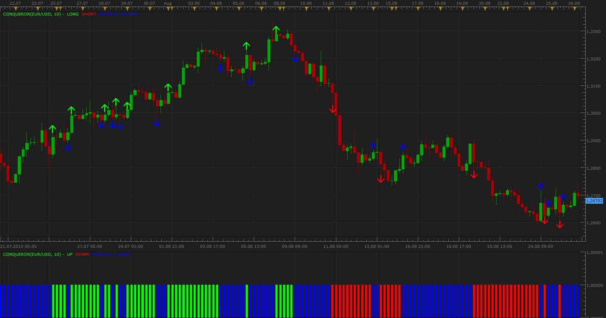

# Conqueror method Indicators

> Source: https://fxcodebase.com/code/viewtopic.php?f=17&t=1989  
> Forum: 17 · Topic 1989 · 13 post(s)

---

## Conqueror method Indicators

**Apprentice** · Mon Aug 30, 2010 10:40 am

Buy
1. Last Close>10 day moving average of close (10DMAc)
2. Today's 10DMAc >10DMAc of 10 days ago
3. Last Close > Close 40 days ago

All three conditions must be met.

Sell signal use inverted logic.

 [Conqueror.lua](files/4040/Conqueror.lua)

The indicator was revised and updated

---

## Re: Conqueror method Indicators

**cyanidez** · Tue Apr 19, 2011 10:50 am

Conqueror Indicator v2:

As per v1, you get a buy signal when all 3 conditions are positive. Your stop is ATR times 2 away from the close.

Eventually one or more of the conditions will start turning negative again. On every signal turning against you, tighten the stop with 1/3.

Version 2 now indicates how many conditions are against you for every candle where this is applicable. This allows you to adjust your stops correctly by simply looking at the indicator feedback.

This is displayed as "1" or "2". When "3" conditions are against you, the Conqueror signal reverses and gives you a sell signal.

Everything applies in reverse for a short trade.

Credit goes to Apprentice for the original indicator and signal! And credit to Courtney Smith for this brilliant strategy.

Enjoy!
cyanidez

---

## Re: Conqueror method Indicators

**giormet** · Tue Apr 16, 2013 4:54 pm

Is it possible to make the indicator for MT4 platform ? Thanks.

---

## Re: Conqueror method Indicators

**Apprentice** · Wed Apr 17, 2013 2:54 am

Your request is added to the development list.

---

## Re: Conqueror method Indicators

**Alexander.Gettinger** · Thu May 02, 2013 10:18 am

> **giormet wrote:**
> Is it possible to make the indicator for MT4 platform ?

MQL4 version of conqueror indicator: [viewtopic.php?f=38&t=36261](https://fxcodebase.com/code/viewtopic.php?f=38&t=36261)

---

## Re: Conqueror method Indicators

**giormet** · Sun May 19, 2013 4:17 pm

Very nice. Thank you very much!

---

## Re: Conqueror method Indicators

**Apprentice** · Tue May 23, 2017 10:30 am

Indicator was revised and updated.

---

## Re: Conqueror method Indicators

**bruno2017** · Sat Jan 18, 2020 4:57 pm

Hello
Can I have the option to remove the arrows on the graph. thank you

---

## Re: Conqueror method Indicators

**Apprentice** · Sun Jan 19, 2020 5:07 am

Your request is added to the development list.
Development reference 561.

---

## Re: Conqueror method Indicators

**Apprentice** · Mon Jan 20, 2020 10:00 am

[Conqueror.lua](files/130819/Conqueror.lua)

Try this version.

---

## Re: Conqueror method Indicators

**papynou34** · Sat Mar 21, 2020 11:48 am

Hello,
Is it possible to have a stratégy based upon this indicator?
Thanks in advance.
Have a nice day.

---

## Re: Conqueror method Indicators

**Apprentice** · Mon Mar 23, 2020 5:03 am

Your request is added to the development list.
Development reference 922.

---

## Re: Conqueror method Indicators

**Apprentice** · Mon Mar 23, 2020 6:50 am

Try this version.
[viewtopic.php?f=31&t=69568](https://fxcodebase.com/code/viewtopic.php?f=31&t=69568)
