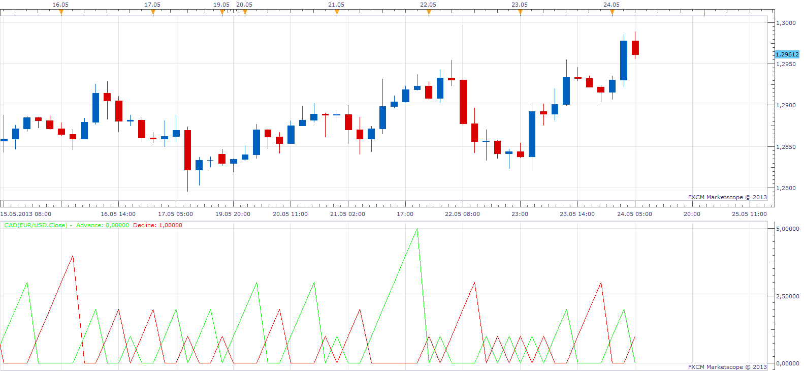

# Consecutive Advance / Decline

> Source: https://fxcodebase.com/code/viewtopic.php?f=17&t=38887  
> Forum: 17 · Topic 38887 · 3 post(s)

---

## Consecutive Advance / Decline

**Apprentice** · Fri May 24, 2013 4:38 am

Indicator will shows number of consecutive advances or declines

 [CAD.lua](files/64096/CAD.lua)

The indicator was revised and updated

---

## Re: Consecutive Advance / Decline

**Alexander.Gettinger** · Fri Sep 12, 2014 5:00 pm

MQL4 version of Consecutive Advance/Decline oscillator: [viewtopic.php?f=38&t=61140](https://fxcodebase.com/code/viewtopic.php?f=38&t=61140).

---

## Re: Consecutive Advance / Decline

**Apprentice** · Mon Jun 26, 2017 4:30 am

The indicator was revised and updated.
