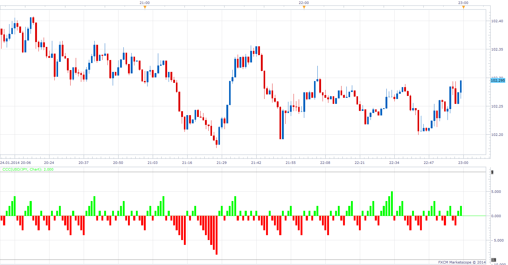

# Consecutive Candle Count

> Source: https://fxcodebase.com/code/viewtopic.php?f=17&t=60243  
> Forum: 17 · Topic 60243 · 4 post(s)

---

## Consecutive Candle Count

**Apprentice** · Sun Jan 26, 2014 3:44 am

Indicator will add one each time a candle continues previous trend.
It is true for any on chart candles source, Heiken-Ashi can be choose as source.

 [CCC.lua](files/92279/CCC.lua)

---

## Re: Consecutive Candle Count

**Alexander.Gettinger** · Wed Jun 04, 2014 5:42 pm

MQL4 version of Consecutive Candle Count oscillator: [viewtopic.php?f=38&t=60775](https://fxcodebase.com/code/viewtopic.php?f=38&t=60775).

---

## Re: Consecutive Candle Count

**upwave** · Thu Feb 19, 2015 1:54 pm

Hi guys,

i tried to derive this indicator into measuring up volumes per Heiken Ashi waves but I was unable to find the way to do it.

Would it be possible to get some support in order to get the same indicator with heiken Ashin candles over :

-cumulative tick volume per waves
-cumulative price spread per wave

Appreciate your support,

Rgds

---

## Re: Consecutive Candle Count

**Apprentice** · Mon Oct 22, 2018 6:07 am

The indicator was revised and updated.
