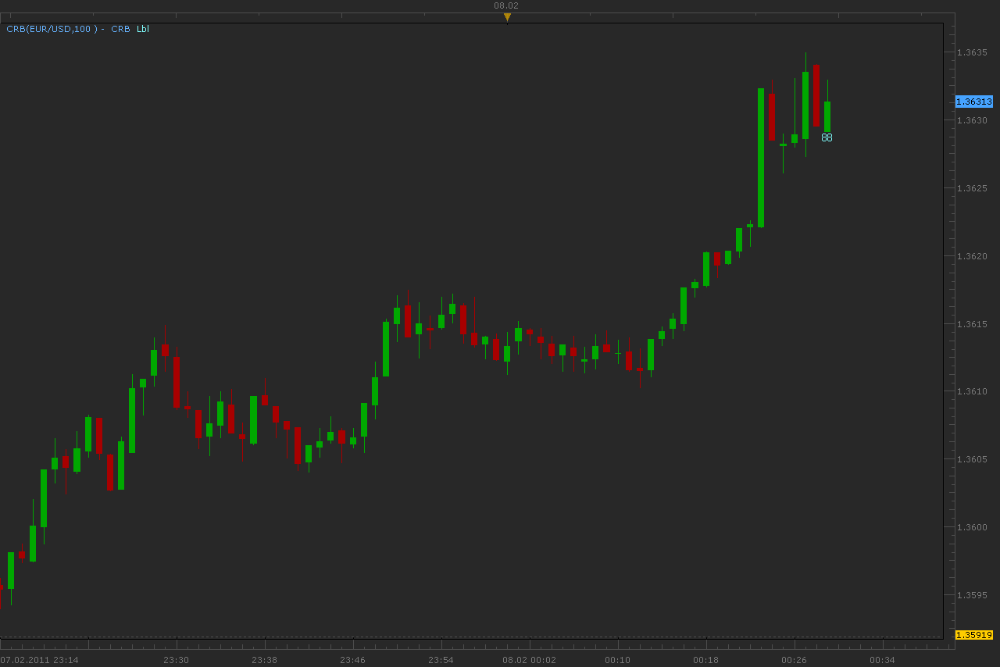

# Constant Range Bars (CRB)

> Source: https://fxcodebase.com/code/viewtopic.php?f=17&t=3347  
> Forum: 17 · Topic 3347 · 22 post(s)

---

## Constant Range Bars (CRB)

**Alexander.Gettinger** · Tue Feb 08, 2011 2:56 am

Indicator draws candles each of which consists of constant number of ticks.
Under last candle can show number of ticks as label.

 

Speed of the indicator drawing depends on amount of data.
For timeframes bigger than m30, this requires big time.
I think what solve this problem.

Download:

 [CRB.lua](files/7998/CRB.lua)

Download indicator for other chart:

 [CRB2.lua](files/7998/CRB2.lua)

---

## Re: Constant Range Bars (CRB)

**Forexlooser** · Wed Feb 09, 2011 5:31 pm

Thank you.

---

## Re: Constant Range Bars (CRB)

**Hoegie** · Fri Feb 11, 2011 2:35 pm

Alexander,

Any idea why the larger timeframes require so much loading time? I am interested in tick based candlesticks instead of time-based candlesticks. I understand they give you a better view of the market and I'm considering something in the range of 89-233 ticks per bar, maybe more as I currently like to trade 4HR/1HR charts. Can this be done under the current platform?

Thank you.

---

## Re: Constant Range Bars (CRB)

**Alexander.Gettinger** · Sun Feb 13, 2011 9:38 pm

> **Hoegie wrote:**
> Any idea why the larger timeframes require so much loading time? I am interested in tick based candlesticks instead of time-based candlesticks. I understand they give you a better view of the market and I'm considering something in the range of 89-233 ticks per bar, maybe more as I currently like to trade 4HR/1HR charts. Can this be done under the current platform?

I work on it.

---

## Re: Constant Range Bars (CRB)

**Alexander.Gettinger** · Wed Mar 02, 2011 4:28 am

> **Hoegie wrote:**
> Any idea why the larger timeframes require so much loading time? I am interested in tick based candlesticks instead of time-based candlesticks. I understand they give you a better view of the market and I'm considering something in the range of 89-233 ticks per bar, maybe more as I currently like to trade 4HR/1HR charts. Can this be done under the current platform?

This problem is solved.
Indicators may use for calculation not only tick data.
At choice timeframe is recommended take into account average volumes for different timeframes.

Download:

 [CRB_TF.lua](files/8570/CRB_TF.lua)

Download indicator for other chart:

 [CRB2_TF.lua](files/8570/CRB2_TF.lua)

---

## Re: Constant Range Bars (CRB)

**Laurus12** · Wed Nov 30, 2011 11:23 am

Thank you very much for this indicator Alexander. I was not aware of the possibility to have tick charts in Marketscope.

---

## Re: Constant Range Bars (CRB)

**Apprentice** · Thu Dec 01, 2011 9:29 am

I'm not sure whether I understand your question.

---

## Re: Constant Range Bars (CRB)

**nookie** · Mon Jan 09, 2012 2:06 pm

This looks great, can it be made like this that candles are heikin ashi ?

---

## Re: Constant Range Bars (CRB)

**Apprentice** · Mon Jan 09, 2012 3:30 pm

Unfortunately, I do not understand your request.

---

## Re: Constant Range Bars (CRB)

**Liquifier** · Thu Feb 23, 2012 9:02 am

I get this error when I try to use CRB.lua on a m1 chart:
An error occurred during the calculation of the indicator 'Custom Candles Indicator'. The error details: [string "CRB.lua"]:255: [string "CRB.lua"]:132: attempt to index field 'open' (a nil value).

Is there a way to get this indicator to behave like the tick charts in Strategy Trader? Basically, I want each bar to represent X ticks but is also time independent.

For example:

 

This chart from Strategy trader does not create a new bar for each m1, m5, m30, etc, but only after 70 ticks of data.

---

## Re: Constant Range Bars (CRB)

**Steve0001** · Sun Feb 26, 2012 9:51 pm

Hi,

I downloaded and tried both the CRB_TF.lua and CRB2_TF.lua indicators. Let me first say that I really appreciate it that someone has taken the time and effort to try to program constant ticks per candle for Marketscope (Trade Station 2). Unfortunately, it does not seem to work as advertised. I was hoping to be able to display the price data with a constant number of ticks per candle (for example 70 ticks per bar).

It appears CRB_TF.lua and CRB2_TF.lua are essentially equivalent. I did most of my testing with CRB_TF.lua . I tested it by changing the number of ticks per bar (100 ticks per bar and lower) and observing how this affected the displayed data. I had Marketscope in the m1 (1 minute bars) time frame. I also had the indicator "time frame to calculate" set to "m1." When I tried it with "time frame to calculate" set to "T" (ticks) I either get a line graph (no candles) or an error [ "An error occurred during the calculation of the indicator 'CRB_TF'. The error details: [string "CRB_TF.lua"]:256: [string "CRB_TF.lua"]:127: attempt to index field 'open' (a nil value)." ].

So with both Marketscope and the indicator set to the m1 (1 minute bars) time frame, and the "size of bar in ticks" large (for example 100), I found that the displayed data looked very much like 1 minute bars with an occasional extra candle(s) thrown in. And when the "size of bar in ticks" was small (for example 1, 2, or 3) the displayed data looked identical to 1 minute bars. This clearly should not be the case.

I hope it can be fixed, because I think constant ticks per candle might be very useful. Thanks.

---

## Re: Constant Range Bars (CRB)

**speculator55005** · Mon Sep 16, 2013 6:46 am

I cant seem to find any difference between this chart and the conventional counterpart.
This is not a bar range view

---

## Re: Constant Range Bars (CRB)

**speculator55005** · Mon Sep 16, 2013 8:33 am

i downloaded this indicator "http://www.fxcodebase.com/code/viewtopic.php?f=17&t=3614&hilit=range+bar"
and then set my time frame to 1m since the bar chart doesnt depend on time which makes it working.

---

## Re: Constant Range Bars (CRB)

**toxxum** · Wed Jan 01, 2014 2:36 am

> **Liquifier wrote:**
> I get this error when I try to use CRB.lua on a m1 chart:
> An error occurred during the calculation of the indicator 'Custom Candles Indicator'. The error details: [string "CRB.lua"]:255: [string "CRB.lua"]:132: attempt to index field 'open' (a nil value).
>
> Is there a way to get this indicator to behave like the tick charts in Strategy Trader? Basically, I want each bar to represent X ticks but is also time independent.
>
> For example:
>
>
> FXCM Strategy Trader2.png
>
>
>
> This chart from Strategy trader does not create a new bar for each m1, m5, m30, etc, but only after 70 ticks of data.

I second this. I have tried to run this indicator on the latest TSII version but I keep getting exactly the same error message as Liquifier. Is there any progress in getting this indicator to work or has the project been buried?

---

## Re: Constant Range Bars (CRB)

**compulsive** · Mon Feb 03, 2014 11:01 am

Any word in getting real tick charts. Any range? It only works for 10 bars in one minute.

The problem that I see is that there are 5 digits after the decimal (such as 1.35185) and it would create a math problem. I say this because When I log into my Futures account and I do tick charts on their platform for FOREX, it allows tick charts (any range) but there are only 4 digits after the decimal, thereby creating less calculation. In fact when you trade the futures currency then there are only 4 digits after the decimal " 1.3185 as well

---

## Re: Constant Range Bars (CRB)

**asedic** · Thu Aug 06, 2015 2:55 pm

Hi Alexander. Thanks for this useful indicator.

I tried to use it and found that option of time frame t1 doesn't work on my platform. It is very interesting option for analysis of situation with number of ticks less than number which contains m1 candle in standard time based chart. In that case CRB looks the same as standard m1 chart.

Is it possible to implement t1 time frame option?

Thanks.

---

## Re: Constant Range Bars (CRB)

**Apprentice** · Tue Oct 23, 2018 6:44 am

The indicator was revised and updated.

---

## Re: Constant Range Bars (CRB)

**Gilles** · Tue Nov 08, 2022 7:20 am

Hi Apprentice,

Can we get bars of a certain size in points.
Ex: 25 points bars.
Whose refresh would not depend on the periods but on the display of ticks only.

Thank you very much :) !

---

## Re: Constant Range Bars (CRB)

**Apprentice** · Sun Nov 13, 2022 4:13 am

Something like Renko?
You can find it under File-> Create View...

---

## Re: Constant Range Bars (CRB)

**Gilles** · Mon Nov 14, 2022 2:01 am

Hi Apprentice,

It would be exactly like RB_VIEW.lua but I wish it wasn't a VIEW mode but an INDICATOR.
This will make it possible to automate a strategy with access to candle.open data, candle.closed data by these candles of 25 points.

Is this possible for you?

Thank you veray much.

---

## Re: Constant Range Bars (CRB)

**Gilles** · Fri Nov 18, 2022 2:58 pm

Hi Apprentice,

I have the impression that what I asked you would look like the Renko2M indicator, am I wrong ?
Regards

---

## Re: Constant Range Bars (CRB)

**Apprentice** · Tue Nov 22, 2022 4:14 am

Yes.
Renko chart is Obsolete and was used prior to the introduction of Views.
