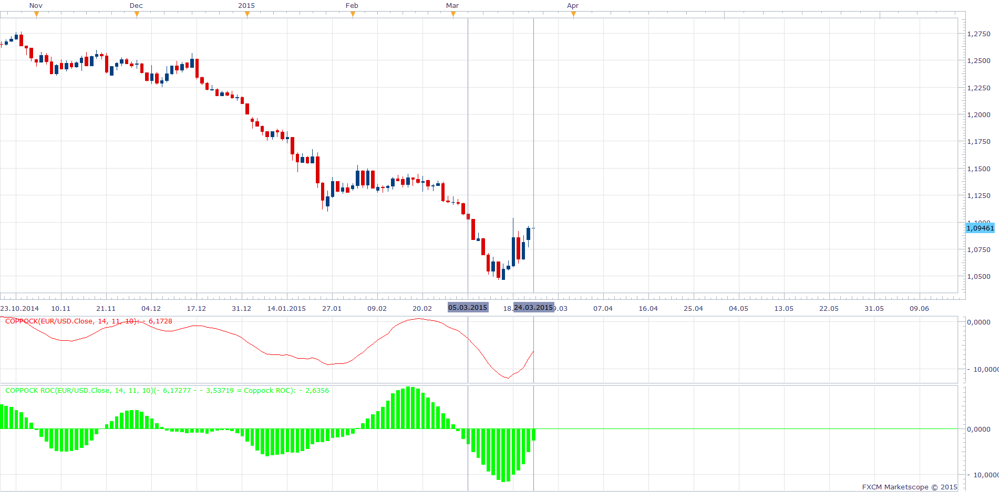

# Coppock Indicator

> Source: https://fxcodebase.com/code/viewtopic.php?f=17&t=1225  
> Forum: 17 · Topic 1225 · 17 post(s)

---

## Coppock Indicator

**Apprentice** · Mon May 31, 2010 1:02 pm

*Coppock Indicator*

The Coppock formula was introduced in Barron's Magazine in 1962 by Edwin Sedgwick Coppock.

A bull market is signaled when the Coppock Indicator turns up from below zero.
No sell signals are generated (it is not designed for that).
However there are some systems using Coppock sell signals.

Formula for calculating Coppock
Coppock[period] = LWMA (ROC[short]+ROC[long])

 [Coppock.lua](files/2324/Coppock.lua)

 

Coppock ROC = Coppock - Coppock N Period ago

 [Coppock ROC.lua](files/2324/Coppock%20ROC.lua)

The indicator was revised and updated

---

## Re: Coppock Indicator

**jeffjeffz** · Mon May 31, 2010 1:05 pm

Thanks!

---

## Re: Coppock Indicator

**davetherave110179** · Mon Apr 18, 2011 9:40 am

Hi Apprentice,

Could you add a colour change to this indicator:
When coppock is below zero the fill colour is red.
When coppock is above zero the fill colour is green.

Many thanks,
davetherave110179

---

## Re: Coppock Indicator

**Apprentice** · Mon Apr 18, 2011 12:46 pm

I made a minor modification.
I used the Bar, instead of Line.

 [Coppock.lua](files/9796/Coppock.lua)

---

## Re: Coppock Indicator

**Alexander.Gettinger** · Thu Apr 03, 2014 12:27 pm

MQL4 version of Coppock indicator: [viewtopic.php?f=38&t=60491](https://fxcodebase.com/code/viewtopic.php?f=38&t=60491).

---

## Re: Coppock Indicator

**nookie** · Tue Mar 17, 2015 9:17 am

Hello, can a slight modification be added, rate of change (customizable) that can measure speed of the coppock curve change, not sure exactly what values though, lets say

if (period 3 - period 2 = 0.0231 * 1000) > (period 2 - period 1 = 0.0155 * 1000)
then print colour bar (explanation 23.1 - 15.5 = 7.6)

if < than 5 print 0

I am not sure on the values so this can be open values for a test.

thanks!
nookie

---

## Re: Coppock Indicator

**Apprentice** · Wed Mar 18, 2015 3:24 am

Something like Bar version from second post.

---

## Re: Coppock Indicator

**nookie** · Wed Mar 18, 2015 7:40 am

Exactly, as a hint, this is a similar indicator, but I am not sure from where to feed data... :

ADX roc oscillator

[viewtopic.php?f=17&t=7485&p=97236&hilit=adx+roc#p97236](https://fxcodebase.com/code/viewtopic.php?f=17&t=7485&p=97236&hilit=adx+roc#p97236)

---

## Re: Coppock Indicator

**Apprentice** · Sun Mar 22, 2015 8:34 am

Coppock ROC introduced

---

## Re: Coppock Indicator

**nookie** · Mon Mar 23, 2015 12:11 pm

Redownloaded and values now are different, but still wrong, if we use the same example from 19 03 and 20 03 now Coppock ROC for 20 03 is -7.93584 which is way different than needed difference of Coppock from 20 03 - Coppock from 19 03

---

## Re: Coppock Indicator

**Apprentice** · Mon Mar 23, 2015 4:40 pm

In this example we have
-6,17277 - (- 3,53719) = - 2,6356
As expected.

---

## Re: Coppock Indicator

**nookie** · Tue Mar 24, 2015 2:47 am

I have tested it for various time frames and all seem to have not correct values, please provide me the exact time frame which you are testing, for example you can check it on D1 for my example for 19 March and 20 March

---

## Re: Coppock Indicator

**Apprentice** · Tue Mar 24, 2015 3:38 am

I have used D1 (Live data)

---

## Re: Coppock Indicator

**nookie** · Tue Mar 24, 2015 5:39 am

I am using D1 for 19 march and 20 march, for which two days were you testing, I am not able to see it from the screenshot?

For 19 March and 20 March the indicator is having wrong output as well as all other dates tested.

---

## Re: Coppock Indicator

**Apprentice** · Wed Mar 25, 2015 11:46 am

Coppock ROC is calculated as follows.
Coppock ROC for 19.3. is equal to Coppock for 19.3. - Coppock N Period before 19.3.
Coppock ROC = Coppock 19.3. - Coppock 2.3.
Coppock ROC = -10,68861- (-1,47877)
Coppock ROC = -9,20984

---

## Re: Coppock Indicator

**nookie** · Thu Mar 26, 2015 2:55 pm

I think we are having different values on the indicators or we are talking about not the same currency pairs so I am including my exact data below:

Instrument for tests: GBP/USD D1 live feed
Date: 19/03/2015
COPPOCK value: -7.22878

Date: 20/03/2015
COPPOCK value: -6.85433

Date: 23/03/2015
COPPOCK value: -6.22070

Based on my calculations values should be the following

Date: 19/03/2015
COPPOCK value: -7.22878
COPPOCK ROC = no data

Date: 20/03/2015
COPPOCK value: -6.85433
COPPOCK ROC = 7.22878 -6.85433 = 0.37445

Date: 23/03/2015
COPPOCK value: -6.22070
COPPOCK ROC = 6.85433 - 6.22070 = 0.63363

If needed I can provide you screenshots

---

## Re: Coppock Indicator

**Apprentice** · Thu Aug 03, 2017 6:22 am

The indicator was revised and updated.
