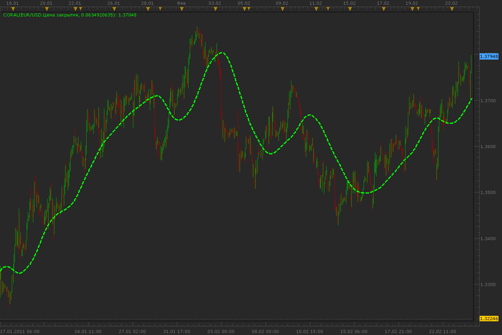

# Coral indicator

> Source: https://fxcodebase.com/code/viewtopic.php?f=17&t=3522  
> Forum: 17 · Topic 3522 · 7 post(s)

---

## Coral indicator

**Alexander.Gettinger** · Thu Feb 24, 2011 5:04 am

This indicator was required: [viewtopic.php?f=27&t=3476&p=8340#p8340](https://fxcodebase.com/code/viewtopic.php?f=27&t=3476&p=8340#p8340)

Formulas:
Coral[i]=-0.064*Buff6[i]+0.672*Buff5[i]-2.352*Buff4[i]+2.744*Buff3[i], where
Buff6[i]=Coeff*Buff5[i]+(1-Coeff)*Buff6[i-1],
Buff5[i]=Coeff*Buff4[i]+(1-Coeff)*Buff5[i-1],
Buff4[i]=Coeff*Buff3[i]+(1-Coeff)*Buff4[i-1],
Buff3[i]=Coeff*Buff2[i]+(1-Coeff)*Buff3[i-1],
Buff2[i]=Coeff*Buff1[i]+(1-Coeff)*Buff2[i-1],
Buff1[i]=Coeff*Price+(1-Coeff)*Buff1[i-1].

 

Download:

 [Coral.lua](files/8414/Coral.lua)

The indicator was revised and updated

---

## Re: Coral indicator

**braumann** · Sat Oct 13, 2012 4:33 pm

Could you change the color of CORAL when he go up(green) and down(red) please ?

Thank you !

---

## Re: Coral indicator

**Apprentice** · Sun Oct 14, 2012 6:42 am

Color Option Added.

---

## Re: Coral indicator

**braumann** · Sun Oct 14, 2012 9:08 am

Thanks

---

## Re: Coral indicator

**cigarguy** · Sat Feb 02, 2013 12:10 pm

Apprentice, I realize that this indi has been completed for some time, but compared this coral to the THV coral on their thread using different time frames and noticed the THV coral is somewhat faster and gives signals faster. I know nothing about codes, but curious if you could explain how they differ? and is their a method for the user to input different paremeters to be similar to the THV coral? Thanks for your great work and indicators.

Larry aka Cigarguy

---

## Re: Coral indicator

**Apprentice** · Mon Feb 04, 2013 5:59 am

I can not find the "other" version, which you mention, can you post the link where it can be found.

---

## Re: Coral indicator

**Apprentice** · Mon May 01, 2017 5:42 am

Indicator was revised and updated.
