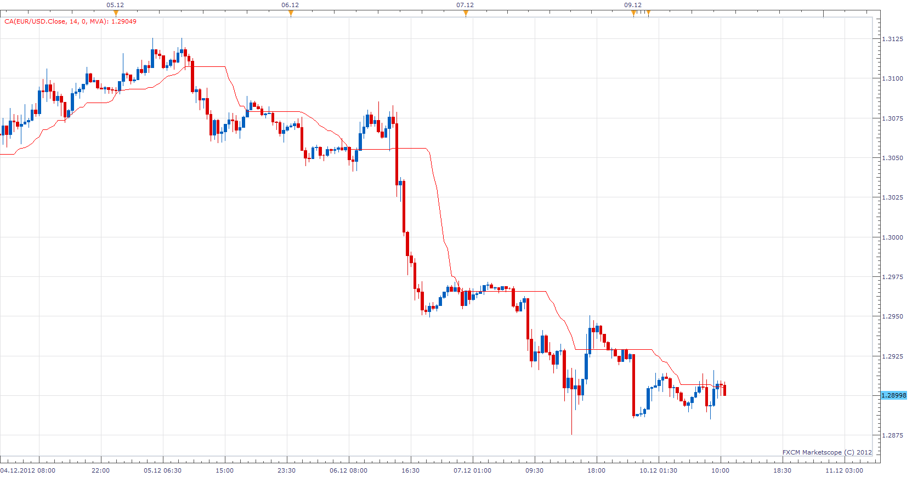

# Corrected Average

> Source: https://fxcodebase.com/code/viewtopic.php?f=17&t=27589  
> Forum: 17 · Topic 27589 · 3 post(s)

---

## Corrected Average

**Apprentice** · Mon Dec 10, 2012 4:47 am

Corrected Average indicator by A.Uhl (also known as the "Optimal Moving Average").

The strengths of the corrected Average (CA) is that the current value of the time series must exceed a the current volatility-dependent threshold, so that the filter increases or falls, avoiding false signals in trend is weak phase.
- by Prof. A.Uhl -

 [CA.lua](files/48241/CA.lua)

The indicator was revised and updated

---

## Re: Corrected Average

**Alexander.Gettinger** · Thu Sep 25, 2014 9:36 am

MQL4 version of Corrected Average indicator: [viewtopic.php?f=38&t=61251](https://fxcodebase.com/code/viewtopic.php?f=38&t=61251).

---

## Re: Corrected Average

**Apprentice** · Fri Jun 23, 2017 6:52 am

The indicator was revised and updated.
