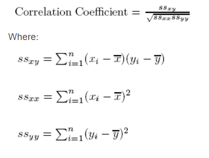

# Correlation Coefficients

> Source: https://fxcodebase.com/code/viewtopic.php?f=17&t=64610  
> Forum: 17 · Topic 64610 · 1 post(s)

---

## Correlation Coefficients

**Apprentice** · Thu Apr 20, 2017 3:14 pm

Shows the correlation coefficient between the two currency pairs.
Negative correlation means the two currency pairs correlate in the opposite directions (e.g. when the price for one goes up, the other one goes down and vice versa)

The correlation coefficient for two exchange rates is calculated using the following formula.

 

Correlation Trade Line Color
Instrument 1 > MA of Instrument 1
Instrument 2 > MA of Instrument 2
or
Instrument 1 < MA of Instrument 1
Instrument 2 < MA of Instrument 2

Reverse Trade Line Color
Instrument 1 > MA of Instrument 1
Instrument 2 < MA of Instrument 2
or
Instrument 1 < MA of Instrument 1
Instrument 2 > MA of Instrument 2

 [Correlation Coefficients.lua](files/112077/Correlation%20Coefficients.lua)

The indicator was revised and updated
