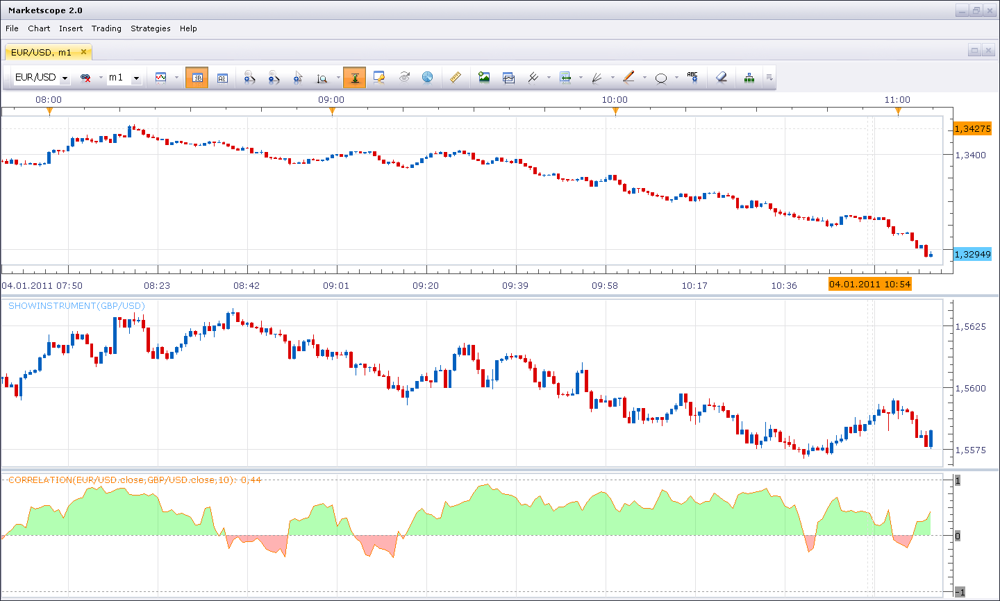

# Correlation (new version)

> Source: https://fxcodebase.com/code/viewtopic.php?f=17&t=3093  
> Forum: 17 · Topic 3093 · 8 post(s)

---

## Correlation (new version)

**Nikolay.Gekht** · Tue Jan 04, 2011 11:16 am

The indicator calculates correlation between direction and speed of changes of two instruments.

 

Download:

 [correlation.lua](files/7209/correlation.lua)

 [Correlation With Alert.lua](files/7209/Correlation%20With%20Alert.lua)

---

## Re: Correlation (new version)

**Nikolay.Gekht** · Mon Jan 10, 2011 11:43 am

Moved from the beta forum to the production forum.

---

## Re: Correlation (new version)

**Apprentice** · Sun Jan 25, 2015 12:23 pm

Bump Up.

---

## Re: Correlation (new version)

**Apprentice** · Sun Jul 02, 2017 12:45 pm

The indicator was revised and updated.

---

## Re: Correlation (new version)

**mistertrade** · Sat May 14, 2022 8:44 am

Hello,

When the value of the correlation coefficient is lower than a value entered (new parameter in 'double' format), would it be possible to add 2 alerts: 1 sound alert and a message which would warn that the value of the correlation coefficient is lower than the value entered in parameter.

Thanks for your help.

---

## Re: Correlation (new version)

**Apprentice** · Sat May 14, 2022 11:40 am

We have added your request to the development list.
Development reference 299.

---

## Re: Correlation (new version)

**Apprentice** · Sat May 14, 2022 12:40 pm

Correlation With Alert.lua added.

---

## Re: Correlation (new version)

**mistertrade** · Mon May 16, 2022 9:47 pm

Hello,
The new 'Correlation With Alert.lua' indicator is even better than I asked for. Moreover, it works perfectly.
Thank you very much for all this work...
