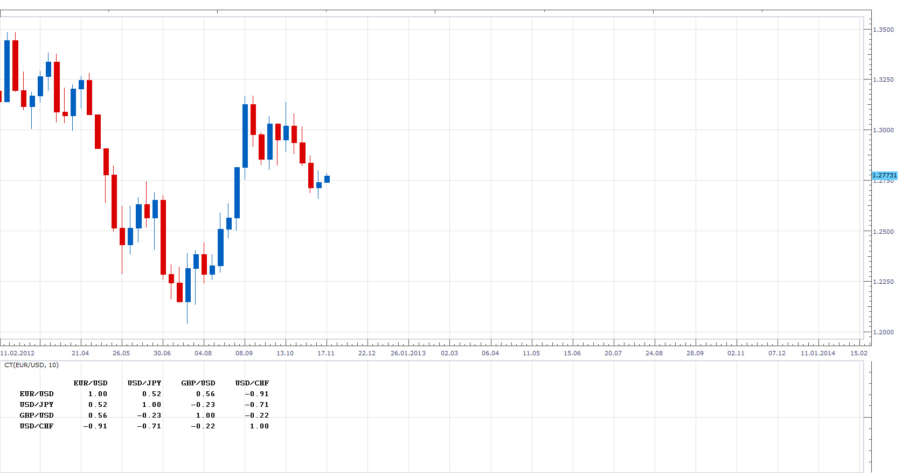
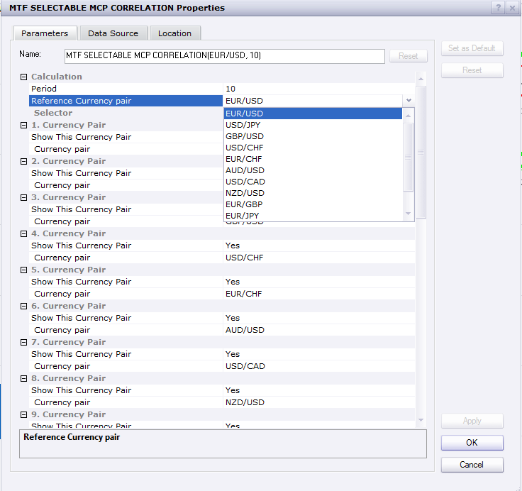

# Correlation Table

> Source: https://fxcodebase.com/code/viewtopic.php?f=17&t=26274  
> Forum: 17 · Topic 26274 · 17 post(s)

---

## Correlation Table

**Apprentice** · Mon Nov 19, 2012 4:55 am

Tables represents the correlation between the various currency pairs
The correlation coefficient highlights the similarity of the movements between two parities.
If the correlation is high (above 80) and positive then the currencies move in the same way.
If the correlation is high (above 80) and negative then the currencies move in the opposite way.
If the correlation is low (below 60) then the currencies don't move in the same way.

This tool can be useful for determining your Tradig strategy
particularly in relation to the position sizing and risk management.

Example
If you have two currency pairs in your portfolio,
you may think that you have a diversified portfolio.
It this pairs have a high correlation, Think again,
 is in essence have two instance of the "same" currency.

 [CT.lua](files/45084/CT.lua)

 

 [MTF MCP Correlation.lua](files/45084/MTF%20MCP%20Correlation.lua)

 [MTF Selectable MCP Correlation.lua](files/45084/MTF%20Selectable%20MCP%20Correlation.lua)

---

## Re: Correlation Table

**catador** · Tue Dec 25, 2012 1:39 pm

Hi Apprentice, there is some problem when loading this indicator. I'm using TS-II dev. Can you please help me? Thanks. Catador

---

## Re: Correlation Table

**Apprentice** · Wed Dec 26, 2012 4:51 am

Looks like a compatibility issue.
I uploaded a simplified version,
which should not have this problem.

---

## Re: Correlation Table

**catador** · Wed Dec 26, 2012 6:51 pm

Please, ignore my previous post...
I had TS-II Dev (downloaded on Dec12-two weeks ago). As I was getting an error with this indicator and some others, I decided to uninstall TS-II Dev and reinstall a fresh download from today, Dec26. Now all of them run FINE!
Question: Should we users assume the beta version of TS-II Dev is being updated every few days (or weeks)?
Thanks.

---

## Re: Correlation Table

**Apprentice** · Thu Dec 27, 2012 3:49 am

There are no rules on the release frequency.

---

## Re: Correlation Table

**Apprentice** · Thu Nov 28, 2013 12:28 pm

MTF MCP Correlation Added

---

## Re: Correlation Table

**Taskryr** · Sat Nov 30, 2013 2:39 pm

Hello,

Is it possible to limit the MTF version to just a few currencies? Everytime I load it 60 currencies load up. I don't need that many. Or am I just overlooking an option in the dialogue box?

Thanks,

---

## Re: Correlation Table

**Apprentice** · Sun Dec 01, 2013 5:12 am

MTF Selectable MCP Correlation Added.
Allows selection of up to 10 currency pairs.

---

## Re: Correlation Table

**Taskryr** · Tue Dec 03, 2013 2:38 pm

Thank you for the selectable file. However, the first currency is showing at 100 correlation on every use of the indicator. Not sure what to make of this.

This particular screen shot has EUR/CAD set as the calculation pair.

---

## Re: Correlation Table

**Apprentice** · Wed Dec 04, 2013 12:51 am

This is normal and expected,
as we compare USD / CAD with USD / CAD

---

## Re: Correlation Table

**Taskryr** · Wed Dec 04, 2013 10:54 am

Im not sure if im missing something, but the pairs compared here are supposed to be EUR/CAD and USD/CAD.

EUR/CAD is showing as a 100% correlation to USD/CAD. What am i doing wrong?

---

## Re: Correlation Table

**Apprentice** · Wed Dec 04, 2013 11:45 am

See "Reference Currency pair" within Indicator parameter menu.
Reference Currency is Currency with which the comparison is made​​.

---

## Re: Correlation Table

**Taskryr** · Wed Dec 04, 2013 3:10 pm

I'm still getting the same issue. The 1st currency listed is showing up as 100 correlation even though it is a different currency. See addl img.

---

## Re: Correlation Table

**Apprentice** · Wed Dec 04, 2013 5:08 pm

Indicator was programmed to use only selected currency pairs (From Selector) .
If u have used a pair out of this set, the first pair from the list was used.
I have changed this algorithm.
Now we will retrieve Reference currency independently.

---

## Re: Correlation Table

**Apprentice** · Sun Apr 22, 2018 5:51 am

The indicator was revised and updated.

---

## Re: Correlation Table

**gsalazar5** · Wed May 01, 2019 12:42 am

I have an Error during the installation of the indicator in FXCM: MTF Selectable MCP Correlation.lua

Do you have any idea about this problem?

Thanks.

---

## Re: Correlation Table

**Apprentice** · Wed May 01, 2019 3:23 am

Fixed.
