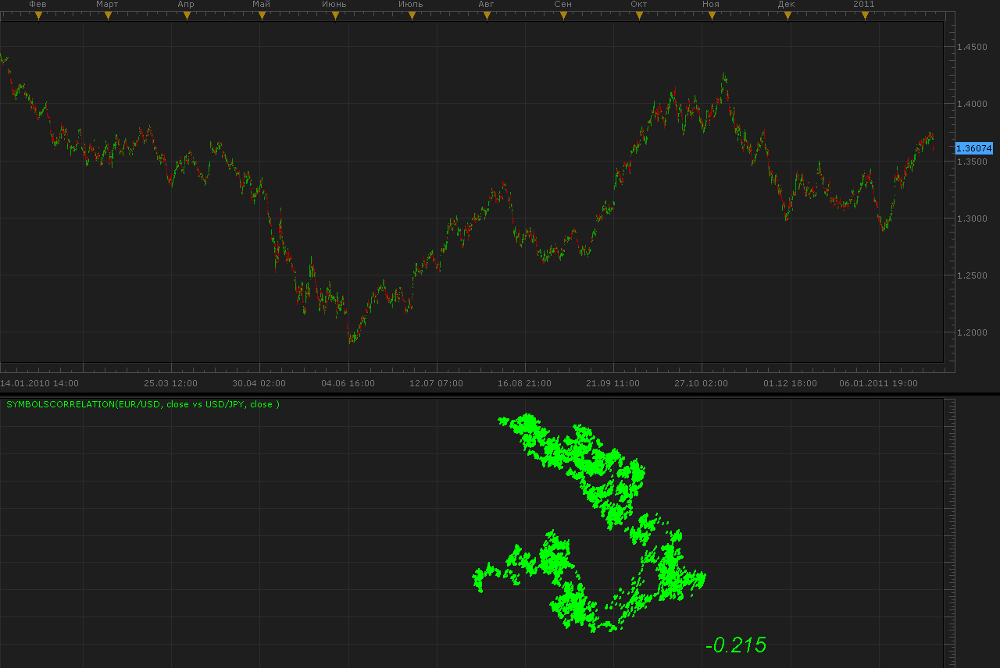
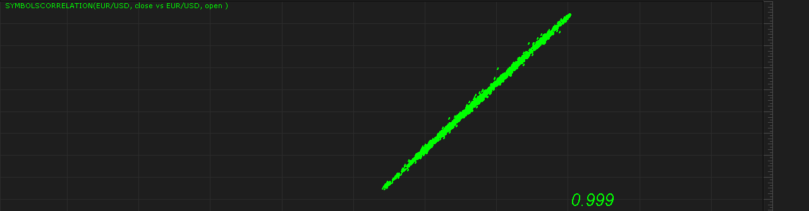
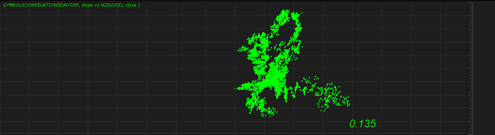
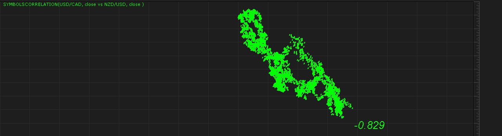

# Correlations

> Source: https://fxcodebase.com/code/viewtopic.php?f=17&t=3278  
> Forum: 17 · Topic 3278 · 4 post(s)

---

## Correlations

**Alexander.Gettinger** · Fri Jan 28, 2011 11:35 pm

Indicator draw joint motion of two instruments.
First at X axis and second at Y axis.
Indicator automatically scales field of the drawing.

 

Also, the indicator calculates correlations coefficient (in right bottom corner).

Examples.
Very strong correlation between open and close prices of EUR/USD:

 

Very weak correlation between EUR/CHF and NZD/USD:

 

The indicator was revised and updated

---

## Re: Correlations

**Alexander.Gettinger** · Fri Jan 28, 2011 11:37 pm

Negative correlation between USD/CAD and NZD/USD:

 

Important. Range of data corresponds to chart range.

Download:

 [SymbolsCorrelation.lua](files/7786/SymbolsCorrelation.lua)

I shall very pleased idea on development of this indicator.

---

## Re: Correlations

**antwoneeter** · Wed Dec 14, 2011 5:15 pm

Great indicator. I'm curious to know why the dots line up closely in an ascending line/area when there's a strong correlation. Are the prices over time compared on the X & Y axis? Maybe I should checkout the code...

---

## Re: Correlations

**Apprentice** · Mon Mar 20, 2017 7:41 am

Indicator was revised and updated.
