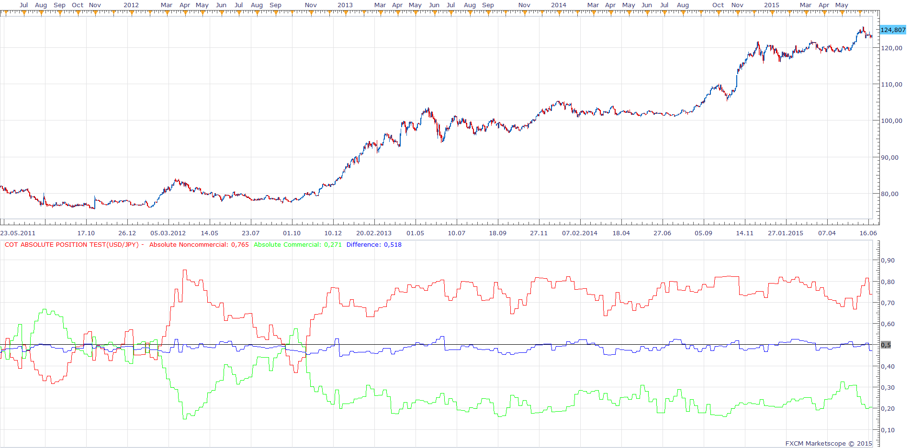

# COT Absolute position

> Source: https://fxcodebase.com/code/viewtopic.php?f=17&t=2103  
> Forum: 17 · Topic 2103 · 50 post(s)

---

## COT Absolute position

**Apprentice** · Thu Sep 09, 2010 4:14 am

Shows the percentage relationship between the Long and Short positions of Large Speculators (Non Commercial)

 [COT Absolute position.lua](files/4333/COT%20Absolute%20position.lua)

To work you need to have installed COT.lua and COTA.lua.
[viewtopic.php?f=17&t=1615](https://fxcodebase.com/code/viewtopic.php?f=17&t=1615)

Difference will be located at the mid point of two initial components.

---

## Re: COT Absolute position

**devise2** · Thu Sep 09, 2010 7:46 am

Hello,

I speak French and sorry for my english. And beginner programming.

Strategy don't applicable or i don't understand. Thank you

---

## Re: COT Absolute position

**Apprentice** · Thu Sep 09, 2010 9:09 am

Hello,

COT Absolute position is not a strategy, it is indicator.

The installation process for the indicators can be found here.
[viewtopic.php?f=17&t=17](https://fxcodebase.com/code/viewtopic.php?f=17&t=17)

I hope this will help.

---

## Re: COT Absolute position

**DS0167** · Thu Sep 09, 2010 10:21 am

Hello,

Just to let you know I received an error message saying that the indicator can not be found when I tried to install it.

Please see the 2 attachments: 1 saying the indicator can not be found and 1 showing the indicator is well uploaded in Marketscope... Any idea where the proble come from?

Thanks in advance for your help.

Kind regards,

---

## Re: COT Absolute position

**Apprentice** · Thu Sep 09, 2010 11:04 am

Good.
Progress, as I wrote, to work, this indicator should be installed as well .
 COT.lua and COTA.lua.

These indicators can be found here.
[viewtopic.php?f=17&t=1615](https://fxcodebase.com/code/viewtopic.php?f=17&t=1615)

---

## Re: COT Absolute position

**DS0167** · Thu Sep 09, 2010 2:19 pm

Thank you and sorry to have not read well your initial instruction

Kind regards,
DS0167

---

## Re: COT Absolute position

**fxtrn0** · Fri Apr 29, 2011 11:41 am

Is is possible for that indicator the scale above 0 be the same with the scale below 0 because visually the levels seem same but in reality are too different, thanks in advance!

---

## Re: COT Absolute position

**fxtrn0** · Fri Apr 29, 2011 1:09 pm

thought that the NonCommercial and Commercial price was getting negative numbers and thats why told about the 0 level, in the picture looking at COTAP seen the center line 0,5 having no 00 like 0.500 and get a bit confused thinking it was 0 (never-mind how i thought it), but in reality is a sequence from 0,2 to 0,8..... been hours in front of charts mind goes BOOM!!! sorry

---

## Re: COT Absolute position

**Blackcat2** · Sun May 01, 2011 9:02 pm

> **Apprentice wrote:**
>
>
> COT Absolute position.png
>
>
> This version has an insight into the commercial component as well.
>
>
> COT Absolute position.lua

When I installed this, I got red and green flat lines. One at the top and one at the bottom. I have already installed the dependencies for this indicator as well. Is there anything else that I'm missing?

Cheers..
BC

---

## Re: COT Absolute position

**Apprentice** · Mon May 02, 2011 2:45 am

Now, I just guessing.

You're probably Day or Scalp Trader.
And you use Time frame, which is less than one hour.
COT nativ time frame is a weekly time frame (w1)

---

## Re: COT Absolute position

**Blackcat2** · Mon May 02, 2011 5:59 am

> **Apprentice wrote:**
> Now, I just guessing.
>
> You're probably Day or Scalp Trader.
> And you use Time frame, which is less than one hour.
> COT nativ time frame is a weekly time frame (w1)

Spot on! It was installed on 15M TF heheheh...
Thanks for the tips...

BC

---

## Re: COT Absolute position

**hektor** · Thu Jun 09, 2011 12:08 pm

Hello,

 Got one question.
 How does the indicator update? Is it done manually or it goes automatically? I came across similar indicator for MT4 where I had download the weekly updates from the CFTC and input them manually!

thanks!

---

## Re: COT Absolute position

**waffle** · Sun Apr 01, 2012 3:28 am

> **Apprentice wrote:**
>
>
> COT Absolute position.png
>
>
> Shows the percentage relationship between the Long and Short positions of Large Speculators (Non Commercial)
>
>
>
> COT Absolute position.lua
>
>
>
> To work you need to have installed COT.lua and COTA.lua.
> [http://fxcodebase.com/code/viewtopic.php?f=17&t=1615](https://fxcodebase.com/code/viewtopic.php?f=17&t=1615)

Hi, I'm getting an error message when attempting to add this indicator to my platform. Can you please update it?

---

## Re: COT Absolute position

**Apprentice** · Sun Apr 01, 2012 10:41 am

As I wrote, to work, several times, COT.lua and COTA.lua indicator should be installed as well.

These indicators can be found here.
[viewtopic.php?f=17&t=1615](https://fxcodebase.com/code/viewtopic.php?f=17&t=1615)

---

## Re: COT Absolute position

**waffle** · Sun Apr 01, 2012 7:09 pm

> **Apprentice wrote:**
> As I wrote, to work, several times, COT.lua and COTA.lua indicator should be installed as well.
>
> These indicators can be found here.
> [viewtopic.php?f=17&t=1615](https://fxcodebase.com/code/viewtopic.php?f=17&t=1615)

I know, thanks for that. But I'm getting an error message when trying to install the COT absolute positioning indicator, which is a much better visual. I've downloaded both indicators...

---

## Re: COT Absolute position

**Apprentice** · Mon Apr 02, 2012 4:57 am

Can you post message that you are getting.
Screen shot is desirable.

---

## Re: COT Absolute position

**compxtrader** · Sat Jun 29, 2013 3:26 pm

Found this indicator and loaded as instructed both COT and COTA and COT Absolute. however the values for the non commercial and the commercial are the same. Ideas to correct this?

---

## Re: COT Absolute position

**Apprentice** · Sun Jun 30, 2013 5:34 am

I have fix the problem.
It was the question of compatibility.
COTA has been changed.

---

## Re: COT Absolute position

**compxtrader** · Sun Jun 30, 2013 10:26 am

Great, thank you. Where can I download the corrected version?

---

## Re: COT Absolute position

**compxtrader** · Sun Jun 30, 2013 10:35 am

Nevermind, I re downloaded and it works correctly. Thanks much.

---

## Re: COT Absolute position

**Taskryr** · Mon May 26, 2014 9:40 am

Hello,

is there a timeline for when the COT indicators will work again? It's been flat since about August.

thanks,

---

## Re: COT Absolute position

**Apprentice** · Tue May 27, 2014 2:57 am

Unfortunately i can not do much.
The problem is on the server side of this indicator.
Will inform people in charge.

---

## Re: COT Absolute position

**Apprentice** · Tue May 27, 2014 9:01 am

For all those interested the server issue is now fixed.

---

## Re: COT Absolute position

**matson** · Mon Jun 09, 2014 3:24 pm

Hello
I install cot and cota indicator and cot absolute position
then when I want to use absolute position it tell me that it cannot find COTA

this cot absolute position can be used on any currency?
which time frame weekly?

Please help
thanks a lot

---

## Re: COT Absolute position

**Apprentice** · Tue Jun 10, 2014 2:00 am

I have just tested the COT Absolute position.
I did not find any bugs.

Conclusion to have not installed COTA to your TS.

Have you try to add COTA on your Chart?

COT indicators will work on other time frames.
Week (W1) Time frame is native for all COT indicators on Fxcodebase.
For us, COT data is updated on a weekly basis.

---

## Re: COT Absolute position

**matson** · Tue Jun 10, 2014 5:46 am

hello apprentice thank you for your reply I install cot cota but as indicator not on the chart? should I?

---

## Re: COT Absolute position

**Apprentice** · Tue Jun 10, 2014 6:31 am

No. You do not need to add them to the chart.
Just make sure they are available in the list of available indicator.
Adding them to chart is good test.

---

## Re: COT Absolute position

**matson** · Tue Jun 10, 2014 9:02 am

Apprentice hi!

how can I remove indicators from the liste of indicators?

---

## Re: COT Absolute position

**matson** · Tue Jun 10, 2014 9:05 am

Apprentice

I manage to make things work buy downloading again indicator

How can I desinstall from the liste of indicators , indicators version that did not work?
thanks

---

## Re: COT Absolute position

**Valeria** · Tue Jun 10, 2014 10:50 pm

Hi matson,

> how can I remove indicators from the liste of indicators?

To remove an extension (indicator, view or strategy) please go to Alerts and Trading Automation->Manage Extensions. In the Manage Extensions dialog box select the extension which should be deleted and click Remove.

 

---

## Re: COT Absolute position

**Stance** · Mon Jun 22, 2015 3:28 pm

I have cot and cota installed but am getting this error when trying to add this indicator?

---

## Re: COT Absolute position

**Apprentice** · Wed Jun 24, 2015 5:16 am

You probably use one of unsupported instruments like US index.
Try one of the standard currency pairs like EUR / USD...
Have changed this Alert to "Unsupported instrument." to be more informative.

---

## Re: COT Absolute position

**Stance** · Mon Aug 03, 2015 8:03 pm

Is it possible to add another line showing the difference between noncommercial and commercial?

---

## Re: COT Absolute position

**Apprentice** · Wed Aug 05, 2015 7:16 am

Difference Added.
Difference will be located at the mid point of two initial components.
Instrument Selection Bug Fixed.

---

## Re: COT Absolute position

**Stance** · Thu Aug 06, 2015 12:05 am

> **Apprentice wrote:**
> Difference Added.
> Instrument Selection Bug Fixed.

Thanks, I've re-downloaded the indicator, but it doesn't look like it is the updated version?

---

## Re: COT Absolute position

**Apprentice** · Thu Aug 06, 2015 2:46 am

I tried to do the same.
This is the output generated by updated indicator.

---

## Re: COT Absolute position

**jrichardson83** · Wed Jun 01, 2016 5:33 pm

I don't think that the currently uploaded version of the indie is the updated one. In the drop down menu to select the instruments there are no options for Currency Pairs. When I select something like the US Index or British Pound, etc., it just says N/A in the oscillator window.

NO CURRENCY PAIR OPTIONS

 

NO DATA DISPLAYED

 

---

## Re: COT Absolute position

**Apprentice** · Thu Jun 02, 2016 2:17 am

From some reason COT indicator does not work,
will need to fix cot indicator.
COT Absolute position use COT indicator data.

---

## Re: COT Absolute position

**jrichardson83** · Thu Jun 02, 2016 5:27 pm

> **Apprentice wrote:**
> From some reason COT indicator does not work,
> will need to fix cot indicator.
> COT Absolute position use COT indicator data.

I see, Apprentice. I will wait for the COT indie to be fixed. Hopefully soon!

Thanks for the update

---

## Re: COT Absolute position

**Apprentice** · Fri Jun 03, 2016 1:08 pm

COT indicator is OK.
Data server is not available.

---

## Re: COT Absolute position

**Spidey** · Thu Jun 23, 2016 4:43 pm

Any idea when the server will be up again?

---

## Re: COT Absolute position

**Apprentice** · Fri Jun 24, 2016 3:14 am

I'm not sure, will ask development team.

---

## Re: COT Absolute position

**Apprentice** · Sat Jun 30, 2018 3:54 am

The indicator was revised and updated.

---

## Re: COT Absolute position

**fabio70** · Mon May 25, 2020 7:05 am

Hi Apprentice,
this indicator does not work from the end of March.
Could you fix it?

---

## Re: COT Absolute position

**Apprentice** · Mon May 25, 2020 7:33 am

The issue is with the server that is feeding the data to the indicator.
Will contact the team in charge of it.

---

## Re: COT Absolute position

**JADragon3** · Thu Jun 04, 2020 12:08 am

Has this been converted to MT4 yet ?

---

## Re: COT Absolute position

**Apprentice** · Thu Jun 04, 2020 8:15 am

Unfortunately no, will have to fix COT retrieval serve,
before any development.

---

## Re: COT Absolute position

**JADragon3** · Sat Jun 06, 2020 2:36 pm

> **Apprentice wrote:**
> Unfortunately no, will have to fix COT retrieval serve,
> before any development.

Regardless , its a really good idea and helpful on higher time frame analysis. Hopefully you will get a chance to work out the issues soon enough.

---

## Re: COT Absolute position

**fabio70** · Wed Jun 24, 2020 5:57 pm

Any news about COT indicator feeding?

---

## Re: COT Absolute position

**Apprentice** · Thu Jun 25, 2020 4:21 am

Unfortunately no.
