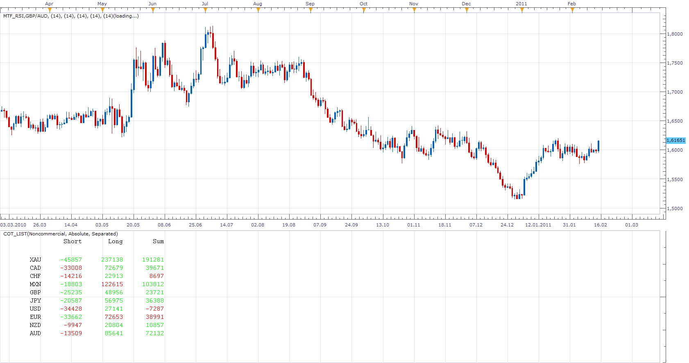

# COT List

> Source: https://fxcodebase.com/code/viewtopic.php?f=17&t=3418  
> Forum: 17 · Topic 3418 · 2 post(s)

---

## COT List

**Apprentice** · Tue Feb 15, 2011 10:22 am

**Unlike like standard COT indicator, List offers simultaneous access to all available COT positions.**

Commitment of Traders (COT) report is published by the Commodity Futures Trading Commission (CFTC).

CFTC divides traders into three groups: Commercial, Non Commercial (large speculators), Small traders (small speculators).

Commercial investors, companies that protect your Long positions (Hedging).

Relative - Percentage Long and Short.

 [COT_List.lua](files/8154/COT_List.lua)

Standard COT indicator is available here
(You do not need to install it.)
[viewtopic.php?f=17&t=1615&hilit=cot](https://fxcodebase.com/code/viewtopic.php?f=17&t=1615&hilit=cot)

---

## Re: COT List

**Apprentice** · Thu Mar 16, 2017 9:22 am

Indicator was revised and updated.
