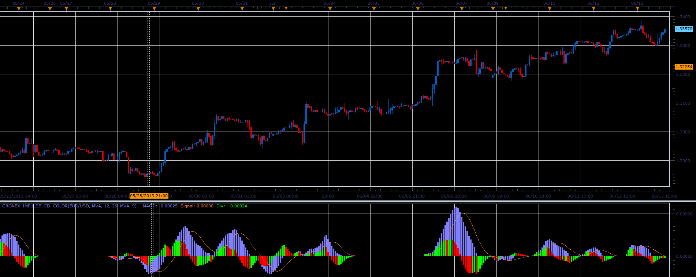

# Cronex Impulse CD Color oscillator

> Source: https://fxcodebase.com/code/viewtopic.php?f=17&t=41318  
> Forum: 17 · Topic 41318 · 2 post(s)

---

## Cronex Impulse CD Color oscillator

**Alexander.Gettinger** · Tue Jun 18, 2013 3:14 pm

This indicator is a ported MQL5 indicator from [http://www.mql5.com/ru/code/1730](http://www.mql5.com/ru/code/1730) (in Russian).

Formulas:
MACD = Fast_MA - Slow_MA_H, if Fast_MA>Slow_MA_H,
MACD = Fast_MA - Slow_MA_L, if Fast_MA<=Slow_MA_H,
Signal = MA(MACD, Signal_Period),
Divr = MACD - Signal, where
Fast_MA = MA(Weighted price, Fast_Period),
Slow_MA_H = MA(High price, Slow_Period),
Slow_MA_L = MA(Low price, Slow_Period).

 

Download:

 [Cronex_Impulse_CD_Color.lua](files/67547/Cronex_Impulse_CD_Color.lua)

For this indicator must be installed Averages indicator ([viewtopic.php?f=17&t=2430](https://fxcodebase.com/code/viewtopic.php?f=17&t=2430)).

The indicator was revised and updated

---

## Re: Cronex Impulse CD Color oscillator

**Apprentice** · Sat May 27, 2017 11:57 am

Indicator was revised and updated.
