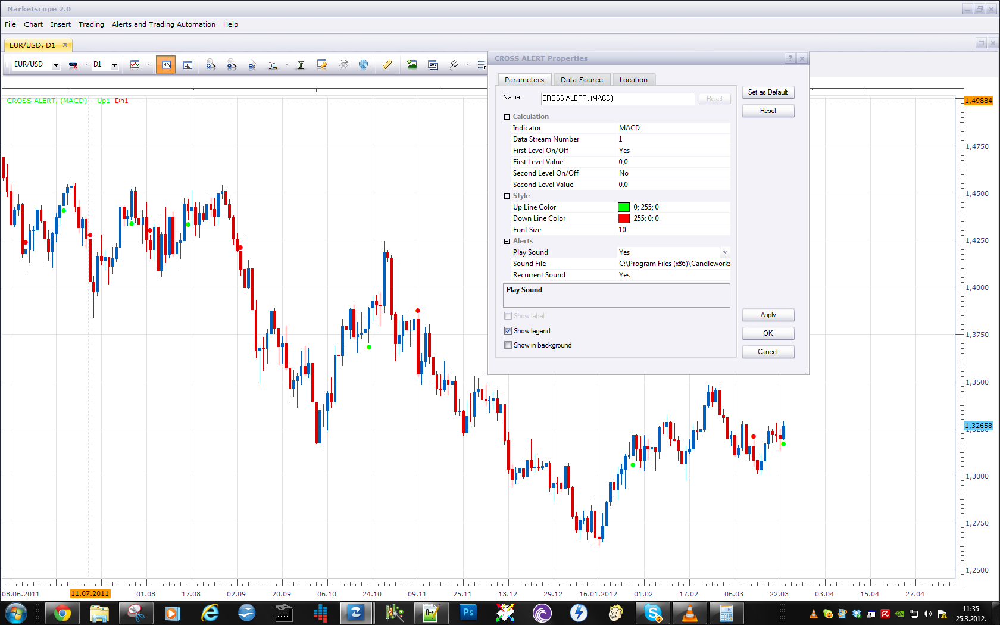
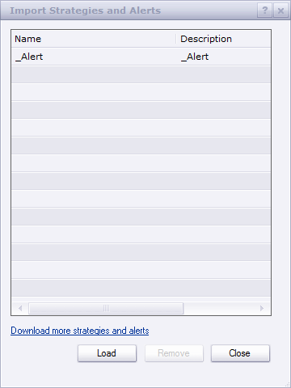

# Cross Alert

> Source: https://fxcodebase.com/code/viewtopic.php?f=17&t=14980  
> Forum: 17 · Topic 14980 · 14 post(s)

---

## Cross Alert

**Apprentice** · Wed Mar 21, 2012 4:42 am

This indicator gives you the ability to define up to two lines.
If the selected indicator cross that line, Audio and On Screen Alert is given.

 [Cross Alert.lua](files/28379/Cross%20Alert.lua)

In this example, the alert is given, whenever RSI cross 50 line.
Dec 22, 2015: Compatibility issue Fix. _Alert helper is not longer needed.

The indicator was revised and updated

---

## Re: Cross Alert

**amazon1a** · Fri Mar 23, 2012 1:13 pm

Hi, I can not get this to work with MACD. I have set up MACD with the default parameters, but I do not see the dots lined up with the crosses on the price chart. I have the first and second levels ON and used a value of 1 for both because I did not know what else to use. Also, I see only dots in the past but not the present. Again, they do not correspond to crosses. Am I doing something wrong?

---

## Re: Cross Alert

**Apprentice** · Sun Mar 25, 2012 4:29 am

I tested this indicator.
No problem detected, the truth i have make this test during the weekend and I could not test the live signals. Try to copy paste this parameters.

 

For live AUdio signals, you need to have an active Alert Signal is trading station.
Use this interface.

 

---

## Re: Cross Alert

**amazon1a** · Sun Mar 25, 2012 5:41 pm

Thanks for your response on the weekend. I have attached a screen shot which shows the problem more clearly. The most recent cross for the EURUSD pair on a daily chart is OK, but none of the crosses before are accurate. Maybe it will work better going forward than with historical data.

---

## Re: Cross Alert

**Apprentice** · Tue Mar 27, 2012 4:05 am

The indicator currently does not support two streams a crossover.
You have defined the zero as the level of interest.
The indicator shows the MACD / zero crossovers.

---

## Re: Cross Alert

**Nifty12** · Wed Mar 28, 2012 5:16 am

Hi Could you explain how to set up the Cross Alert for either 2 MA crosses or a price cross of a MA.
Also how to set up and use the the first and second level values and the On/off settings?
I have not been able to find enough info on this and it looks like just what I need. Thanks

---

## Re: Cross Alert

**Apprentice** · Wed Mar 28, 2012 6:37 am

Price and Other Indikators Cross is currently not supported,, for now.
You can only define a horizontal line.
When the indicator, cross this line, you'll get the alert.

---

## Re: Cross Alert

**alpha_bravo** · Mon Apr 02, 2012 12:06 pm

Hey Apprentice,

Nice one with the indicator, is there any way to get it to work on BETVOL_V2...

[viewtopic.php?f=17&t=4037&p=10204&hilit=BETVOL_V2#p10204](https://fxcodebase.com/code/viewtopic.php?f=17&t=4037&p=10204&hilit=BETVOL_V2#p10204)

It lets me load the betvol indicator in the Cross Alert pallet options, and it also lets me define a value, but i get no signal??

---

## Re: Cross Alert

**alpha_bravo** · Mon Apr 02, 2012 12:11 pm

Sorry, here is my screen shot...should i be using a different stream number?

---

## Re: Cross Alert

**Apprentice** · Tue Apr 03, 2012 2:34 am

You have to set, Play Sound to Yes.
Also, _Alert.lua must be active, to pull this through.

---

## Re: Cross Alert

**alpha_bravo** · Tue Apr 03, 2012 6:17 pm

Ahh i see, i had the sound turned on, but i was loading _Alert.lua in the indicators...insted of stratigies . So i have it working now, but the problem now is that it gives an alert on every candle, because the starting value is below the value i have choosen in betvol_v2.

It alerts me on every new candle open, surely that defeats the purpose? Is it possible to add an option to only alert when it actually crosses the given value from below?

cheers.

---

## Re: Cross Alert

**Apprentice** · Wed Apr 04, 2012 2:01 am

This is possible.
It is difficult to make, one that fits all situations, but I will try something.

---

## Re: Cross Alert

**Apprentice** · Sun Apr 02, 2017 7:42 am

Indicator was revised and updated.

---

## Re: Cross Alert

**mayk01** · Fri Jul 05, 2024 10:06 am

It breaks after the first alarm, but it's very useful.
