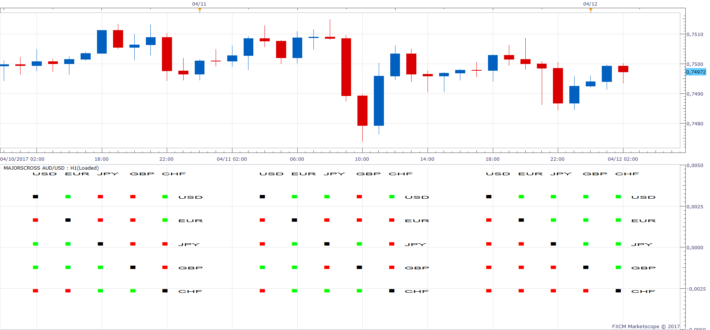

# Cross

> Source: https://fxcodebase.com/code/viewtopic.php?f=17&t=2243  
> Forum: 17 · Topic 2243 · 5 post(s)

---

## Cross

**Apprentice** · Wed Sep 22, 2010 12:28 pm

This is the first indicator of this type.
Its advantage is that it allows the presentation of a large amount of information.
In fact, half of the data presented is Redudant

One possible application is an insight into the status of several indicators for individual currency pairs.

Specifically this indicator lets you view the cross referec of all major currency pairs.

Now the interesting part, on three separate time frames.
So at a glance you can see that currencies weaken or strengthen.
I plan to add a little more exotic currency pair.

Add percentage view.
Or allow you to create your own Cross,
But this might let to someone with a little more experience.

Keep in mind that this concept, the first version.
Suggestions are welcome, bugs are possible.

Support for ease implementation, is in development.

I wrote two versions.
Each supports different combinations of currency pairs.

**Make sure you are subscribed to all currency pairs that are used by Cross.**

"USD","EUR","JPY", "GBP", "CHF" CROSS

 [MajorsCross.lua](files/4708/MajorsCross.lua)

To work You would need to be, subscribed to all this pairs.
"EUR/USD" ,"USD/JPY", "GBP/USD","USD/CHF", "EUR/JPY", "EUR/GBP", "EUR/CHF","GBP/JPY","CHF/JPY", "GBP/CHF"

"USD","JPY","AUD", "CAD", "NZD" CROSS

 [MinorCross.lua](files/4708/MinorCross.lua)

To work You would need to be, subscribed to all this pairs.
"USD/JPY", "AUD/USD","USD/CAD", "NZD/USD", "AUD/JPY", "AUD/CAD","AUD/NZD","NZD/CAD", "CAD/JPY", "NZD/JPY"

The old version could be interesting for developers.

---

## Re: Cross

**jackfx09** · Wed Jan 25, 2012 9:51 am

Apprentice,

Any chance on updating this panel. It is a great piece of work that all should appreciate!

Thanks!
sjc

---

## Re: Cross

**Apprentice** · Wed Jan 25, 2012 6:26 pm

Your request is added to the developmental cue.

---

## Re: Cross

**Apprentice** · Fri Jan 27, 2012 3:18 am

Updated in order to use many functions that were not available at the time of the first version.

---

## Re: Cross

**Apprentice** · Wed Feb 21, 2018 10:31 am

The Indicator was revised and updated.
