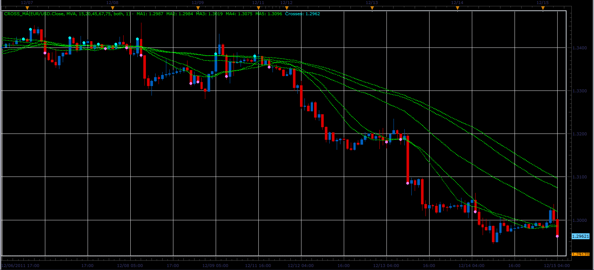

# CrossMA indicator

> Source: https://fxcodebase.com/code/viewtopic.php?f=17&t=9701  
> Forum: 17 · Topic 9701 · 3 post(s)

---

## CrossMA indicator

**Alexander.Gettinger** · Thu Dec 15, 2011 4:50 am

The indicator draws a set of averages ([viewtopic.php?f=17&t=9568](https://fxcodebase.com/code/viewtopic.php?f=17&t=9568)) and indicates if the price is on one side of all of MA.

 

Download:

 [Cross_MA.lua](files/20694/Cross_MA.lua)

For this indicator must be installed Averages indicator from [viewtopic.php?f=17&t=2430](https://fxcodebase.com/code/viewtopic.php?f=17&t=2430)

The indicator was revised and updated

---

## Re: CrossMA indicator

**Alexander.Gettinger** · Thu Feb 23, 2012 11:03 am

CrossMA indicator with VAMA

Download:

 [Cross_VAMA.lua](files/26697/Cross_VAMA.lua)

For this indicator must be installed VAMA indicator from [viewtopic.php?f=17&t=2349](https://fxcodebase.com/code/viewtopic.php?f=17&t=2349).

---

## Re: CrossMA indicator

**Apprentice** · Mon Mar 27, 2017 4:01 pm

Indicator was revised and updated.
