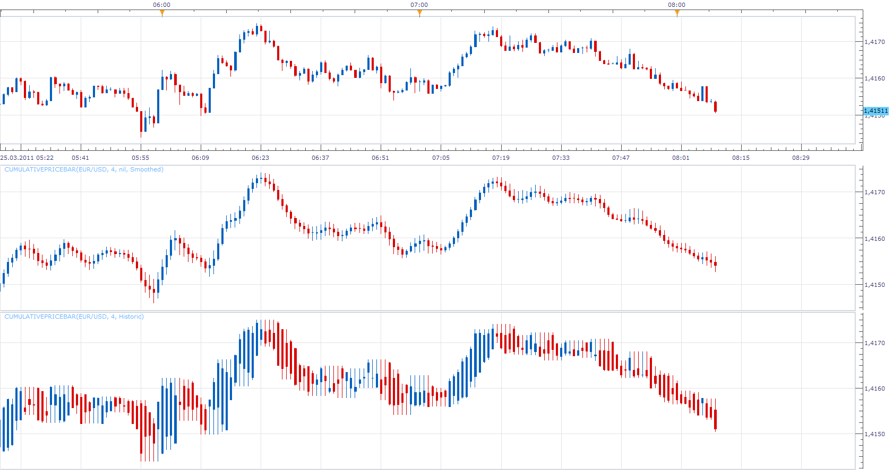

# Cumulative Price Bar

> Source: https://fxcodebase.com/code/viewtopic.php?f=17&t=3729  
> Forum: 17 · Topic 3729 · 4 post(s)

---

## Cumulative Price Bar

**Apprentice** · Fri Mar 25, 2011 7:18 am

This indicator shows the Price action in the last N periods with a single candle.

There are two modes.
Historic and Smoothed.

Smoothed
Candles are formed on the basis of moving average of the last N periods of the individual components.

Historic
Candles are formed, based on open, low, high, close values ​​of the last N periods.
If the period is zero, the indicator does not differ from the Main Chart Price Data.

 [CumulativePriceBar.lua](files/9056/CumulativePriceBar.lua)

To use Smoothed Mode you need to install Averages Indicator.
You can find it here.
[viewtopic.php?f=17&t=2430&p=5268&hilit=averages#p5268](https://fxcodebase.com/code/viewtopic.php?f=17&t=2430&p=5268&hilit=averages#p5268)

 

In contrast to the above versions, Tick Time Frame Timed Cumulative Price Bar have candle duration determined in seconds.

 [Tick Time Frame Timed Cumulative Price Bar.lua](files/9056/Tick%20Time%20Frame%20Timed%20Cumulative%20Price%20Bar.lua)

The indicator was revised and updated

---

## Re: Cumulative Price Bar

**Apprentice** · Sat Feb 18, 2017 5:36 am

Indicator was revised and updated.

---

## Re: Cumulative Price Bar

**ekonom29** · Thu Mar 02, 2017 12:23 am

can it have anchor time

example i want to start the calculation at 6 pm on 1minute chart so it use candle 6pm as acnhor point to calcute cumulative price bar,

---

## Re: Cumulative Price Bar

**Apprentice** · Sun May 07, 2017 6:47 am

Tick Time Frame Timed Cumulative Price Bar.lua added.
