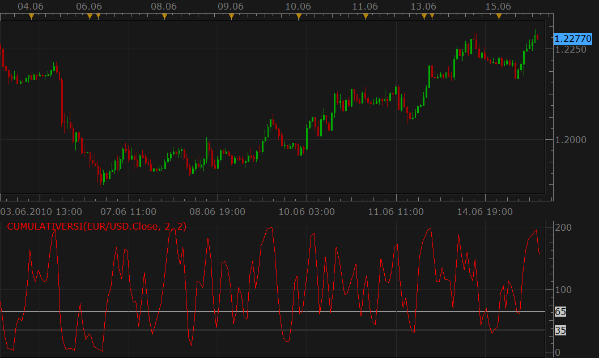

# Cumulative RSI

> Source: https://fxcodebase.com/code/viewtopic.php?f=17&t=1340  
> Forum: 17 · Topic 1340 · 3 post(s)

---

## Cumulative RSI

**Nikolay.Gekht** · Tue Jun 15, 2010 9:13 am

The cumulative RSI is intended to be used in cumulative RSI strategy described in Chapter 9 of Trading Strategies That Work by Larry Connors and Cesar Alvarez.

The formula is pretty simple:
CumulativeRSI = SUM(RSI(N), X)

The book recommends to use the small numbers for N and X, such as 2.

 

Download:

 [CumulativeRSI.lua](files/2561/CumulativeRSI.lua)

See also CumulativeRSI signal: [viewtopic.php?f=29&t=1341](https://fxcodebase.com/code/viewtopic.php?f=29&t=1341)

The indicator was revised and updated

---

## Re: Cumulative RSI

**Alexander.Gettinger** · Fri Jan 09, 2015 4:17 pm

MQL4 version of Cumulative RSI oscillator: [viewtopic.php?f=38&t=61694](https://fxcodebase.com/code/viewtopic.php?f=38&t=61694).

---

## Re: Cumulative RSI

**Apprentice** · Tue Jul 18, 2017 7:50 am

The indicator was revised and updated.
