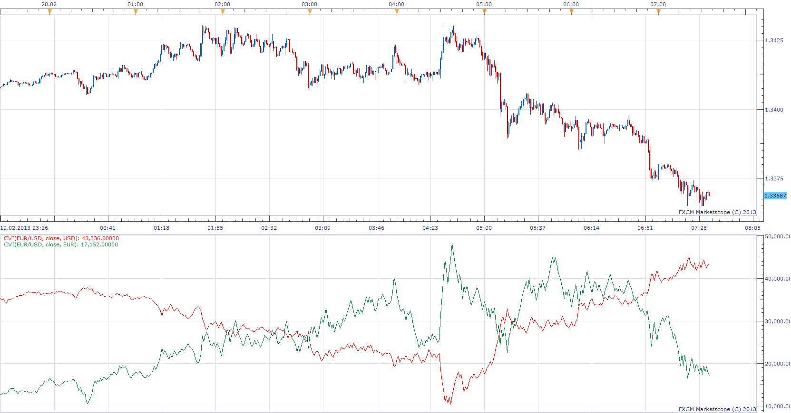
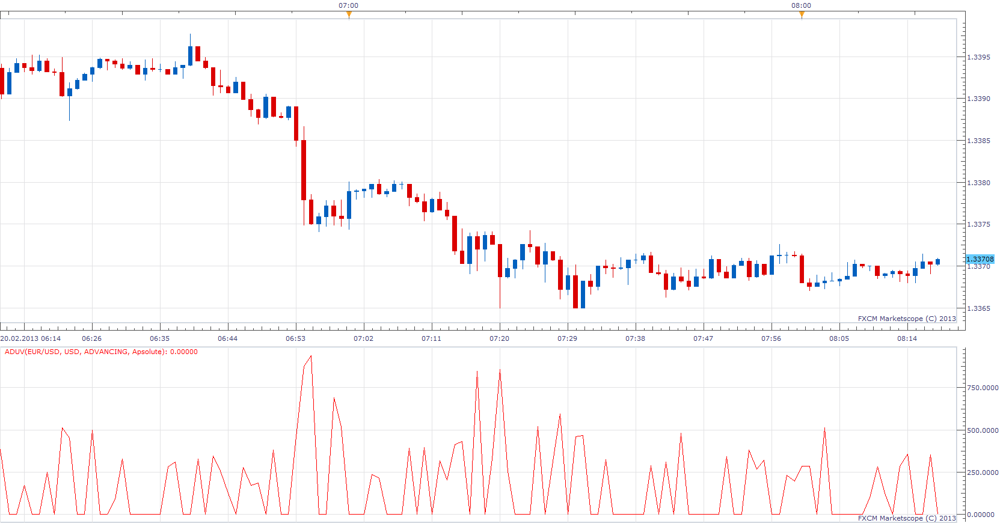
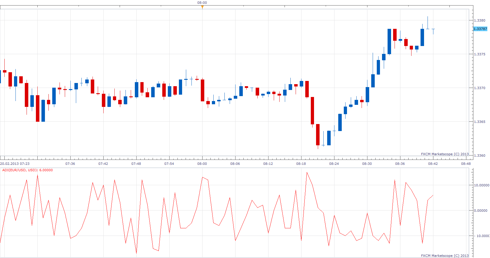

# CUMULATIVE VOLUME INDEX

> Source: https://fxcodebase.com/code/viewtopic.php?f=17&t=32247  
> Forum: 17 · Topic 32247 · 12 post(s)

---

## CUMULATIVE VOLUME INDEX

**Apprentice** · Wed Feb 20, 2013 9:00 am

The Cumulative Volume Index ("CVI") is a market momentum indicator that shows whether money is flowing into or out of the stock market. It is calculated by subtracting the volume of declining stocks from the volume of advancing stocks, and then adding this value to a running total.

CVI = Prev CVI + Advancing Volume - Declining Volume

Forex implementation is faced with certain problems.
The absence of the classic Volume, lack of common denominator.
I have walked around this problem by offering a choice of Base Currency.
For selected base currency, CVI is calculated for all the currency pairs that have selected currency.

 [CVI.lua](files/54969/CVI.lua)

MQ4/MT4 version
[viewtopic.php?f=38&t=67145&p=122720#p122720](https://fxcodebase.com/code/viewtopic.php?f=38&t=67145&p=122720#p122720)

---

## ADVANCING, DECLINING, UNCHANGED VOLUME

**Apprentice** · Wed Feb 20, 2013 9:32 am

Advancing volume is the total volume for all securities that advanced in price. Declining volume is the total volume for all securities that declined in price. And similarly, unchanged volume is the total volume for all securities that were unchanged in price.
All calculation is based on the Base Currency.

 [ADUV.lua](files/54970/ADUV.lua)

---

## ADVANCING-DECLINING ISSUES

**Apprentice** · Wed Feb 20, 2013 10:01 am

ADVANCING-DECLINING ISSUES is difference between the number of advancing and declining issues.

 [ADI.lua](files/54971/ADI.lua)

ADVANCING-DECLINING RATIO is ratio between the number of advancing and declining issues.

 [ADR.lua](files/54971/ADR.lua)

---

## Re: CUMULATIVE VOLUME INDEX

**Jeffreyvnlk** · Tue May 07, 2013 5:42 pm

If possible, could you give some hints to apply those for trading ?

---

## Re: CUMULATIVE VOLUME INDEX

**Apprentice** · Wed May 08, 2013 5:54 am

Unfortunately i can not be of much help.
As you know, usually I do not use indicators in my trading.

As I understand it, CVI can be used for detection of major turning points.
Techniques like divergence can be used.

---

## Re: CUMULATIVE VOLUME INDEX

**smtm11** · Thu May 23, 2013 3:40 am

Which trading platform did you use to get the CVI indicator ? I dont recognize it.

---

## Re: CUMULATIVE VOLUME INDEX

**Apprentice** · Fri May 24, 2013 3:36 am

I have used, FXCM Trade Station 2, MarketScope Charting Package.

---

## Re: CUMULATIVE VOLUME INDEX

**Apprentice** · Fri Jun 22, 2018 8:02 am

The indicator was revised and updated.

---

## Re: CUMULATIVE VOLUME INDEX

**logicgate** · Tue Dec 11, 2018 9:06 pm

Would you be so kind to compile a MT4 version please??

---

## Re: CUMULATIVE VOLUME INDEX

**Apprentice** · Wed Dec 12, 2018 5:46 am

Your request is added to the development list under Id Number 4354

---

## Re: CUMULATIVE VOLUME INDEX

**Apprentice** · Wed Dec 12, 2018 7:54 am

MQ4/MT4 version
[viewtopic.php?f=38&t=67145&p=122720#p](https://fxcodebase.com/code/viewtopic.php?f=38&t=67145&p=122720#p)

---

## Re: CUMULATIVE VOLUME INDEX

**logicgate** · Wed Dec 12, 2018 1:51 pm

> **Apprentice wrote:**
> Your request is added to the development list under Id Number 4354

Thanks a lot brother, God Bless and good trades!
