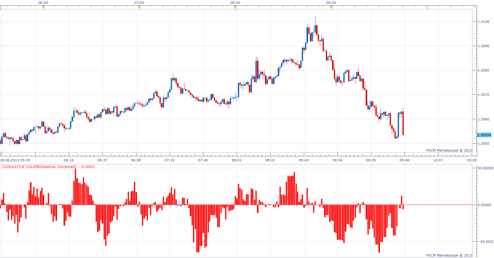
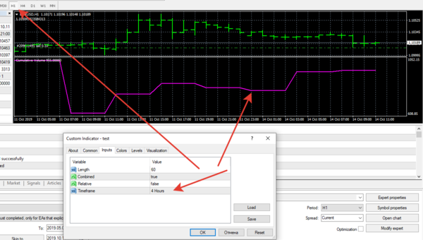
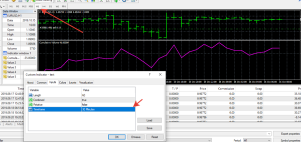

# Cumulative Volume

> Source: https://fxcodebase.com/code/viewtopic.php?f=17&t=42392  
> Forum: 17 · Topic 42392 · 47 post(s)

---

## Cumulative Volume

**Apprentice** · Fri Jun 28, 2013 8:09 am

*Separated/Relative*

 

*Cumulative/Relative*

An interesting way of presenting volume date.
Will show the total volume for the selected period.
U can choose between.
Relative and Absolute presentation.
Cumulative or Separated (Up/Down) data presentation.

 [Cumulative Volume.lua](files/68911/Cumulative%20Volume.lua)

 [Session Cumulative Volume.lua](files/68911/Session%20Cumulative%20Volume.lua)

Indicator-based strategy.
[viewtopic.php?f=31&t=68960](https://fxcodebase.com/code/viewtopic.php?f=31&t=68960)

This version will simplify the presentation
while offering more information.
[https://fxcodebase.com/code/viewtopic.php?f=17&t=72518](https://fxcodebase.com/code/viewtopic.php?f=17&t=72518)

---

## Re: Cumulative Volume

**Alexander.Gettinger** · Tue Aug 13, 2013 2:14 pm

MQL4 version of Cumulative Volume: [viewtopic.php?f=38&t=59087](https://fxcodebase.com/code/viewtopic.php?f=38&t=59087)

---

## Re: Cumulative Volume

**Apprentice** · Fri Jun 09, 2017 7:47 am

The indicator was revised and updated.

---

## Re: Cumulative Volume

**jaricarr** · Thu Aug 31, 2017 10:50 pm

Hi Apprentice,

It doesn't seem to be working.

---

## Re: Cumulative Volume

**Apprentice** · Fri Sep 01, 2017 4:13 am

Works for me.

---

## Re: Cumulative Volume

**Apprentice** · Sun Feb 18, 2018 7:45 am

The indicator was revised and updated.

---

## Re: Cumulative Volume

**logicgate** · Mon Sep 09, 2019 10:48 am

Hi there dear friend;

Can you please revise and update this MT4 version?

I find it weird that this one also is not loading on the tick chart on a live chart, but it works if loaded on a tick chart generated in the simulator.

The pips pay my bills buy sell pressure now decided to work on the tick chart live, go figure.

---

## Re: Cumulative Volume

**Apprentice** · Tue Sep 10, 2019 7:53 am

Your request is added to the development list.
Development reference 55.

---

## Re: Cumulative Volume

**Apprentice** · Wed Sep 11, 2019 6:17 am

[Cumulative_Volume v1.2.mq4](files/128578/Cumulative_Volume%20v1.2.mq4)

Try this version.

---

## Re: Cumulative Volume

**logicgate** · Wed Sep 11, 2019 7:52 am

Gonna test it now, thanks!

---

## Re: Cumulative Volume

**logicgate** · Thu Sep 12, 2019 11:23 am

> **Apprentice wrote:**
>
>
> The attachment **Cumulative_Volume v1.2.mq4** is no longer available
>
>
> Try this version.

Works exactly the same as the 1.1 version, still not loading on the live tick chart. I am attaching an indicator here that I am using to generate tick charts, it might help you figure out why the cumulative volume indicator is not plotting, but all other indicators work.

---

## Re: Cumulative Volume

**logicgate** · Thu Sep 12, 2019 12:08 pm

Check this out, it is weird that it works on the tick chart generated when using the simulator but does not work on the live chart, check the screenshot posted here. You could take a look at the pips pay my bills code (which works on the tick live chart) and compare with the cumulative volume and see what is different there.

---

## Re: Cumulative Volume

**logicgate** · Thu Sep 12, 2019 1:18 pm

Dear friend apprentice, no need to waste your time with this anymore, I discovered that the cumulative volume indi won´t work on tick charts of 89 ticks. From 144 ticks upwards it works.

---

## Re: Cumulative Volume

**Gilles** · Wed Sep 25, 2019 4:37 am

Hi apprentice,
Can you make a strategy based on

Cumulative volume (Relative, Separated)

if top positiv > +50 = BUY
if lower negativ < -50 = SELL

See you soon :)

---

## Re: Cumulative Volume

**Apprentice** · Sat Sep 28, 2019 3:58 pm

Try this version.
[viewtopic.php?f=31&t=68960](https://fxcodebase.com/code/viewtopic.php?f=31&t=68960)
Make sure to re-download/install the indicator.

---

## Re: Cumulative Volume

**logicgate** · Thu Oct 03, 2019 3:29 pm

> **Apprentice wrote:**
>
>
> Cumulative_Volume v1.2.mq4
>
>
> Try this version.

Hi there dear friend Apprentice.

I think this indicator would benefit from that option to choose the timeframe, can you add it please?

---

## Re: Cumulative Volume

**Apprentice** · Wed Oct 09, 2019 10:57 am

Your request is added to the development list.
Development reference 160.

---

## Re: Cumulative Volume

**Apprentice** · Thu Oct 10, 2019 12:54 pm

[Cumulative_Volume_v1.3.mq4](files/129124/Cumulative_Volume_v1.3.mq4)

Try this version.

---

## Re: Cumulative Volume

**logicgate** · Thu Oct 10, 2019 4:10 pm

Hi there buddy,

When choosing a timeframe other than current, the indicator does not work, the line stays flat.

---

## Re: Cumulative Volume

**Apprentice** · Mon Oct 14, 2019 5:27 am

I don't have any issues. It's likely MT4 doesn't have higher timeframe loaded.

---

## Re: Cumulative Volume

**logicgate** · Mon Oct 14, 2019 4:11 pm

Hi there buddy. Already tried all combinations and with all timeframes loaded, it still only works if set to "current timeframe", otherwise I get a flatline. Check the screenshot, I have practically all timeframes there on opened charts. You can see I have loaded the indicator on a 4H chart, then I tried choosing 1M, 5M, 15M, 30M, 1H, and I only get a flat line on the indicator, then when set to current timeframe it works.

---

## Re: Cumulative Volume

**Apprentice** · Wed Oct 16, 2019 8:37 am

Everything works, the issue in your terminal/history.

---

## Re: Cumulative Volume

**logicgate** · Wed Oct 16, 2019 10:39 am

Can you please help me fix that? What should I do?

---

## Re: Cumulative Volume

**logicgate** · Wed Oct 16, 2019 11:14 am

Hi buddy, it started working now, have no clue why it wasn´t before!

---

## Re: Cumulative Volume

**logicgate** · Sat Jul 11, 2020 10:48 am

> **Apprentice wrote:**
>
>
> Cumulative_Volume_v1.3.mq4
>
>
> Try this version.

Please dear friend Apprentice, one more option that can be added to this indi is the "reset" time input. For example, I would like the calculation to reset to zero after a new daily bar forms, or NY session starts.

Best regards

---

## Re: Cumulative Volume

**Apprentice** · Sat Jul 11, 2020 3:43 pm

Your request is added to the development list.
Development reference 1669.

---

## Re: Cumulative Volume

**Apprentice** · Mon Jul 13, 2020 8:52 am

it doesn't rely on the previous values. There is nothing to reset.

Currently, we have
1 2 3 4 5 NOW
Average of last X candles.

We may only use the Vwap approach.
1 2 3 [break] 4 5 NOW
NOW
4 NOW
4 5 NOW
Averaging only elements after the break,
with a variable period,
starting with 1, on first candle after the break
 then 2 ...

---

## Re: Cumulative Volume

**logicgate** · Mon Jul 13, 2020 5:46 pm

Hi there dear friend.

I don´t understand, why it can´t start from zero at a determined time interval?

Check the image, I have edited the image on the bottom to show one example of the calculation starting at zero every day break:

---

## Re: Cumulative Volume

**logicgate** · Mon Jul 13, 2020 5:54 pm

Sorry I forgot to add this comment in my last post:

I don´t understand why there is a moving average in this indicator? (the "length" parameter)

I thought that the formula was: up ticks minus down ticks per bar = X value, right (the net value of volume)? Then the net value of each bar was summed to the previous and a running total is plotted. Why not plot the raw cumulated value? No need for a moving average to smooth anything. Anyways, I still don´t understand why the value cannot be brought to zero at a determined reset interval.

Best regards

---

## Re: Cumulative Volume

**Apprentice** · Tue Jul 14, 2020 4:41 am

Will try to write something.
iMA is used as simple method to get period sum.

Avg = Sum/Period
Sum= Avg*Period

---

## Re: Cumulative Volume

**logicgate** · Tue Jul 14, 2020 7:34 am

Thanks buddy, I recommend that you take a look at the code of the cumulative delta indicator I posted in the other thread/request. That is the best delta I have ever seen in MT4, you need to check what formula is being used. It just works beautifully, but has the awful limitation of only starting plotting data when you load it. There has to be a way to make it load at least a week or two of data on the chart. It needed to look at the M1 data( the .hst history file) to do that when it get´s launched.

---

## Re: Cumulative Volume

**Apprentice** · Tue Jul 14, 2020 9:18 am

Something like Session Cumulative Volume.lua
[viewtopic.php?f=17&t=42392](https://fxcodebase.com/code/viewtopic.php?f=17&t=42392)

---

## Re: Cumulative Volume

**logicgate** · Wed Jul 15, 2020 5:48 am

> **Apprentice wrote:**
> Something like Session Cumulative Volume.lua
> [viewtopic.php?f=17&t=42392](https://fxcodebase.com/code/viewtopic.php?f=17&t=42392)

I don´t know, but I prefer the cumulative delta data plotted with candles for each bar, not histograms or lines.

---

## Re: Cumulative Volume

**Apprentice** · Fri Sep 18, 2020 8:22 am

Based on Request 1669

 [Cumulative_Volume_v1.4.mq4](files/137734/Cumulative_Volume_v1.4.mq4)

---

## Re: Cumulative Volume

**logicgate** · Thu Sep 24, 2020 8:39 am

Thanks buddy, gonna test it today

---

## Re: Cumulative Volume

**logicgate** · Sun Apr 24, 2022 6:04 am

Hi there dear friend Apprentice.

It would be great if we could get the cumulative volume V1.4 for MT5 too.

Best regards

---

## Re: Cumulative Volume

**Apprentice** · Mon Apr 25, 2022 7:32 am

Your request is added to the development list.
Development reference 259.

---

## Re: Cumulative Volume

**charli86** · Fri Jun 10, 2022 2:46 pm

> **Apprentice wrote:**
>
>
> Cumulative_Volume_v1.3.mq4
>
>
> Try this version.

Thanks for the indicator, it is amazing, if possible please, I just need an alarm(and arrow if possible) when levels 20 and -20 are reached....Thank you in advance!!!!

---

## Re: Cumulative Volume

**Apprentice** · Wed Jun 15, 2022 1:55 pm

We have added your request to the development list.
Development reference 358.

---

## Re: Cumulative Volume

**charli86** · Mon Jun 20, 2022 9:51 am

> **Apprentice wrote:**
> We have added your request to the development list.
> Development reference 358.

Thank you.

---

## Re: Cumulative Volume

**logicgate** · Tue Jul 12, 2022 12:22 pm

> **Apprentice wrote:**
> Your request is added to the development list.
> Development reference 259.

Hello my friend!

The latest version of the Cumulative Volume never saw the light of day for MT5?

---

## Re: Cumulative Volume

**logicgate** · Sun Jul 24, 2022 5:45 am

Another request for this indicator (besides adding multi timeframe input to the regular version):

Can you turn it into an index to display the data like an oscillator? From 0 to 100

---

## Re: Cumulative Volume

**logicgate** · Fri Nov 22, 2024 5:18 am

Cumulative Delta for MT5 from latest request in this thread never came to fruition.

---

## Re: Cumulative Volume

**Apprentice** · Fri Aug 01, 2025 5:54 am

[Cumulative_Volume_v1.5 Alert.mq4](files/160097/Cumulative_Volume_v1.5%20Alert.mq4)

 [Cumulative_Volume_v1.5 Alert.mq5](files/160097/Cumulative_Volume_v1.5%20Alert.mq5)

---

## Re: Cumulative Volume

**iardavan** · Fri Aug 22, 2025 6:49 pm

Greetings and respect.
 Could you kindly introduce an indicator, if you know of one, that displays the delta size of each zigzag leg above and below it?
For example, when you adjust the zigzag settings to values like 36 or 275,... it shows the delta numbers of those legs compared to the previous leg.
I’ve marked it with a red arrow in the image.

Or is there an indicator that shows the delta as a histogram at the bottom?

 I want to see if I can achieve a template similar to [https://kissorderflow.com/](https://kissorderflow.com/)
 Thank you for your kindness.

---

## Re: Cumulative Volume

**Apprentice** · Mon Aug 25, 2025 2:33 am

We have added your request to the development list.
Development reference 535

---

## Re: Cumulative Volume

**Apprentice** · Tue Sep 02, 2025 4:00 am

Try this version.
[https://fxcodebase.com/code/viewtopic.php?f=17&t=76289](https://fxcodebase.com/code/viewtopic.php?f=17&t=76289)
