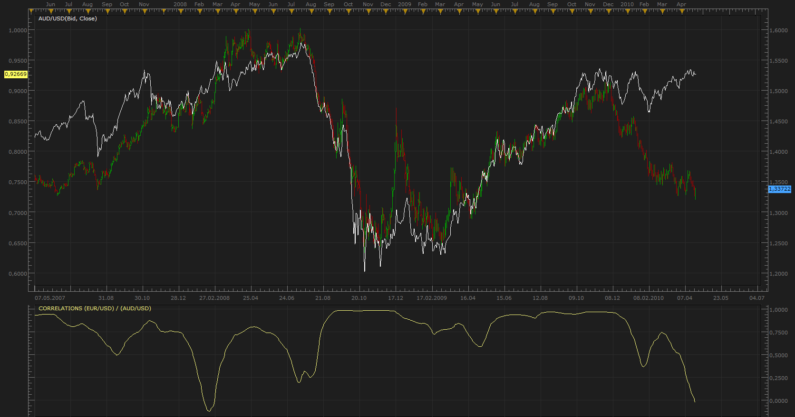

# Currency Correlations

> Source: https://fxcodebase.com/code/viewtopic.php?f=17&t=843  
> Forum: 17 · Topic 843 · 5 post(s)

---

## Currency Correlations

**Apprentice** · Mon Apr 26, 2010 9:15 am

*Correlations*

Please test this indicator, given the proposals for its further development.

A correlation of +1 implies that the two currency pairs will move in the same direction 100% of the time. A correlation of -1 implies the two currency pairs will move in the opposite direction 100% of the time. A correlation of zero implies that the relationship between the currency pairs is completely random.

0.0 Very weak to negligible correlation
0.5 Moderate correlation
1.0 Very strong correlation
(- ) Negative correlation

EUR/USD and USD/EUR have correlation -1,
respectively, EUR/USD and EUR/USD have correlation 1.

One extremely useful tool, Not so much for trading as for the creation of long-term analysis.
Important for risk control and to identify turning point in the market.

 [Correlations.lua](files/1501/Correlations.lua)

The indicator was revised and updated

---

## Re: Currency Correlations

**patick** · Mon Apr 26, 2010 1:36 pm

Love your indicators Apprentice. Thank you very much!

---

## Re: Currency Correlations

**Apprentice** · Sun Dec 05, 2010 12:05 pm

Currency Selector added.

---

## Re: Currency Correlations

**Apprentice** · Sun Jan 25, 2015 12:19 pm

Major Update.

---

## Re: Currency Correlations

**Apprentice** · Sun Jul 02, 2017 12:48 pm

The indicator was revised and updated.
