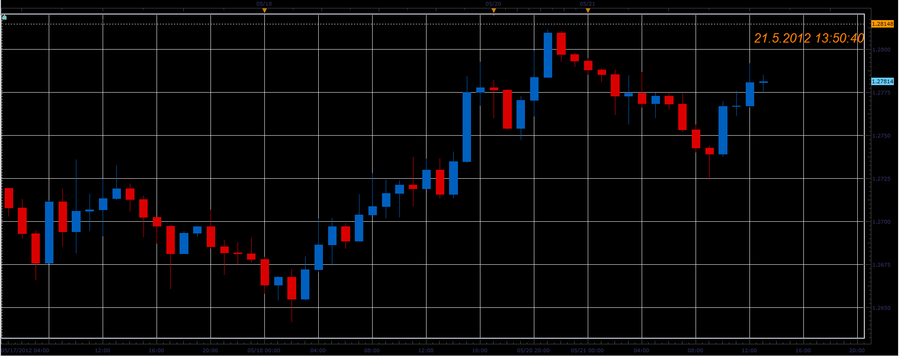

# Current time indicator

> Source: https://fxcodebase.com/code/viewtopic.php?f=17&t=18855  
> Forum: 17 · Topic 18855 · 2 post(s)

---

## Current time indicator

**Alexander.Gettinger** · Mon May 21, 2012 12:53 pm

The indicator shows the current time in the following time zone:
EST time zone
UTC (Coordinated Universal Time)
The user's local time zone
The display time zone (the time zone chosen to display date and time in the host application)
The currently connected server time zone
Financial time (the midnight (0:00:00) is a start of the trading day for the currently connected server).

 

Download:

 [Current_Time_Indicator.lua](files/33678/Current_Time_Indicator.lua)

The indicator was revised and updated

---

## Re: Current time indicator

**Apprentice** · Tue Apr 04, 2017 5:40 am

Indicator was revised and updated.
