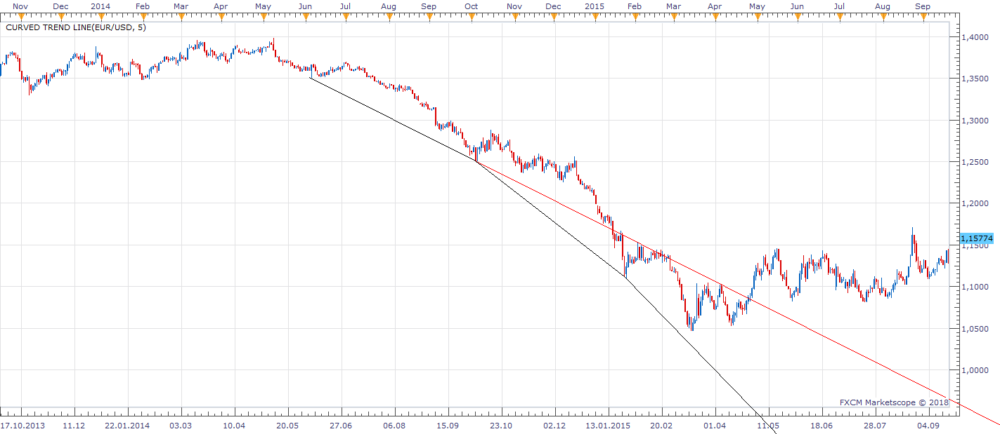
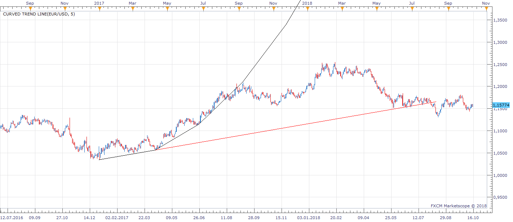
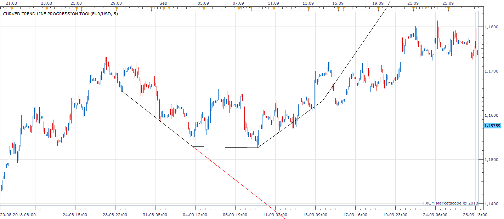
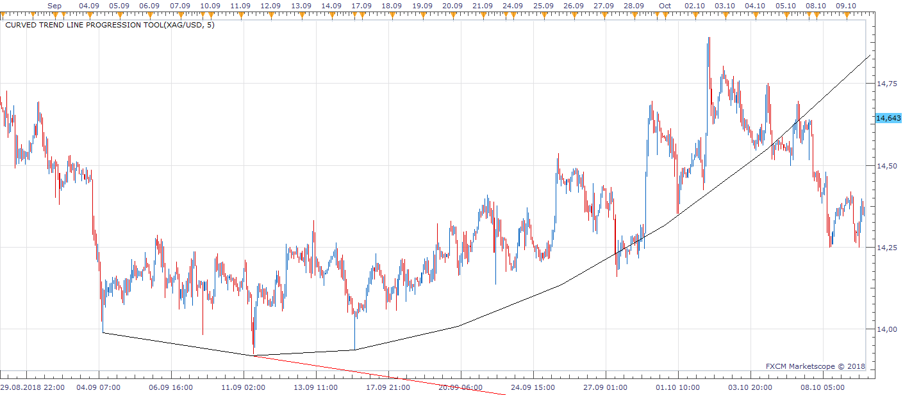
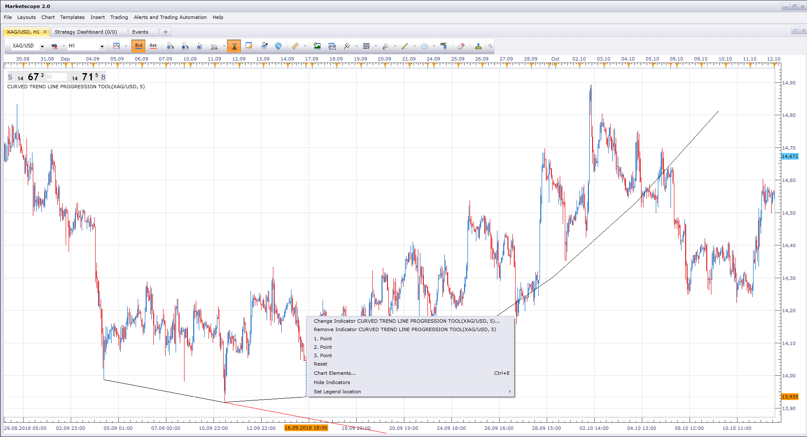
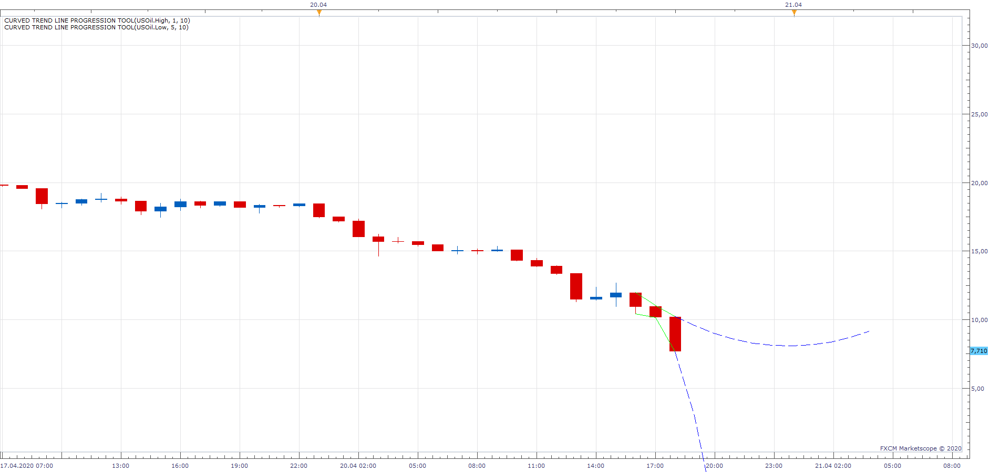

# Curved Trend line Progression Tool

> Source: https://fxcodebase.com/code/viewtopic.php?f=17&t=66833  
> Forum: 17 · Topic 66833 · 11 post(s)

---

## Curved Trend line Progression Tool

**Apprentice** · Mon Oct 15, 2018 3:04 pm

 

 

 

 

 

 

Using Lagrange Interpolation, Based on three points defined by the user, the indicator will try to approximate future trend line progression.

 [Curved Trend line Progression Tool.bin](files/121618/Curved%20Trend%20line%20Progression%20Tool.bin)

 

ZigZag based version with autoselection.

 [ZigZag Trend line Progression Tool.bin](files/121618/ZigZag%20Trend%20line%20Progression%20Tool.bin)

Multi-Line version of the indicator.
[viewtopic.php?f=17&t=69082](https://fxcodebase.com/code/viewtopic.php?f=17&t=69082)

---

## Re: Curved Trend line Progression Tool

**Apprentice** · Fri Oct 26, 2018 4:18 am

Major update.
Please re-download.

---

## Re: Curved Trend line Progression Tool

**Apprentice** · Mon Nov 05, 2018 8:27 am

Channel option added.

---

## Re: Curved Trend line Progression Tool

**Apprentice** · Mon May 13, 2019 10:34 am

Major update.
Please re-download.

---

## Re: Curved Trend line Progression Tool

**SANTOSH** · Mon Jul 01, 2019 6:40 am

Hello Apprentice ,
Instead of user intervention for the three point set up everytime , can you make it as auto- selection ??
The three points selection could be a zig high -low or anything better high low rather than zig .

- Santosh

---

## Re: Curved Trend line Progression Tool

**Apprentice** · Mon Jul 01, 2019 4:04 pm

Try ZigZag Trend line Progression Tool.bin

---

## Re: Curved Trend line Progression Tool

**Apprentice** · Mon Apr 20, 2020 1:14 pm

Last Three Candles Mode added.
Single stream sources allowed.

 

If on, it will draw lines automatically.

 

You only need to select a source (high or low).

---

## Re: Curved Trend line Progression Tool

**Cactus** · Tue May 26, 2020 8:23 pm

This looks very interesting.

I notice when an indicator seems a bit more complex you tend to post it as a .bin extension resource, which is the same as .lua but does not allow for seeing source code as you know. Just like in the case of "pitchfork".
I see potential in this but also some problems. When selecting the points using the "context menu" it is not very precise and time consuming.
Would it be possible to allow for .csv file input for the points? So user can draw multiple trendlines with one indicator, providing it with a .csv file.
Also, can the outputs of these lines be used in strategies as streams with values for every period?
Later we can implement a "lookback" / "backstep" parameter also to draw multiple instances in the past with just one indicator.

Thank you for your hard work

---

## Re: Curved Trend line Progression Tool

**Apprentice** · Wed May 27, 2020 5:04 am

Your request is added to the development list.
Development reference 1368.

---

## Re: Curved Trend line Progression Tool

**Apprentice** · Tue Jun 09, 2020 7:19 am

[Curved_Trend_line_Progression_Tool_csv.lua](files/134724/Curved_Trend_line_Progression_Tool_csv.lua)

 [Curved_Trend_line_Progression_Tool_csv.csv.csv](files/134724/Curved_Trend_line_Progression_Tool_csv.csv.csv)

Try this version.

---

## Re: Curved Trend line Progression Tool

**Cactus** · Fri Dec 18, 2020 10:34 am

> **Apprentice wrote:**
>
>
> Curved_Trend_line_Progression_Tool_csv.lua
>
>
>
>
> Curved_Trend_line_Progression_Tool_csv.csv.csv
>
>
>
> Try this version.

Lovely, thank you
