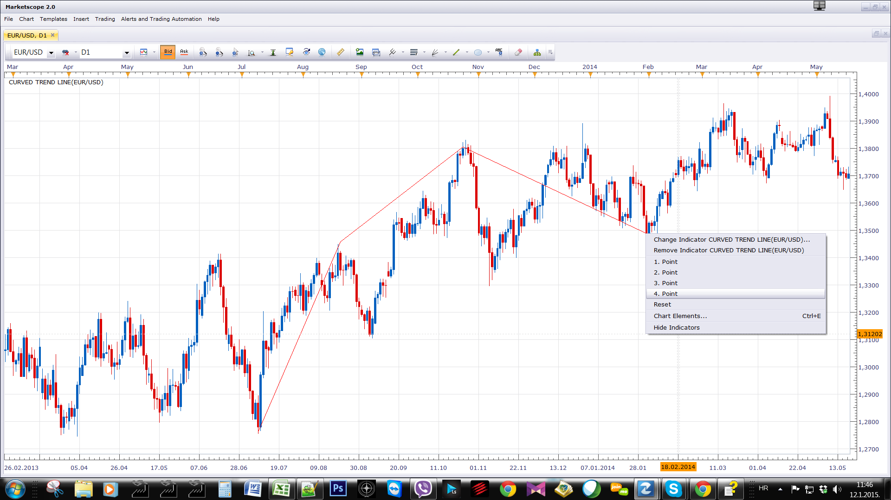
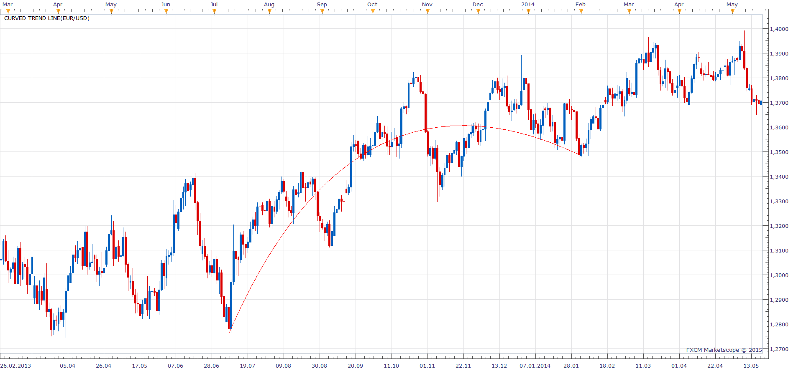

# Curved trend line

> Source: https://fxcodebase.com/code/viewtopic.php?f=17&t=61708  
> Forum: 17 · Topic 61708 · 4 post(s)

---

## Curved trend line

**Apprentice** · Mon Jan 12, 2015 5:43 am

Based on request.
[viewtopic.php?f=44&t=61661&p=98001#p97982](https://fxcodebase.com/code/viewtopic.php?f=44&t=61661&p=98001#p97982)

 

For greater visibility, While using Polyline Line Type.
Define four points.
Second and third points as control points.

 

Change to BezierLine Line Type.

 [Curved trend line.lua](files/98104/Curved%20trend%20line.lua)

---

## Re: Curved trend line

**Taskryr** · Sun Feb 22, 2015 9:17 pm

Is it possible to do the same thing, but with only 3 points instead of 4? Where the arc passes exactly through the three points. Also can the arc project the angle out x number of bars into the future?

Thanks

---

## Re: Curved trend line

**Apprentice** · Tue Feb 24, 2015 6:20 am

Your request is added to the development list.

---

## Re: Curved trend line

**Apprentice** · Mon Feb 05, 2018 10:47 am

The indicator was revised and updated.
