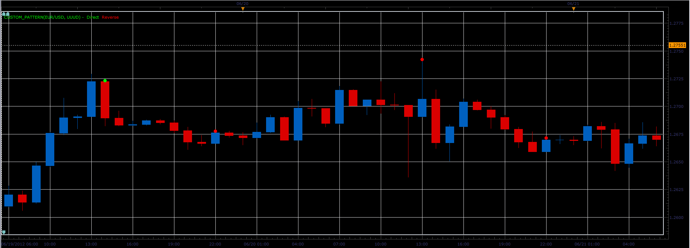
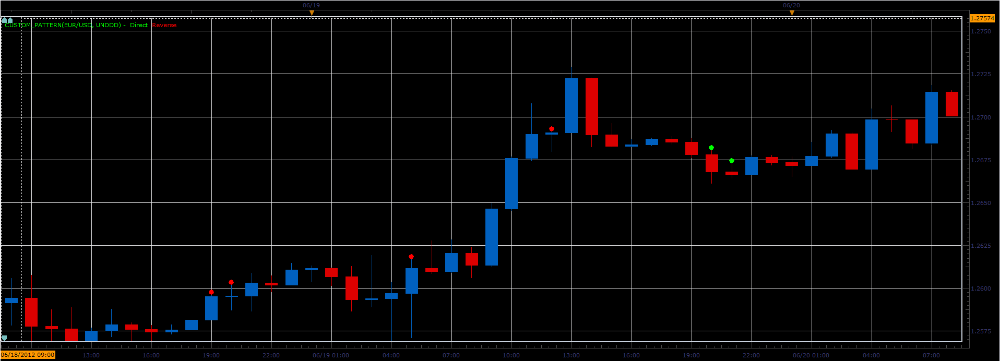

# Custom candle pattern

> Source: https://fxcodebase.com/code/viewtopic.php?f=17&t=20495  
> Forum: 17 · Topic 20495 · 11 post(s)

---

## Custom candle pattern

**Alexander.Gettinger** · Fri Jun 22, 2012 4:41 pm

The indicator provides the user to specify a custom format pattern candle and draws patterns on the chart.
U - UP candle (Close>Open),
D - DOWN candle (Close<Open),
N - Nothing (UP or DOWN).

For example, Pattern="UUUD":

 

Pattern="UNDDD":

 

Download:

 [Custom_Pattern.lua](files/35922/Custom_Pattern.lua)

---

## Re: Custom candle pattern

**Alexander.Gettinger** · Fri Jun 22, 2012 4:42 pm

MQL4 version of this indicator: [viewtopic.php?f=38&t=20494](https://fxcodebase.com/code/viewtopic.php?f=38&t=20494)

---

## Re: Custom candle pattern

**luigipg** · Sat Jun 23, 2012 1:29 am

Please I already required a signal for this indicator, can you do it? Thanks a lot. Luigi!!!

---

## Re: Custom candle pattern

**Alexander.Gettinger** · Mon Jun 25, 2012 4:18 pm

> **luigipg wrote:**
> Please I already required a signal for this indicator, can you do it? Thanks a lot. Luigi!!!

OK.
I will write signal/strategy.

---

## Re: Custom candle pattern

**luigipg** · Tue Jun 26, 2012 1:21 am

Thanks a lot Alexander. Very kind. Luigi!!!

---

## Re: Custom candle pattern

**Alexander.Gettinger** · Tue Jul 17, 2012 4:31 pm

Strategy based on this indicator: [viewtopic.php?f=31&t=21108](https://fxcodebase.com/code/viewtopic.php?f=31&t=21108)

---

## Re: Custom candle pattern

**nookie** · Fri Oct 09, 2015 6:05 am

Hi, I am looking for something similar, recognition of candle in the following way, is that achievable?

if close is more than 60% of price spread > green same dot
if close is less than 40% of price spread > red same dot

---

## Re: Custom candle pattern

**Apprentice** · Mon Oct 12, 2015 5:43 am

Can you define "price spread"?

---

## Re: Custom candle pattern

**nookie** · Mon Oct 12, 2015 10:28 am

Sure, price spread = High - Low

---

## Re: Custom candle pattern

**Apprentice** · Wed Oct 14, 2015 4:27 am

Requested can be found here.
[viewtopic.php?f=17&t=62783&p=102821#p102821](https://fxcodebase.com/code/viewtopic.php?f=17&t=62783&p=102821#p102821)

---

## Re: Custom candle pattern

**Apprentice** · Tue Oct 23, 2018 6:40 am

The indicator was revised and updated.
