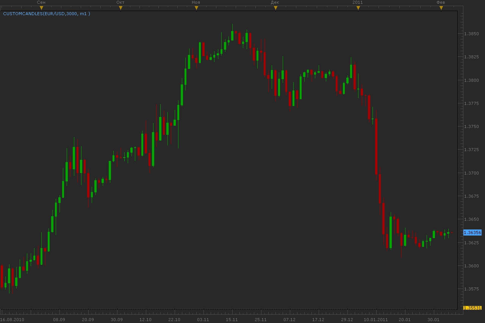
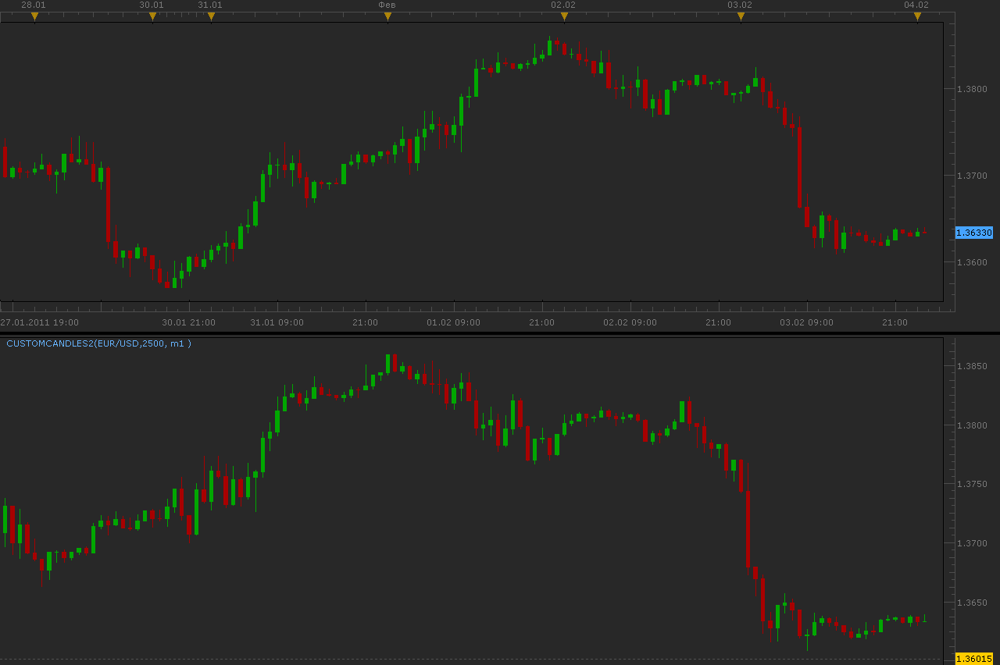

# Custom candles

> Source: https://fxcodebase.com/code/viewtopic.php?f=17&t=3320  
> Forum: 17 · Topic 3320 · 14 post(s)

---

## Custom candles

**Alexander.Gettinger** · Fri Feb 04, 2011 1:28 am

Indicator draw candles with custom timesize.
For example, 3000 second candles picture:

 

Parameters [Time frame to calculate] and [Max. bars on chart] needs for optimization of the calculations, because when use tick data indicator can be calculated long.

Download:

 [CustomCandles.lua](files/7905/CustomCandles.lua)

The indicator was revised and updated

---

## Re: Custom candles

**Alexander.Gettinger** · Fri Feb 04, 2011 1:30 am

Other version of indicator draw candles in additional chart.

 

Download:

 [CustomCandles2.lua](files/7906/CustomCandles2.lua)

---

## Re: Custom candles

**Forexlooser** · Fri Feb 04, 2011 9:43 am

Hello Alex, thank you for this nice Indicator.

Can you create a Multi-Tick Chart ?

Also draw a Candel about 100 or 200 Ticks, not seconds.

Thank you and bye

andy

---

## Re: Custom candles

**Alexander.Gettinger** · Fri Feb 04, 2011 8:38 pm

> **Forexlooser wrote:**
> Can you create a Multi-Tick Chart ?
> andy

I work on this now.

---

## Re: Custom candles

**alextrade** · Sat Feb 05, 2011 12:49 pm

Hi Alex, i was also wondering if you can create a tick chart and show it counting down on the screen, at present i use 1 minute bar candles for my entries but could really do with a 90 tick chart like you can get from tradestation,many thanks.
Alex M

---

## Re: Custom candles

**Alexander.Gettinger** · Tue Feb 08, 2011 3:00 am

> **Forexlooser wrote:**
> Can you create a Multi-Tick Chart ?
> andy

Please see this indicator: [viewtopic.php?f=17&t=3347](https://fxcodebase.com/code/viewtopic.php?f=17&t=3347)

---

## Re: Custom candles

**alextrade** · Tue Feb 08, 2011 4:34 am

Hi Alex , this is perfect exactly what i need, do you no if it is possible to create a entry box when you trade from the charts. i trade in multiples of 3 and i scale out at 15pips 30 pips and 45pips for my targets, so instead of having to enter 3 separate enrtys would it be possible to create a pop up box that you enter your order e.g. ENTRY STOP LIMIT
 1 130.00 129.80 130.15
 2 130.00 129.80 130.30
 3 130.00 129.80 130.45
this would just make life easy and quicker when entering orders, not sure if it can be done but thanks anyway
Alex M.

---

## Re: Custom candles

**Alexander.Gettinger** · Wed Feb 09, 2011 3:58 am

Do you can show picture to I understand what do you want?

---

## Re: Custom candles

**alextrade** · Wed Feb 09, 2011 12:07 pm

If you right click on the charts you go to ORDER ENTRY a box appears i need to modify that box or create a indicator to take 3 orders at 1 time allowing me also to enter a stop loss 3 times and a limit 3 times so that when i make a trade it will take profit at 3 different levels basically the trade will be on auto pilot. i can email you a script for exactly what i want but it is coded for MT4 would this be any help? if so can you provide an email i can send to.. thanks again Alex.

Alex M

---

## Re: Custom candles

**030985** · Fri Apr 27, 2012 10:00 am

Hello,

I was trying this indicator but I do not manage to make it work. This is the error I get when trying to launch it :
"An error occurred during the calculation of the indicator 'CUSTOMCANDLES'. The error details: [string "CustomCandles.lua"]:234: [string "CustomCandles.lua"]:130: attempt to index field 'open' (a nil value)."
I tried with different charts but without success.

May someone know why is that ?

Thank you very much.

---

## Re: Custom candles

**TudorJones** · Fri Apr 12, 2013 8:36 pm

Helloo mr apparentice

I was hoping if you can make a custome candle that marks when the candle body is close 5% from its high for a bull candle and 5% from its low for a bear candle on a daily and weekly and 4hr chart ?

Thank you in advance
You're a genius

---

## Re: Custom candles

**030985** · Wed Oct 15, 2014 9:34 am

> **030985 wrote:**
> Hello,
>
> I was trying this indicator but I do not manage to make it work. This is the error I get when trying to launch it :
> "An error occurred during the calculation of the indicator 'CUSTOMCANDLES'. The error details: [string "CustomCandles.lua"]:234: [string "CustomCandles.lua"]:130: attempt to index field 'open' (a nil value)."
> I tried with different charts but without success.
>
> May someone know why is that ?
>
> Thank you very much. ;)

Hello,

I tried again this indicator, and whatever I try, I cannot get it to work, and have this error.
May someone know why it is happening ? Or could someone confirm that the indicator is working correctly on their platform ?

EDIT: if I try for example 120seconds charts on a 1 minute chart, it works. The issue occurs when I try with a number under 60 seconds charts (for example 30 seconds).
How to proceed if I want to see 30 seconds chart ?

Thank you very much for your assistance :)

030985

---

## Re: Custom candles

**Apprentice** · Sat Jul 01, 2017 5:16 am

The indicator was revised and updated.

---

## Re: Custom candles

**Apprentice** · Mon Jul 17, 2017 4:30 pm

Try this version.
[viewtopic.php?f=17&t=64929](https://fxcodebase.com/code/viewtopic.php?f=17&t=64929)
