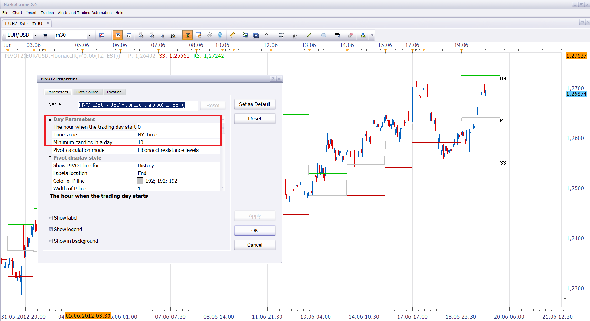

# Custom Day Range PIVOT

> Source: https://fxcodebase.com/code/viewtopic.php?f=17&t=20384  
> Forum: 17 · Topic 20384 · 3 post(s)

---

## Custom Day Range PIVOT

**Nikolay.Gekht** · Tue Jun 19, 2012 2:47 pm

The PIVOT indicator to display daily pivot on the chart where "day" can be defined by the user by the hour when day start and the time zone (choice from EST, UTC, user's time zone and financial time (17:00EST is "midnight").

The indicator can be applied at any 1-hour or smaller charts.
N-hour charts are not supported because the day border may do not match the candle borders.

Please pay attention at the "Minimum candles in the day" parameter. The parameter is designed to eliminate short days which appears because of a gap in the prices between Friday 17:00EST and Sunday 12:00EST. This parameter forces the indicator to take the previous to the yesterday day if the number of the candles in the yesterday day is less than the number specified in this parameter. 1 means take any day. As far as I can see the reasonable setting is between 6 and 12.

 

Download:

 [pivot2.lua](files/35749/pivot2.lua)

The indicator was revised and updated

---

## Re: Custom Day Range PIVOT

**Nikolay.Gekht** · Fri Aug 03, 2012 11:20 am

Updated: Fix small discrepancy with standard pivot, fix camarilla pivot, increase default number of candles required to 2 to prevent capturing Friday's 17:00 EST candle.

---

## Re: Custom Day Range PIVOT

**Apprentice** · Sat Jun 17, 2017 3:46 am

The indicator was revised and updated.
