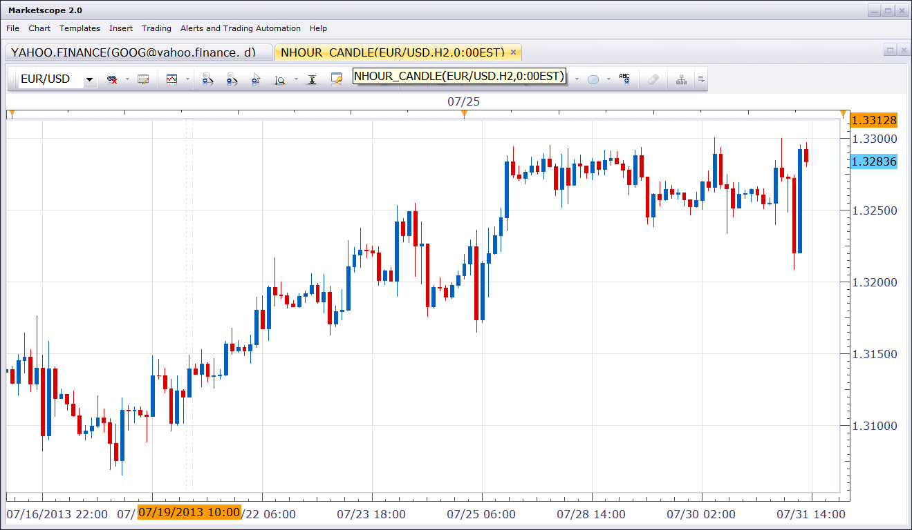

# Custom N-hour candles view

> Source: https://fxcodebase.com/code/viewtopic.php?f=17&t=58424  
> Forum: 17 · Topic 58424 · 2 post(s)

---

## Custom N-hour candles view

**Nikolay.Gekht** · Wed Jul 31, 2013 12:11 pm

The standard N-hours candles which can be opened in the regular manner are always aligned against the beginning of the trading day - 17:00NYT, so you can't, for example, see 2-hours candles which starts at midnight.

This view allows to specify any hour as a reference point.

The view is equal to the regular chart. If "Up to now" is chosen as "Date To" the chart will be updated every time when new tick arrives.

 

Download:

 [nhour_candle.lua](files/87582/nhour_candle.lua)

The indicator was revised and updated

---

## Re: Custom N-hour candles view

**Apprentice** · Mon Jun 12, 2017 5:59 am

The indicator was revised and updated.
