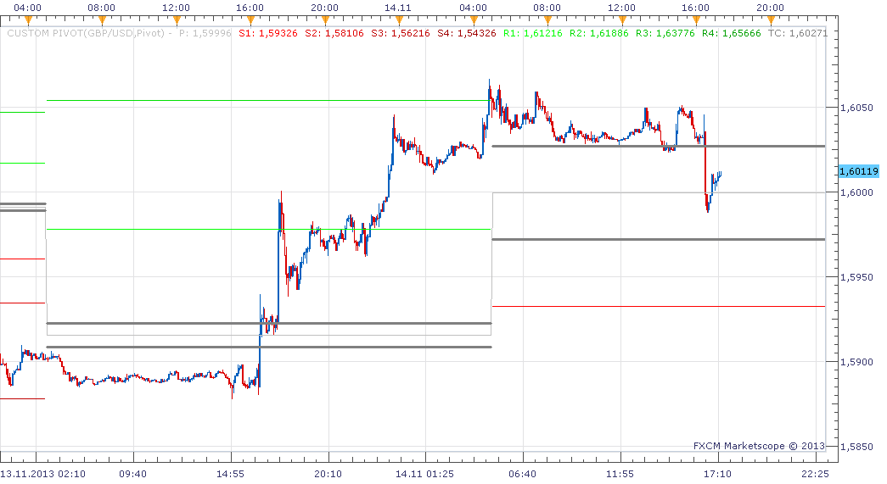

# Custom Pivot

> Source: https://fxcodebase.com/code/viewtopic.php?f=17&t=7345  
> Forum: 17 · Topic 7345 · 24 post(s)

---

## Custom Pivot

**Apprentice** · Mon Oct 17, 2011 6:34 pm

Basically this is a standard Pivot point indicator.
I added BC and BT lines.

TC = (Pivot - BC) + Pivot
BC = (High + Low)/2

You must download both files.

 [custom pivot.lua](files/16383/custom%20pivot.lua)

 [custom pivot.lua.rc](files/16383/custom%20pivot.lua.rc)

---

## Re: Custom Pivot

**superleo** · Mon Oct 17, 2011 10:16 pm

what is the importance of these two lines

---

## Re: Custom Pivot

**order66** · Fri Oct 21, 2011 5:38 pm

These establish the Pivot Range as outlined by Mark Fisher in "The Logical Trader".

His Description:

> The pivot range is where the market is likely to find support or meet resistance. If it manages to break through the pivot range, the market would likely make a significant move in that direction.

---

## Re: Custom Pivot

**superleo** · Sat Oct 22, 2011 10:40 am

thankyou for you explanation.

---

## Re: Custom Pivot

**philipphilip** · Thu Aug 16, 2012 3:14 am

Can the option of moving the beginning of the Floor Pivot be included?

I want to be able to have my pivots calculated and displayed from GMT+2.

Regards,

Philip

---

## Re: Custom Pivot

**MathQuant** · Sun Feb 03, 2013 6:24 pm

Thank You

---

## Re: Custom Pivot

**nettopakko** · Wed Oct 23, 2013 1:53 am

Try as I may, a hundred times or more, I cannot download the custom indicator that apprentice has on display to my fmcx tradestation. Help please.

---

## Re: Custom Pivot

**Apprentice** · Wed Oct 23, 2013 2:19 am

Is this the case for indicator above.
Or this is a general problem.
If First, U need to download both files. (.lua + .lua.rc)
If, Second, look at this links for reference.
[viewtopic.php?f=17&t=59681](https://fxcodebase.com/code/viewtopic.php?f=17&t=59681)
[viewtopic.php?f=17&t=17](https://fxcodebase.com/code/viewtopic.php?f=17&t=17)

---

## Re: Custom Pivot

**pdesai** · Wed Nov 13, 2013 1:38 pm

Hi,
In the old version of pivot indicator when the historical levels are plotted the lines were not connected but in the new version they are all connected making the chart untidy.Any chance of plotting historical levels unconnected in new version? ps there is an error message when trying to plot old version "pivot.lua 310 unknown label location"

Thanks

---

## Re: Custom Pivot

**Apprentice** · Thu Nov 14, 2013 4:28 am

I was unable to reproduce.
Will send this issue to the development team to investigate.

---

## Re: Custom Pivot

**sunshine** · Thu Nov 14, 2013 5:40 am

Hi pdesai,

> **pdesai wrote:**
> In the old version of pivot indicator when the historical levels are plotted the lines were not connected but in the new version they are all connected making the chart untidy.

Currently only pivot (gray) lines are connected in historical mode (not all lines). The indicator works this way for a last few years.

 

> **pdesai wrote:**
> Any chance of plotting historical levels unconnected in new version?

If you need the pivot lines without connections, the indicator should be re-written.

> **pdesai wrote:**
> ps there is an error message when trying to plot old version "pivot.lua 310 unknown label location"

I'm failed to reproduce an issue. Please tell me which version you are using? (you can post the code here).

---

## Re: Custom Pivot

**pdesai** · Thu Nov 14, 2013 10:08 am

Hi sunshine ,
"I'm failed to reproduce an issue. Please tell me which version you are using? (you can post the code here)"

This is the one i have in my TS2 candlework folder :

Thankyou for your prompt response

---

## Re: Custom Pivot

**sunshine** · Fri Nov 15, 2013 1:52 am

Do I understand correctly that you are using the standard pivot version which is located in this folder?
C:\Program Files\Candleworks\FXTS2\indicators\Standard

If so, please tell me the version of your FX Trading Station (it can be checked in the Help menu -> About command). Also please post a screenshot with the error message you get.

---

## Re: Custom Pivot

**pdesai** · Thu Nov 21, 2013 10:49 am

> **sunshine wrote:**
> Do I understand correctly that you are using the standard pivot version which is located in this folder?
> C:\Program Files\Candleworks\FXTS2\indicators\Standard
>
> If so, please tell me the version of your FX Trading Station (it can be checked in the Help menu -> About command). Also please post a screenshot with the error message you get.

Hi
Sorry for delayed reply.The version is 01.13.092613
The error message screenshot:

---

## Re: Custom Pivot

**automan** · Sun Nov 24, 2013 10:32 am

Is there a metatrader version of this indicator?

---

## Re: Custom Pivot

**Apprentice** · Sun Nov 24, 2013 11:41 am

Not as far as I know.

---

## Re: Custom Pivot

**Robadub** · Thu Dec 17, 2015 9:55 am

Hi!
The fibonacci retracement pivots are super fiable.
And I was wondering if is posible to add other levels like:
-0.618 , -0.382 , -0.126 , 0.126 , 0.874 , 1.126 , 1.382 and 1.618.

Thanks!!

---

## Re: Custom Pivot

**Apprentice** · Mon Dec 21, 2015 5:45 am

Your request is added to the development list.

---

## Re: Custom Pivot

**Robadub** · Tue Dec 29, 2015 4:56 pm

> **Apprentice wrote:**
> Your request is added to the development list.

Thanks! And happy New Year

---

## Re: Custom Pivot

**chipsoft** · Mon May 02, 2016 5:41 pm

Dear Apprentice,

Kindly develop range extension Pivot indicator for the following calculations. kindly see attachment. Kindly add this range extension Pivots in Custom Pivot indicator as another add on. I will be very grateful to you.
I have also made a request for the same in the Indicator and Signal request section.
Kind regards

---

## Re: Custom Pivot

**Apprentice** · Wed May 04, 2016 2:51 am

Your request is added to the development list.

---

## Re: Custom Pivot

**Apprentice** · Tue May 17, 2016 10:58 am

Try this version.
[viewtopic.php?f=17&t=63492](https://fxcodebase.com/code/viewtopic.php?f=17&t=63492)

---

## Re: Custom Pivot

**Apprentice** · Sun Sep 23, 2018 7:15 am

The indicator was revised and updated.

---

## Re: Custom Pivot

**Alexander.Gettinger** · Wed Mar 20, 2019 7:29 pm

> **automan wrote:**
> Is there a metatrader version of this indicator?

Please try this indicator:

 [Custom_Pivot.mq4](files/124830/Custom_Pivot.mq4)
