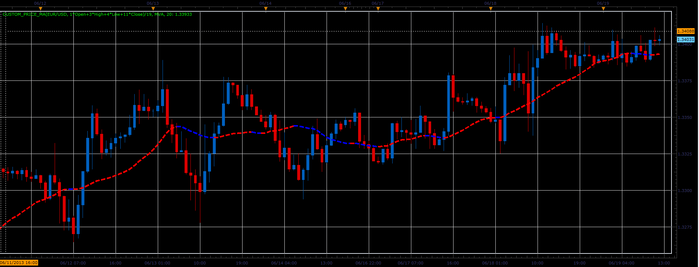

# Custom price MA

> Source: https://fxcodebase.com/code/viewtopic.php?f=17&t=41457  
> Forum: 17 · Topic 41457 · 2 post(s)

---

## Custom price MA

**Alexander.Gettinger** · Wed Jun 19, 2013 3:02 pm

Formulas:
Custom price MA = MA(Custom price), where
Custom price = (Open_Coeff*Open+High_Coeff*High+Low_Coeff*Low+Close_Coeff*Close)/Sum_Coeff,
Sum_Coeff = Open_Coeff+High_Coeff+Low_Coeff+Close_Coeff.

 

Download:

 [Custom_Price_MA.lua](files/67708/Custom_Price_MA.lua)

For this indicator must be installed Averages indicator ([viewtopic.php?f=17&t=2430](https://fxcodebase.com/code/viewtopic.php?f=17&t=2430)).

The indicator was revised and updated

---

## Re: Custom price MA

**Apprentice** · Tue May 23, 2017 6:34 am

Indicator was revised and updated.
