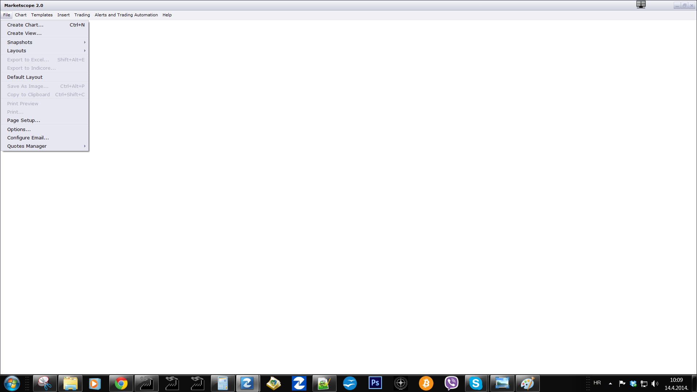
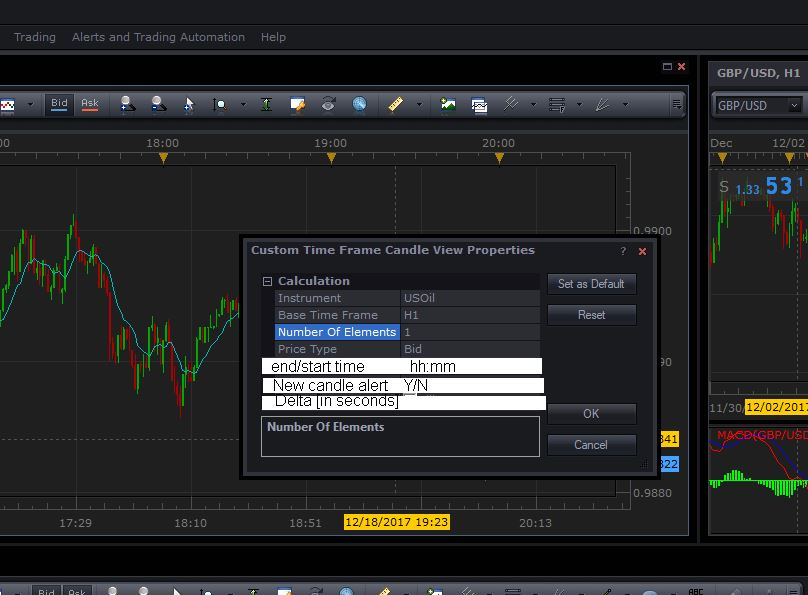

# Custom Time Frame Candle View

> Source: https://fxcodebase.com/code/viewtopic.php?f=17&t=60537  
> Forum: 17 · Topic 60537 · 73 post(s)

---

## Custom Time Frame Candle View

**Apprentice** · Sun Apr 13, 2014 5:31 am

View This will allow the creation of non-standard time frames.
Example "m99", "D9" or "W9"

 

Custom Time Frame Candle View is View.
U will not find it as a standard indicator.
U have to add it add View.
File-> Create View -> Custom Time Frame Candle View

 [Custom Time Frame Candle View.lua](files/93500/Custom%20Time%20Frame%20Candle%20View.lua)

 [CTF.lua](files/93500/CTF.lua)

Sub Minute Candle View version can be found here.
[viewtopic.php?f=17&t=63442](https://fxcodebase.com/code/viewtopic.php?f=17&t=63442)

MT4/MQ4 version.
[viewtopic.php?f=38&t=67215](https://fxcodebase.com/code/viewtopic.php?f=38&t=67215)

---

## Re: Custom Time Frame Candle View

**kaspo99** · Tue Apr 15, 2014 5:23 am

Hi Apprentice
Been playing with this all day now and works great.
Only one thing I would change, that is when I have say a 90 minute chart the data range only goes back a week or so, or 166 xm90 candles, tried changing the range input back but this seems to be the max.
This means the range is stuck to the left so no way like this to have the trading action in the middle of the chart or to the right, which is how I view my charts while trading.
The hourly is not too bad, I can go back 836 candles, same with the daily, I can go back a few years with the daily, so the only gripe is with the minute conversion.
Tried altering the code but got into a pickle, so yes apart from this one thing the extension is great and better than the mt4 period converter as do not require breeder charts etc..
thanks in advance
regards
kaspo99

---

## Re: Custom Time Frame Candle View

**Apprentice** · Tue Apr 15, 2014 11:00 am

Unfortunately these are Data retrieval limits of TS.
If you use the minute chart, m1 is not optimal as Base.
H1 is a much better solution.
Unfortunately, you can not have 90 minutes with a 60 minute base.

Will try to find a solution.

---

## Re: Custom Time Frame Candle View

**Apprentice** · Tue Apr 15, 2014 11:06 am

[Custom Time Frame Candle View.lua](files/93535/Custom%20Time%20Frame%20Candle%20View.lua)

Try this version.
U can have any time frame as Base.
For 90 minutes, you can select 30 minutes as a base, Number Of Elements will be 3.

---

## Re: Custom Time Frame Candle View

**kaspo99** · Tue Apr 15, 2014 11:33 am

Hi Apprentice
Yes that works, all the range that is needed now.
The only thing is the tab label is too long again.
I will change and shorten my own version to suit myself as I know how to do this, but just letting you know for the codebase version.
Apart from that it is great.
Nice work as usual.
Thanks very much
cheers
kaspo99

---

## Re: Custom Time Frame Candle View

**kaspo99** · Fri Apr 18, 2014 2:06 am

Hi Apprentice
This is great indicator extension.
Last thing with this is when using the ruler tool to count pips the decimal point is in the wrong place compared to normal charts, that is, when measuring 10.3 pips the ruler will show 103 instead of 10.3 or measuring 103.7 pips will read 1.0037 instead of 103.7 pips.
Everything else is great thanks.
regards
kaspo99

---

## Re: Custom Time Frame Candle View

**Apprentice** · Fri Apr 18, 2014 2:46 am

In this respect This indicator is flawless.
I believe this is known TS Bug.

---

## Re: Custom Time Frame Candle View

**kaspo99** · Fri Apr 18, 2014 2:55 am

Okay, thought that was the case.
Thanks for speedy reply.
regards
kaspo99

---

## Re: Custom Time Frame Candle View

**Apprentice** · Fri Feb 13, 2015 4:12 am

Bump Up

---

## Re: Custom Time Frame Candle View

**Delta3** · Sun Mar 01, 2015 2:44 pm

This sounds a bit of a simplistic question but where do you locate this indicator once you have installed it?

It's not in the list of indicators but I can view it in - Manage Extensions. I see it has a different icon one of a line graph are these located separately and if so, where abouts might I lay my hands on the blighter's?

TIA

---

## Re: Custom Time Frame Candle View

**Delta3** · Mon Mar 02, 2015 10:23 am

Disregard the above

Sorted now.

---

## Re: Custom Time Frame Candle View

**daniel.kovacik** · Sat Mar 14, 2015 8:42 am

Hello,

LF option how to set microtimeframes like 1 sec, 5 sec, 15 sec. Is there a way how to do it in TS2?
Also, range timeframe would be usefull.

Thanks
Regards
DK

---

## Re: Custom Time Frame Candle View

**Apprentice** · Mon Mar 16, 2015 3:06 am

Range timeframes?
As for sub-minute time frames this is possible.
But the number of candles will be limited to available tick data.

---

## Re: Custom Time Frame Candle View

**daniel.kovacik** · Mon Mar 16, 2015 5:25 am

Hi, that would be cool...
Isnt there a way how to save tick source on my computer when I ll turn on my platform for 24 hours? I know that there is only one way how to download tick data when my platform is off with that tool from fxcmapps.com. I just dont get it why FXCM doesnt provide more data.

Thanks
Regards
DK

---

## Re: Custom Time Frame Candle View

**Apprentice** · Tue Mar 17, 2015 5:32 am

Tick data provide information on all price changes from tick to tick, a lot of data to handle / download. This can be demanding for the server side, or transfer through the connection.

---

## Re: Custom Time Frame Candle View

**daniel.kovacik** · Wed Mar 18, 2015 11:36 am

So, they ll provide more tick data If I ll ask... I was asking but throught support but they didnt give me possitve answer. Just its not possible.

Do you have more tick data with FXCM? or more historical data...

---

## Re: Custom Time Frame Candle View

**Apprentice** · Sun Mar 22, 2015 9:00 am

At least for now things will remain as they are.

---

## Re: Custom Time Frame Candle View

**ainelle** · Sat Oct 24, 2015 6:59 pm

Hello,

I'd like to have a 30s time frame.

As you said, I selected ticks ("T") as based time frame, then 30 as number of elements.
First note : it seems that the candle will contain 30 ticks, instead of 30s. How to choose 30 seconds ?
Second note : the loading never ends, even when I chose a "from" date close to now. Is it because the market is currently closed (I tried only during the week-end) ?

---

## Re: Custom Time Frame Candle View

**Apprentice** · Tue Oct 27, 2015 3:46 am

N - second time frame is not possible with the above algorithm.
Completely new indicator should be written.
Tick "T" has no fixed duration, can last more or less than a second.

---

## Re: Custom Time Frame Candle View

**ainelle** · Tue Oct 27, 2015 4:14 am

I saw the problem and found my own solution.

Tx

---

## Re: Custom Time Frame Candle View

**ainelle** · Fri Oct 30, 2015 11:04 pm

Hello,

I have an other problem:
If I draw a form ( like a circle) ending in the "future" part of the graphic, when a new candle is created, the circle is modified removing the part that has been drawn in the "future" part of the graphic.

How to set that the view is not allowed to modify user's forms ?

---

## Re: Custom Time Frame Candle View

**ainelle** · Wed Nov 04, 2015 6:13 pm

Is there anyone to help me ?

---

## Re: Custom Time Frame Candle View

**headbanger** · Sat Jan 02, 2016 1:29 pm

Is there anyway to refresh the chart? when i create a custom view, the candles are not updated. i see the price label go up and down but the candle remains the same and new candles are not added. is there an option i need to change?

---

## Re: Custom Time Frame Candle View

**ainelle** · Sun Jan 03, 2016 10:49 am

Hi,

When you call "getHistory", you have to put "0" as 'to'

---

## Re: Custom Time Frame Candle View

**Apprentice** · Mon Jan 04, 2016 4:54 am

Make sure NOT to check to range box.

---

## Re: Custom Time Frame Candle View

**zivbeads** · Wed Feb 03, 2016 12:10 pm

> **Apprentice wrote:**
> Range timeframes?
> As for sub-minute time frames this is possible.
> But the number of candles will be limited to available tick data.

is the indicator view already available ?
 or still on developmen for sub minute time frame

---

## Re: Custom Time Frame Candle View

**Apprentice** · Thu Feb 04, 2016 1:56 am

It is not available, yet.

---

## Re: Custom Time Frame Candle View

**zivbeads** · Tue Feb 09, 2016 6:52 am

> **Apprentice wrote:**
> It is not available, yet.

hi apprentice can i request for sub minute time frame candle view/ indicator ?

---

## Re: Custom Time Frame Candle View

**Apprentice** · Thu May 05, 2016 4:56 am

Try this version.
[viewtopic.php?f=17&t=63442](https://fxcodebase.com/code/viewtopic.php?f=17&t=63442)

---

## Re: Custom Time Frame Candle View

**speakinmymind** · Wed May 18, 2016 1:52 pm

Could you please make this work with the "Yahoo Finance Chart View" so we can apply this to the DJIA?

[viewtopic.php?f=17&t=58421&p=101531&hilit=yahoo#p101531](https://fxcodebase.com/code/viewtopic.php?f=17&t=58421&p=101531&hilit=yahoo#p101531)

---

## Re: Custom Time Frame Candle View

**Apprentice** · Thu May 19, 2016 3:38 am

If your goal are sub day time frames,
this data is not available via this provider.

---

## Re: Custom Time Frame Candle View

**speakinmymind** · Mon May 23, 2016 10:09 am

> **Apprentice wrote:**
> If your goal are sub day time frames,
> this data is not available via this provider.

No, not sub day, higher timeframes.

---

## Re: Custom Time Frame Candle View

**Hailkayy** · Tue Jul 05, 2016 9:57 am

Apprentice,

Can you alter the code so that when we open a view all the indicators are supported ?
Some are supported yet,
Currently TRO - DBB - BB cloud and some other are not supported.
Thanks a lot if you could fix this.
Good job.

---

## Re: Custom Time Frame Candle View

**Hailkayy** · Tue Jul 05, 2016 10:24 am

More details ablut the request :

Dbb and bbcloud seems to be working
Tro S/R is not supported

On all indicators I would like to be able to choose an other timeframe i.e set a Daily DBB on a 200m View.

Would love if you could fix this.
Thanks

---

## Re: Custom Time Frame Candle View

**Apprentice** · Tue Jul 05, 2016 2:33 pm

[tro_dynamic_sr_new.lua](files/107004/tro_dynamic_sr_new.lua)

Try this quick fix.

---

## Re: Custom Time Frame Candle View

**Hailkayy** · Fri Jul 08, 2016 12:43 pm

Thank you,

Thanks for the work.
Please can you make a quick fix for Showtimetoend ?

as the timeframes are peculiar, it would be useful to know when a 217m or a 65m candle is ending without having to stay at the computer.

In the future please see if it is possible to add larger TF indicator in the special views.
For now, a second quick fix for showtimetoend please !

Thanks a lot.

---

## Re: Custom Time Frame Candle View

**Apprentice** · Sun Jul 10, 2016 9:28 am

Your request is added to the development list,
Under Bugzilla Id Number 3565
Bugzilla is developer internal requests database.
If someone is interested to do any task from this list please contact me.

---

## Re: Custom Time Frame Candle View

**Hailkayy** · Mon Jul 11, 2016 11:10 am

Seems like the queue is long lol.
Thanks if you or someone could quick fix showtimetoend anyway, or make a similar one (with alers few mins before (user set)) that works with customtimeframe.

Thanks a lot ! Important

---

## Re: Custom Time Frame Candle View

**Hailkayy** · Mon Jul 11, 2016 1:11 pm

It shows unconventional numbers, such as 1:77:35 for the 200 mins or the 35 mins.

---

## Re: Custom Time Frame Candle View

**Apprentice** · Tue Jul 12, 2016 7:40 am

Showtimetoend Is Not build to support non-standard time frames.

---

## Re: Custom Time Frame Candle View

**speakinmymind** · Tue Jan 31, 2017 6:31 am

Can you make this work with the Yahoo Finance Chart View?

[viewtopic.php?f=17&t=58421&p=101531&hilit=yahoo#p101531](https://fxcodebase.com/code/viewtopic.php?f=17&t=58421&p=101531&hilit=yahoo#p101531)

To view larger timeframes on stocks and indexes.

Thanks for all you do.

---

## Re: Custom Time Frame Candle View

**Apprentice** · Tue Jan 31, 2017 6:43 am

Day, Week, Month is already available through yahoo.finance view.
Can you explain what you expect (2 Day, 2 Weeks ...)

---

## Re: Custom Time Frame Candle View

**Apprentice** · Wed Feb 01, 2017 3:41 am

Custom Time Frame Yahoo Finance View.lua added
[viewtopic.php?f=17&t=58421&p=110826#p110826](https://fxcodebase.com/code/viewtopic.php?f=17&t=58421&p=110826#p110826)

---

## Re: Custom Time Frame Candle View

**veyron89890** · Fri Jul 14, 2017 7:06 am

hello people

I have problem with this indicator , when i try to use an indicator on a custime time frame chart the platform crash , can you guys help me in same way ?

thank you

---

## Re: Custom Time Frame Candle View

**Apprentice** · Mon Jul 17, 2017 4:03 am

Can you please send a crash report to my email?

---

## Re: Custom Time Frame Candle View

**Recursive Trendline** · Thu Aug 10, 2017 4:15 am

Hi Apprentice,

The candlesticks are always aligned to New York Close. So they open only at specified time.
Is it possible to align the candles to custom time, not just New York Close?

For Example, I want the candlesticks to open a new candle at +4:00 hours after the New York Close and have the 24 hour cycle from that time on.

Regards
Recursive

---

## Re: Custom Time Frame Candle View

**Apprentice** · Sun Aug 13, 2017 2:44 am

Your request is added to the development list, Under Id Number 3846
 If someone is interested to do this task, please contact me.

---

## Re: Custom Time Frame Candle View

**Apprentice** · Wed Sep 06, 2017 3:26 am

Try this version.

 [Custom Time Frame Candle View.lua](files/114721/Custom%20Time%20Frame%20Candle%20View.lua)

---

## Re: Custom Time Frame Candle View

**Hailkayy** · Mon Dec 18, 2017 8:37 am

Apprentice,

Always thanks for your service, you made my journey a lot more convenient. Im still here from time to time but I am fine.

I would like to ask if you could quickly implement the features I have attached in the picture.
Explanations :

 

**Example**:

 1] End/start time : 18:35 [24hrs format] that way any candle would start and end at every xx.35 mins.
for the 2 hour candle : 18:35 20:35 22h35 etc...
For the 5 mins candle : 18:35 18:40 18:45 etc..

Outside of market active hours I have noticed the times seems to scramble and differ from the element set. Could you please make sure the element [1 hour, 20 Mins etc] is respected 24hrs/24hrs ?

3] Delta : 60s or 30s or 600s etc.. [infinte], that way an alert would pop 60s, 30s, etc., before the new candle is to appear. Easy monitoring.

4] + Of course : Alert type, sound file etc.

Thanks a lot and I ll be happy to donate more at some point.

Best.

NB: People donate if you make a bit of cash in the mkts thanks to Apprentice =]

---

## Re: Custom Time Frame Candle View

**Apprentice** · Tue Dec 19, 2017 4:20 am

Your request is added to the development list under Id Number 3983

---

## Re: Custom Time Frame Candle View

**Hailkayy** · Wed Dec 20, 2017 12:46 am

Hi Apprentice,

Sorry I forgot something.

**Calendar :**

Can you add a calendar drop-down menu so that we can have the Daily, Weekly, Monthly TF start on any day we want ?

Those big time frames arent customizeable only with time inputs.

Thanks.

R.

---

## Re: Custom Time Frame Candle View

**Apprentice** · Wed Dec 20, 2017 5:57 am

1. Part of your task.

 [Custom Time Frame Candle View.Hailkayy.lua](files/116564/Custom%20Time%20Frame%20Candle%20View.Hailkayy.lua)

---

## Re: Custom Time Frame Candle View

**Apprentice** · Wed Dec 20, 2017 11:12 am

2. Part of your task.

 [Custom Time Frame Candle View.Hailkayy.lua](files/116573/Custom%20Time%20Frame%20Candle%20View.Hailkayy.lua)

---

## Re: Custom Time Frame Candle View

**Hailkayy** · Thu Dec 21, 2017 6:41 am

Very good thanks a lot.

R.

---

## Re: Custom Time Frame Candle View

**Silverthorn** · Wed Dec 27, 2017 12:49 am

Hi Aprentice,

Is it possible to create a variable/ time scaled chart that allowed the display of x number of y multiplier over the chart.
If there could be 10 or more time zones where a base unit multiplier and quantity of bars to create for that zone that would be perfect.

For instance setting the time zones

1-5
5-3
15-4

on a one min chart would create a chart with

5 of 1min bars followed by 3 of 5min bars followed by 4 of 15min bars etc...

---

## Re: Custom Time Frame Candle View

**Apprentice** · Thu Dec 28, 2017 6:42 am

Can you show this on example.
Offer a better description.

---

## Re: Custom Time Frame Candle View

**Silverthorn** · Tue Jan 02, 2018 12:02 am

Thanks Apprentice,

What I was originally wanting was to just be able to set the number of candles to be produced instead of setting a start date.

In other words I'd like to be able to set up a chart for m1 x 6 and specify that I want to create 60 candles instead of having to work out an appropriate start date. That way I could change just the base time frame and number of elements and still have the chart display 60 candles at H1 x 12 for instance.

But then I got to thinking that it would be really cool if I could set the chart so that for example the first 10 candles were set to say m5 x 1 then starting from there the next 10 candles were m5 x 2 and the next 10 m5 x 3 etc. I figure that way I could have a chart that would display short medium and long term time frames on a single chart.

I hope that is a little more clear.

Cheers!!

---

## Re: Custom Time Frame Candle View

**Apprentice** · Tue Jan 02, 2018 8:18 am

Your request is added to the development list under Id Number 3992

---

## Re: Custom Time Frame Candle View

**Apprentice** · Wed Jan 03, 2018 5:26 am

Try this version.

 [Custom Time Frame Candle View.Silverthorn.lua](files/116728/Custom%20Time%20Frame%20Candle%20View.Silverthorn.lua)

---

## Re: Custom Time Frame Candle View

**Hailkayy** · Wed Jan 03, 2018 12:28 pm

Hi apprentice,

Indicator working nice, yet I really would like this Main Chart Oscillator Overlay Template.lua indicator to work on the indicator your made me. [http://fxcodebase.com/code/viewtopic.php?f=28&t=61403&p=97427&hilit=main+template#p97427](https://fxcodebase.com/code/viewtopic.php?f=28&t=61403&p=97427&hilit=main+template#p97427)

At the moment it is blinking and taking much CPU ressources when inserted in this new version of Custom time frame view [Hailkay version].

Could you please make it work so it doesn't blink and work fine like in the original version ?
When it blinks it slows down the CPU. So maybe if it works like normal it is going to take less CPU ressources.

Otherwise please also check if the indicator is not too 'heavy'.

Thanks.

Royce.

---

## Re: Custom Time Frame Candle View

**Silverthorn** · Wed Jan 03, 2018 11:00 pm

AWESOME!!!

Thanks sooo much. It's not very often that things turn out better than expected but this is GREAT!!

3 years of data on one chart with no congestion and historic support and resistance so easily visible at all times. I'm in heaven.

 

The setup is a little counter intuitive and it took a while for me to realise that because the chart paints left to right Elements (1) and Bars (1) are the left bars and Elements (3) and Bars (3) are the right hand side of the chart.

Is it possible to put an option to draw a vertical line at the end of each set of bars to indicate where the number of Elements changes?

Thanks again... This really ROCKS!!

---

## Re: Custom Time Frame Candle View

**Apprentice** · Sun Jan 07, 2018 5:37 am

Try this version.

---

## Re: Custom Time Frame Candle View

**Hailkayy** · Tue Jan 16, 2018 3:05 pm

Apprentice please finish the job, indicator is not working as fluid as the initial version.
Maybe its a size mb, or texture problem.

It is just too slow or heavy to run. If I open several windows it starts to lag and take 100% of cpu resources. Please fix it.

---

## Re: Custom Time Frame Candle View

**Apprentice** · Wed Jan 17, 2018 8:52 am

Try this version.

 [Custom Time Frame Candle View.Hailkayy.lua](files/117088/Custom%20Time%20Frame%20Candle%20View.Hailkayy.lua)

Reply from my team was,
we can NOT do much.

---

## Re: Custom Time Frame Candle View

**Hailkayy** · Thu Jan 18, 2018 5:51 am

That is much better ! Like the first version.

Thanks.

Royce.

---

## Re: Custom Time Frame Candle View

**High&Low** · Mon Oct 08, 2018 1:23 am

Hi,

Could you please add an option for number with fraction ?

For the number of element, I need to put numbers like 2.64 or similar, Is it possible ?

Thanks,

---

## Re: Custom Time Frame Candle View

**Apprentice** · Mon Oct 08, 2018 5:32 am

Your request is added to the development list under Id Number 4246

---

## Re: Custom Time Frame Candle View

**High&Low** · Fri Oct 19, 2018 1:23 am

Hi,

Any update about the request ?

Thank you in advance

---

## Re: Custom Time Frame Candle View

**Apprentice** · Fri Oct 19, 2018 4:05 am

Ivan took this task.
Will post any updates here.

---

## Re: Custom Time Frame Candle View

**Apprentice** · Sat Dec 08, 2018 6:18 am

Try this version.

 [Custom Time Frame Candle View.Hailkayy.lua](files/122637/Custom%20Time%20Frame%20Candle%20View.Hailkayy.lua)

---

## Re: Custom Time Frame Candle View

**logicgate** · Fri Dec 14, 2018 4:00 pm

Hi brother apprentice, can you compile a MT4 version of this indi too? Or perhaps it is already available here in the forum under a different name?

Cheers

---

## Re: Custom Time Frame Candle View

**Apprentice** · Sat Dec 15, 2018 6:26 am

Your request is added to the development list under Id Number 4372

---

## Re: Custom Time Frame Candle View

**Apprentice** · Fri Dec 28, 2018 8:04 am

MT4/MQ4 version.
[viewtopic.php?f=38&t=67215](https://fxcodebase.com/code/viewtopic.php?f=38&t=67215)
