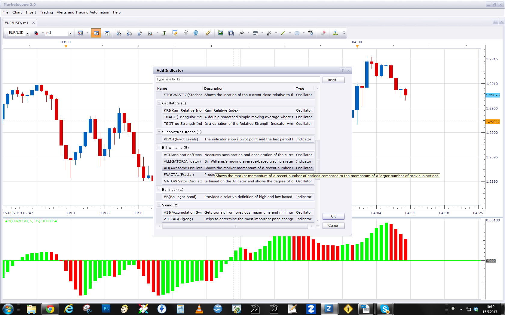

# Custom Velezr Signal Indicator

> Source: https://fxcodebase.com/code/viewtopic.php?f=17&t=36928  
> Forum: 17 · Topic 36928 · 10 post(s)

---

## Custom Velezr Signal Indicator

**Apprentice** · Thu May 09, 2013 6:13 am

An indication is given if all selected filters give same indication.

1.Filter
Long - OSMA>0
Short - OSMA<0
2.Filter
Long - Short MA > Long MA
Short - Short MA < Long MA
3.Filter
Long - Heikin Ashi Close > Heikin Ashi Open
Short -Heikin Ashi Close < Heikin Ashi Open
4.Filter
Long - Awesome Oscillator > 0
Short - Awesome Oscillator <0

 [Custom Velezr Signal Indicator.lua](files/61719/Custom%20Velezr%20Signal%20Indicator.lua)

The indicator was revised and updated

---

## Re: Custom Velezr Signal Indicator

**gabrielvelezr** · Thu May 09, 2013 12:31 pm

Thank you....good job!

---

## Re: Custom Velezr Signal Indicator

**fxtradingstudent** · Fri May 10, 2013 3:47 am

can you create strategy based on this indicator

buy:

1. OSMA >0
2.SHORT MA> LONG MA
3. HA CLOSE > HA OPEN
4. AO >0

sell:

1. OSMA < 0
2.SHORT MA< LONG MA
3. HA CLOSE < HA OPEN
4. AO < 0

---

## Re: Custom Velezr Signal Indicator

**Apprentice** · Sat May 11, 2013 2:16 am

Your request is added to the development list.

---

## Re: Custom Velezr Signal Indicator

**Blackcat2** · Sun May 12, 2013 6:13 am

How do I find the AO indicator?

Thanks..
BC

---

## Re: Custom Velezr Signal Indicator

**Apprentice** · Wed May 15, 2013 3:12 am

Awesome oscillator (AO) is a standard, pre-install indicator within MarketScope.

---

## Re: Custom Velezr Signal Indicator

**Coondawg71** · Tue Sep 16, 2014 7:38 am

Can we please request a Signal Line to this indicator.

Thanks!

sjc

---

## Re: Custom Velezr Signal Indicator

**Apprentice** · Wed Sep 17, 2014 11:36 am

Can you elaborate.

Custom Velezr Signal Indicator gives arrows only, not the output stream, based on which we can calculate an average.

---

## Re: Custom Velezr Signal Indicator

**Coondawg71** · Wed Sep 17, 2014 2:59 pm

Please disregard my request. It was mistakenly posted in the wrong indicator forum.

---

## Re: Custom Velezr Signal Indicator

**Apprentice** · Sat Jun 24, 2017 5:04 am

The indicator was revised and updated.
