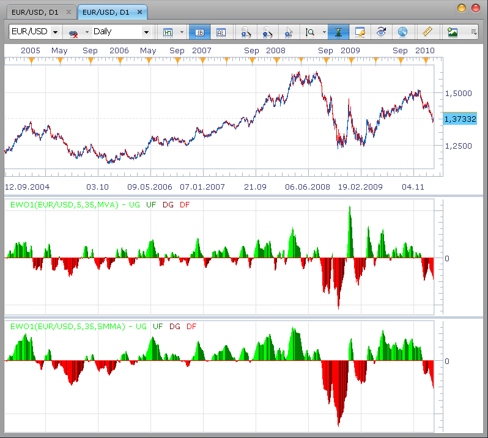

# Customizable and Easy-to-Read Elliot Wave Osicllator.

> Source: https://fxcodebase.com/code/viewtopic.php?f=17&t=307  
> Forum: 17 · Topic 307 · 25 post(s)

---

## Customizable and Easy-to-Read Elliot Wave Osicllator.

**Nikolay.Gekht** · Wed Feb 10, 2010 5:49 pm

**Apr, 10: now the indicator is in the list of the standard indicators of Marketscope. You don't need to download and install it anymore.**

Updated Feb, 22. The histogram is displayed better when the current bar has the same height as the previous bar.

The standard Marketscope implementation of the Elliot Wave oscillator is not easy to read and is not flexible at all.

Here is a slighty modified version of the EWO oscilattor which

- Displays the result as a colored histogram
- Lets the user choose the smoothing method (MVA, EMA, LWMA, SMMA, VIDYA95, VIDYA92 and WILDERS
- Lets the user choose the fast and slow smothing parameters.

Below is an example how EWO based on MVA and SMMA looks:

 



```lua
-- The formula is described in the Kaufman "Trading Systems and Methods" chapter 14 "Behavioral techniques" (page 358-361)

-- Indicator profile initialization routine
-- Defines indicator profile properties and indicator parameters
function Init()
    indicator:name("Elliot Wave Oscillator (Customizable)");
    indicator:description("Measures the rate of price change in one wave against the rate of change in another wave.");
    indicator:requiredSource(core.Bar);
    indicator:type(core.Oscillator);

    indicator.parameters:addInteger("FastN", "Fast Moving Average", "", 5, 2, 1000);
    indicator.parameters:addInteger("SlowN", " Slow Moving Average", "", 35, 2, 1000);

    indicator.parameters:addString("Source", "The price source", "", "M3");
    indicator.parameters:addStringAlternative("Source", "Median (H+L+C)/3", "", "M3");
    indicator.parameters:addStringAlternative("Source", "Median (H+L)/2", "", "M2");
    indicator.parameters:addStringAlternative("Source", "Close", "", "C");

    indicator.parameters:addString("Method", "The smoothing method", "The methods marked by the star (*) requires to have approriate indicators installed", "MVA");
    indicator.parameters:addStringAlternative("Method", "MVA", "", "MVA");
    indicator.parameters:addStringAlternative("Method", "EMA", "", "EMA");
    indicator.parameters:addStringAlternative("Method", "LWMA", "", "LWMA");
    indicator.parameters:addStringAlternative("Method", "SMMA*", "", "SMMA");
    indicator.parameters:addStringAlternative("Method", "Vidya (1995)*", "", "VIDYA");
    indicator.parameters:addStringAlternative("Method", "Vidya (1992)*", "", "VIDYA92");
    indicator.parameters:addStringAlternative("Method", "Wilders*", "", "WMA");

    indicator.parameters:addString("HideLine", "Hide the envelop curve", "This options is useful for reusing this indicator in other indicators", "Yes");
    indicator.parameters:addStringAlternative("HideLine", "Yes", "", "Yes");
    indicator.parameters:addStringAlternative("HideLine", "No", "", "No");

    indicator.parameters:addColor("clrUpGrow", "Up Growing Color", "", core.rgb(0, 255, 0));
    indicator.parameters:addColor("clrUpFall", "Up Falling Color", "", core.rgb(0, 127, 0));
    indicator.parameters:addColor("clrDnGrow", "Down Growing Color", "", core.rgb(127, 0, 0));
    indicator.parameters:addColor("clrDnFall", "Down Falling Color", "", core.rgb(255, 0, 0));
    indicator.parameters:addColor("clrCurve", "Envelope Color", "", core.rgb(127, 127, 127));
end

-- Indicator instance initialization routine
local first;
local first1;
local source = nil;

-- Streams block
local SRC = nil;
local FMA = nil;
local SMA = nil;
local EWO = nil;
local UPGROW = nil;
local UPFALL = nil;
local DNGROW = nil;
local DNFALL = nil;
local DUMMY = nil;
local srcmode;
local prior;

-- Routine
function Prepare()
    assert(instance.parameters.FastN < instance.parameters.SlowN, "Fast MA must be faster than Slow MA");
    srcmode = instance.parameters.Source;
    source = instance.source;
    first1 = source:first();

    SRC = instance:addInternalStream(source:first(), 0);

    FMA = core.indicators:create(instance.parameters.Method, SRC, instance.parameters.FastN);
    SMA = core.indicators:create(instance.parameters.Method, SRC, instance.parameters.SlowN);

    first = SMA.DATA:first();
    local name = profile:id() .. "(" .. source:name() .. "," .. instance.parameters.FastN .. "," ..  instance.parameters.SlowN .. "," ..  instance.parameters.Method  .. ")";
    instance:name(name);

    if instance.parameters.HideLine == "Yes" then
        EWO = instance:addInternalStream(first, 0);
    else
        EWO = instance:addStream("EWO", core.Dot, name .. ".EWO", "EWO", instance.parameters.clrCurve, first);
    end
    UPGROW = instance:addStream("UG", core.Bar, name .. ".UG", "UG", instance.parameters.clrUpGrow, first + 1);
    UPFALL = instance:addStream("UF", core.Bar, name .. ".UF", "UF", instance.parameters.clrUpFall, first + 1);
    DNGROW = instance:addStream("DG", core.Bar, name .. ".DG", "DG", instance.parameters.clrDnGrow, first + 1);
    DNFALL = instance:addStream("DF", core.Bar, name .. ".DF", "DF", instance.parameters.clrDnFall, first + 1);
    UPGROW:addLevel(0);
end

-- Indicator calculation routine
function Update(period, mode)
    if period >= first1 then
        if srcmode == "M3" then
            SRC[period] = (source.high[period] + source.low[period] + source.close[period]) / 3;
        elseif srcmode == "M2" then
            SRC[period] = (source.high[period] + source.low[period]) / 2;
        else
            SRC[period] = source.close[period];
        end
    end

    local diff, pdiff;
    SMA:update(mode);
    FMA:update(mode);

    if period >= first then
        diff = FMA.DATA[period] - SMA.DATA[period];
        EWO[period] = diff;
    end

    if period >= first + 1 then
        diff = EWO[period];
        pdiff = EWO[period - 1];
        if diff > 0 then
            if diff > pdiff then
                UPGROW[period] = diff;
                prior = 1;
            elseif diff < pdiff then
                UPFALL[period] = diff;
                prior = -1;
            else
                if (prior == 1) then
                    UPGROW[period] = diff;
                else
                    UPFALL[period] = diff;
                end
            end
        else
            if diff > pdiff then
                DNGROW[period] = diff;
                prior = 1;
            elseif diff < pdiff then
                DNFALL[period] = diff;
                prior = -1;
            else
                if (prior == 1) then
                    DNGROW[period] = diff;
                else
                    DNFALL[period] = diff;
                end
            end
        end
    end
end
```

Download:

 [EWO1.lua](files/534/EWO1.lua)

Note: To use [SMMA](https://fxcodebase.com/code/viewtopic.php?f=17&t=195), [VIDYA](https://fxcodebase.com/code/viewtopic.php?f=17&t=301), [VIDYA92](https://fxcodebase.com/code/viewtopic.php?f=17&t=301#p525) and [WILDERS](https://fxcodebase.com/code/viewtopic.php?f=17&t=248) indicators as a smoothing method please download and install these indicators too.

The indicator was revised and updated

---

## Re: Customizable and Easy-to-Read Elliot Wave Osicllator.

**boursicoton** · Sun Feb 21, 2010 4:00 pm

i dont understood this indicator....where's elliott in this model ?
i take EMA 5 and 35..... 5 cross over 35 green and red for cross under....all simply !

---

## Re: Customizable and Easy-to-Read Elliot Wave Osicllator.

**Nikolay.Gekht** · Mon Feb 22, 2010 12:39 am

I'll prepare the detailed description for our site soon.
You can also read more about usage of this oscillator on trading related sites, for example [here](http://www.tradingfives.com/articles/elliott_oscillator.htm)

---

## Re: Customizable and Easy-to-Read Elliot Wave Osicllator.

**FiniteTuning** · Thu Aug 19, 2010 10:15 pm

Greetings, and thank you so much for all of the AWESOME indicators you have released.

I have a request, probably not a simple one.

Could you create an Elliot wave zigzag counter that numbers the waves 1-5 on the chart as well as a,b,c on the back end after wave five? But in either case, an indicator that strictly follows the main rules of Elliott wave theory to the "t".

I have no clue where to even begin, maybe you do.

Thank you greatly, I so appreciate your hard work...!

---

## Re: Customizable and Easy-to-Read Elliot Wave Osicllator.

**Apprentice** · Fri Aug 20, 2010 2:45 am

We are working on the development of this indicator.

But the development of the same is not as simple as it seems at first glance.
I developed a theoretical basis for this indicator,
but we can not seem to find time for its implementation.

I therefore invite you to help us in developing this indicator,
especially if you already have such algorithm or the code for this indicator.

---

## Re: Customizable and Easy-to-Read Elliot Wave Osicllator.

**Apprentice** · Fri Aug 20, 2010 2:58 am

To make it official.
I added it to the developmental cue.

---

## Re: Customizable and Easy-to-Read Elliot Wave Osicllator.

**Merchantprince** · Wed May 18, 2011 3:33 pm

> **FiniteTuning wrote:**
> Could you create an Elliot wave zigzag counter that numbers the waves 1-5 on the chart as well as a,b,c on the back end after wave five? But in either case, an indicator that strictly follows the main rules of Elliott wave theory to the "t".

I have been searching for an indicator that matches this description. It was mentioned that such a custom indicator was added to the development queue. Has there been any progress on it since then?

---

## Re: Customizable and Easy-to-Read Elliot Wave Osicllator.

**Apprentice** · Thu May 19, 2011 3:44 am

This is one of the few tools that we have not been able to accomplish.
There have been several attempts.
I have a few ideas, but I lack the time and knowledge.
If anyone has an algorithm that could help us, help is appreciated.

---

## Re: Customizable and Easy-to-Read Elliot Wave Osicllator.

**rob mccrory** · Fri Jun 03, 2011 5:15 pm

> **Apprentice wrote:**
> This is one of the few tools that we have not been able to accomplish.
> There have been several attempts.
> I have a few ideas, but I lack the time and knowledge.
> If anyone has an algorithm that could help us, help is appreciated.

Hey Apprentice,

I'm not sure if I'm 'on subject' in this thread, but are you looking to accomplish something like the image i posted? It's not Elliott Wave, it is, however, a Tom DeMarkTD Wave indicator for Ninja Trader. Maybe you could look at that code for creative ideas? If not, thought I'd give ya a heads up either way.

I've seen a great looking TD Wave indicator for StockFinder...it colors the bars according to what wave price action is in. TD Wave is a pretty powerful tool. I could try to track that down.

I have Jason Perls book on Demark indicators. If you would like the chapter on TD Wave (which details the rules for the indicator) I could make a doc for you.

If I'm way off the mark, to the indicator you had in mind, go ahead and nuke this post.

let me know

---

## Re: Customizable and Easy-to-Read Elliot Wave Osicllator.

**Apprentice** · Sat Jun 04, 2011 4:43 am

I'll take a look.
As regards the book, I have on my shelf, thank you.
Links to already made solutions or sample code you can send to my private email.

Which indicator andsettings you are using on chart that you have submitted.
I can not decipher from this chart.

---

## Re: Customizable and Easy-to-Read Elliot Wave Osicllator.

**rob mccrory** · Sat Jun 04, 2011 12:18 pm

This is a Ninja Trader 6.5 indicator which I can't install on my NT 7.0. I'm apprehensive to install 6.5 with 7.0....I don't want to blow up my 7.0 install.

As for the image, I grabbed it from the NinjaTrader forum.

I do remember that the indicator had a TD Wave UP setting and a TD Wave DOWN setting.

I used Notepad to open the indicator file. I'll send it to you, it may help.

---

## Re: Customizable and Easy-to-Read Elliot Wave Osicllator.

**rretch** · Sat Jun 25, 2011 12:59 pm

Apprentice,

Are you still interested in producing a "Wave" drawing indicator?

There has been a "A,B,C" count indicator released for NinjaTrader 7.0. It looks promising, and may, perhaps, serve as a launching point for an Elliot Wave and/or Tom DeMark TD Wave indicators.

Let me know if you want the code, and how the best way to send it may be. I ask because I tried a cut and paste into a .txt file and it looked unusable...at least to me.

rob

---

## Re: Customizable and Easy-to-Read Elliot Wave Osicllator.

**Apprentice** · Sun Jun 26, 2011 5:36 am

You can send it to my private email.
Look for it here.
[memberlist.php?mode=viewprofile&u=437](https://fxcodebase.com/code/memberlist.php?mode=viewprofile&u=437)

---

## Re: Customizable and Easy-to-Read Elliot Wave Osicllator.

**Blackcat2** · Sun Jun 26, 2011 6:33 pm

> **rretch wrote:**
> Apprentice,
>
> Are you still interested in producing a "Wave" drawing indicator?
>
> There has been a "A,B,C" count indicator released for NinjaTrader 7.0. It looks promising, and may, perhaps, serve as a launching point for an Elliot Wave and/or Tom DeMark TD Wave indicators.
>
> Let me know if you want the code, and how the best way to send it may be. I ask because I tried a cut and paste into a .txt file and it looked unusable...at least to me.
>
> rob

Ooooh... I have been looking for the code for "A,B,C" indicator ([viewtopic.php?f=27&t=4640](https://fxcodebase.com/code/viewtopic.php?f=27&t=4640)).. It would be greatly appreciate it if you can share with us..

Thanks heaps

---

## Re: Customizable and Easy-to-Read Elliot Wave Osicllator.

**rretch** · Mon Jun 27, 2011 9:32 am

Hey Apprentice and Blackcat2,

I think I spoke too soon when I posted the new NinjaTrader ABC indicator.

It is an ABC indicator, however, it requires you to place the mouse on the points YOU think are the A and B. I was bummed out 'cause I thought it was based on 'objective' analysis by the indicator.

The TD Wave indicator for NinjaTrader 6.5 is an objective indicator....which is what DeMark was trying to solve while working with the subjectivity working with Elliot Waves. I'll try again to load it on my NinjaTrader 7.0 to at least get the code.

I'll post the code, and maybe the FXcodebase community can find a way to make it an objective indicator.

I have seen a TD Wave indicator for Worden's Stockcharts application....i was very impressed...seriously. And that was seeing work on stocks. I would wager it's abilities would be enhanced with FX

rob

```
#region Using declarations
using System;
using System.ComponentModel;
using System.Diagnostics;
using System.Drawing;
using System.Drawing.Drawing2D;
using System.Xml.Serialization;
using NinjaTrader.Cbi;
using NinjaTrader.Data;
using NinjaTrader.Gui.Chart;
using System.Windows.Forms;
#endregion

// This namespace holds all indicators and is required. Do not change it.
namespace NinjaTrader.Indicator
{
    /// <summary>
    /// ABC Fibs via 3 click alt-mouse events (once started, must finish sequence)
   /// Click below bar mid-value on 'A' click, will setup ABC as UP SWING (else Down Swing)
   ///   (Up Swing will use low of A, High of B, and Low of C bar)
   /// V 1.0 - Dec 8, 2010, DeanV@nt
   ///
    /// </summary>
    [Description("Alt-RightClick 3x to Draw ABC points and some related Fibs (A-bar click (above/below bar mid value) defines UP vs DOWN swings")]
    public class dDrawABC : Indicator
    {
        #region Variables
      
      private double adjustableFib = 1.786;
      private bool _fDragging = false;

      private ChartControl _chartControl;
      private Rectangle _chartBounds;
      private double _min, _max;

      //make these global and set on plot call, so we don't have to pass around.
      private int rightScrnBnum;   //right most bar# on screen.
      private int leftScrnBnum;   //left most bar# in display
      
      private int _iBarStart,_iBarEnd;
      private double _priceStart, _priceEnd;

      private Font          textFont       = new Font("Courier", 9, FontStyle.Regular);
      private Font          textFontLabel   = new Font("Courier", 12, FontStyle.Regular);
      private int          textOffset      = 15;
      private int          textOffset2      = 30;
      private int          textOffset3      = 45;
      private Color         colorUp         = Color.Green;
      private Color         colorDn         = Color.Red;
      private Color         swingColor      = Color.Black;

      private int swingDir   = 1;
      private int rightMaxBarNum = 0;

      private ILine lineAB = null;
      private ILine lineBC = null;
      
      //hidden saves for first time restore
      private DateTime _aPDate;
      private DateTime _bPDate;
      private DateTime _cPDate;
      private double _aPVal;
      private double _bPVal;
      private double _cPVal;
      
      private int _ABbarStart,_ABbarEnd;
      private double _ABpriceStart, _ABpriceEnd;
      private int _BCbarStart,_BCbarEnd;
      private double _BCpriceStart, _BCpriceEnd;
      private bool _fDrawAB = false;
      private bool _fDrawBC = false;

      private double[] FibPct = new double[14] ;   //prestuffed.
      private double[] FibVal = new double[14] ;
      
      private Color fibABColor      = Color.Gray;
      private Color fibBCColor      = Color.RoyalBlue;
      private int fibABRets = 3;
      private int fibBCRets = 1;
      private int fibABExtends = 5;
      private int fibBCExtends = 4;
      private int fibMMRets = 4;
      private int fibMMExtends = 5;
      private int fibMMReverse = 5;
      private bool fibABTextToRight = false;
      private bool fibBCTextToRight = true;
      private bool fibMMTextToRight = false;
      
      #endregion

        /// <summary>
        /// This method is used to configure the indicator and is called once before any bar data is loaded.
        /// </summary>
        protected override void Initialize()
        {
            Overlay            = true;
         //PlotsConfigurable = false;
         
         BarsRequired = 0;   //so we can draw with first 20 bars on screen, without error.
         
         //right most bar will be zero if calc@end of bar, or -1 if calc@each tick
         //Limit to existing bars so we can get Hi/Low info
         rightMaxBarNum = CalculateOnBarClose ? -1 : 0;
         
         //pre-stuff fib percentages, top to bottom.
         FibPct[0] = adjustableFib;   //!0 = show this level
         
         FibPct[1] = 2.0 ;
         FibPct[2] =  1.618 ;
         FibPct[3] = 1.272 ;   //continuation extentions

         FibPct[4] = 1.0 ;   // 100% of move
         //these are backwards for proper display, cause of later math.
         FibPct[5] = 0.764 ;   //not quite accurate, but close enough
         FibPct[6] = 0.618 ;
         FibPct[7] =  0.5 ;
         FibPct[8] = 0.382 ;
         FibPct[9] = 0.236 ;
         FibPct[10] = 0.0 ;   //reference point, low for up, hi for down.
         
         FibPct[11] = -0.272 ;   //retractions
         FibPct[12] = -0.618 ;
         FibPct[13] = -1.0 ;
         
        }

        /// <summary>
        /// Called on each bar update event (incoming tick)
        /// </summary>
        protected override void OnBarUpdate()
        {
         SetChartControl (this.ChartControl);
   
         if(lineAB == null) {
            RestoreDrawObjects();
         }

        }      
      
        #region Properties

        [Description("Adjustable Fib Level (+= Extend, -= Retract, -0.786r, 1.764e, 0=no). Effects All ABC points.")]
        [GridCategory("DisplayFibs")]
        public double AdjustableFib
        {
            get { return adjustableFib; }
            set { adjustableFib = value; }
        }

      [Description("Show AB Retract Levels (0=No, 1= 50%, 2= 38+61, 3=1+2, 4=2+78, 5=All.")]
        [GridCategory("DisplayFibs")]
        public int FibABRets
        {
            get { return fibABRets; }
            set { fibABRets = Math.Max(0, value); }
        }
        [Description("Show BC Retract Levels (0=No, 1= 50%, 2= 38+61, 3=1+2, 4=2+78, 5=All.")]
        [GridCategory("DisplayFibs")]
        public int FibBCRets
        {
            get { return fibBCRets; }
            set { fibBCRets = Math.Max(0, value); }
        }
        [Description("Show Extended Levels (0=No, 1= 127, 2= 161, 3=200, 4=161+200, 5=All 3.")]
        [GridCategory("DisplayFibs")]
        public int FibABExtends
        {
            get { return fibABExtends; }
            set { fibABExtends = Math.Max(0, value); }
        }
        [Description("Show Extended Levels (0=No, 1= 127, 2= 161, 3=200, 4=161+200, 5=All 3.")]
        [GridCategory("DisplayFibs")]
        public int FibBCExtends
        {
            get { return fibBCExtends; }
            set { fibBCExtends = Math.Max(0, value); }
        }
        [Description("Show MM Wrong Direction Levels (0=No, 1= -27, 2= -61, 3=-100, 4=61+100, 5=All 3.")]
        [GridCategory("DisplayFibs")]
        public int FibMMReverse
        {
            get { return fibMMReverse; }
            set { fibMMReverse = Math.Max(0, value); }
        }
        [Description("Show MM Retract Levels (0=No, 1= 50%, 2= 38+61, 3=1+2, 4=2+78, 5=All.")]
        [GridCategory("DisplayFibs")]
        public int FibMMRets
        {
            get { return fibMMRets; }
            set { fibMMRets = Math.Max(0, value); }
        }
        [Description("Show MM Extended Levels (0=No, 1= 127, 2= 161, 3=200, 4=161+200, 5=All")]
        [GridCategory("DisplayFibs")]
        public int FibMMExtends
        {
            get { return fibMMExtends; }
            set { fibMMExtends = Math.Max(0, value); }
        }
        [Description("Show AB Text Labels Right Justified")]
        [GridCategory("DisplayFibs")]
        public bool FibABTextToRight
        {
            get { return fibABTextToRight; }
            set { fibABTextToRight = value; }
        }
        [Description("Show BC Text Labels Right Justified")]
        [GridCategory("DisplayFibs")]
        public bool FibBCTextToRight
        {
            get { return fibBCTextToRight; }
            set { fibBCTextToRight = value; }
        }
        [Description("Show MM Text Labels Right Justified")]
        [GridCategory("DisplayFibs")]
        public bool FibMMTextToRight
        {
            get { return fibMMTextToRight; }
            set { fibMMTextToRight = value; }
        }

      /// <summary>
      /// Hidden previous save points for startup restore
      /// (no easy way to hide, so just move on...)
      /// </summary>
        [Category("saveme")]
        //[XmlInclude()]      // this line ensures that the indicator can be saved/recovered as part of a chart template, do not remove
      //[Browsable(false)]
        public DateTime APDate
        {
            get { return _aPDate; }
            set { _aPDate = value; }
        }
      // Serialize our object
      //[Browsable(false)]
      //public String _aPDateSerialize
      //{
      //   get { return _aPDate.ToString(); }
      //   set { _aPDate = DateTime.Parse(value); }
      //   //get { return _aPDate; }
      //   //set { _aPDate = (value); }
      //}
        [Category("saveme")]
      //[Browsable(false)]
        public double APVal
        {
            get { return _aPVal; }
            set { _aPVal = value; }
        }
        [Category("saveme")]
      //[Browsable(false)]
        public DateTime BPDate
        {
            get { return _bPDate; }
            set { _bPDate = value; }
        }
        [Category("saveme")]
      //[Browsable(false)]
        public double BPVal
        {
            get { return _bPVal; }
            set { _bPVal = value; }
        }
        [Category("saveme")]
      //[Browsable(false)]
        public DateTime CPDate
        {
            get { return _cPDate; }
            set { _cPDate = value; }
        }
        [Category("saveme")]
      //[Browsable(false)]
        public double CPVal
        {
            get { return _cPVal; }
            set { _cPVal = value; }
        }

      //Color stuff
      //
      [XmlIgnore()]
      [Description("Swing Color Up (also MM Fibs)")]
      [Category("Display Settings")]
      public Color SwingColorUp
      {
         get { return colorUp; }
         set { colorUp = value; }
      }
      // Serialize our Color object
      [Browsable(false)]
      public string ColorUpSerialize
      {
         get { return NinjaTrader.Gui.Design.SerializableColor.ToString(colorUp); }
         set { colorUp = NinjaTrader.Gui.Design.SerializableColor.FromString(value); }
      }
      [XmlIgnore()]
      [Description("Swing Color Down (also MM Fibs)")]
      [Category("Display Settings")]
      public Color SwingColorDn
      {
         get { return colorDn; }
         set { colorDn = value; }
      }
      // Serialize our Color object
      [Browsable(false)]
      public string ColorDnSerialize
      {
         get { return NinjaTrader.Gui.Design.SerializableColor.ToString(colorDn); }
         set { colorDn = NinjaTrader.Gui.Design.SerializableColor.FromString(value); }
      }

      [XmlIgnore()]
      [Description("AB Fib Color")]
      [Category("Display Settings")]
      public Color FibABColor
      {
         get { return fibABColor; }
         set { fibABColor = value; }
      }
      // Serialize our Color object
      [Browsable(false)]
      public string FibABColorSerialize
      {
         get { return NinjaTrader.Gui.Design.SerializableColor.ToString(fibABColor); }
         set { fibABColor = NinjaTrader.Gui.Design.SerializableColor.FromString(value); }
      }
      [XmlIgnore()]
      [Description("BC Fib Color")]
      [Category("Display Settings")]
      public Color FibBCColor
      {
         get { return fibBCColor; }
         set { fibBCColor = value; }
      }
      // Serialize our Color object
      [Browsable(false)]
      public string FibBCColorSerialize
      {
         get { return NinjaTrader.Gui.Design.SerializableColor.ToString(fibBCColor); }
         set { fibBCColor = NinjaTrader.Gui.Design.SerializableColor.FromString(value); }
      }

      #endregion
      
      int BarFromX (int x)
      {
         //returns BarsAgo
         int leftBarPix = _chartControl.GetXByBarIdx(Bars,leftScrnBnum);
         int leftOffset =  leftBarPix - ChartControl.BarSpace > 0 ? leftBarPix - ChartControl.BarSpace : 0;
         //Limit to existing left bar #, adjust for leftscreen whitespace as need.
         int myX = x < leftBarPix ? ChartControl.BarSpace : x-leftOffset;
         int xOffset = ((myX- (ChartControl.BarSpace/2)) /ChartControl.BarSpace);
         int thisBar = (CurrentBar - leftScrnBnum) -  xOffset;   //BarsAgo
         
         //Limit to existing right bar #
         if(thisBar < rightMaxBarNum) thisBar = rightMaxBarNum;   
                        
         return  thisBar;
         
      }

      double PriceFromY (int y)
      {
         double bottom = _chartBounds.Bottom;
         return RoundInst(_min + (bottom - y) * (_max - _min) / _chartBounds.Height);
      }

      void ChartControl_MouseDown (object sender, System.Windows.Forms.MouseEventArgs e)
      {
         if ((Control.ModifierKeys & Keys.Alt) == 0) {
            //Print("not Alt");
            return;
         }

         if(_fDragging == false) {
            //start a new one
            RemoveDrawObjects();   //delete all object from this application
            _iBarStart = BarFromX (e.X);
            _priceStart = PriceFromY (e.Y);
            _fDrawAB = true;
            _fDrawBC = false;
            _fDragging = true;
            
            _ABbarStart = _iBarStart;
            //place 'A' text
            double midBarAdd = (High[_iBarStart] - Low[_iBarStart]) *0.5;
            swingDir = _priceStart >= Low[_iBarStart] + midBarAdd ? -1 : 1;
            swingColor = swingDir > 0 ? colorUp : colorDn;
            _priceStart = swingDir < 0 ? High[_iBarStart] : Low[_iBarStart];
            _ABpriceStart = _priceStart;
            
            DrawText("dDwALabel", AutoScale, "A",
               _iBarStart, _priceStart, textOffset2 * swingDir *-1, swingColor, textFontLabel,
               StringAlignment.Center, Color.Transparent, Color.Transparent, 0);
            DrawText("dDwAPct", AutoScale, _priceStart.ToString(),
               _iBarStart, _priceStart, textOffset * swingDir *-1, swingColor, textFont,
               StringAlignment.Center, Color.Transparent, Color.Transparent, 0);
            
         }
         else if(_fDrawAB == true) {
            //finish AB, start BC
            //save points for first time restore
            _aPDate = lineAB.StartTime;
            _aPVal = lineAB.StartY;
            _bPDate = lineAB.EndTime;
            _bPVal = lineAB.EndY;
            
            _fDrawAB = false;
            _fDrawBC = true;
            
            _ABbarEnd = _iBarEnd;   //current position from mousemove
            _ABpriceEnd = _priceEnd;
            _BCbarStart = _ABbarEnd;   //current position
            _BCpriceStart = _ABpriceEnd;
            //reset line start to draw BC
            _iBarStart = _BCbarStart;
            _priceStart = _BCpriceStart;
            
            //Place 'B' text on bar H or low
            double moveVal = RoundInst(Math.Abs(_ABpriceStart -_ABpriceEnd));
            
            DrawText("dDwBLabel", AutoScale, "B",
               _iBarStart, _priceStart, textOffset2 * swingDir, swingColor, textFontLabel,
               StringAlignment.Center, Color.Transparent, Color.Transparent, 0);
            DrawText("dDwBPrice", AutoScale, moveVal.ToString() +"c - " + _priceStart.ToString(),
               _iBarStart, _priceStart, textOffset * swingDir, swingColor, textFont,
               StringAlignment.Center, Color.Transparent, Color.Transparent, 0);
         }

         else if(_fDrawBC){
            _cPDate = lineBC.EndTime;
            _cPVal = lineBC.EndY;
            //finish BC draw
            _fDrawBC = false;
            _fDragging = false;
            _BCbarEnd = _iBarEnd;   //current position from mousemove
            _BCpriceEnd = _priceEnd;
            
            DoDrawFibs(1, fibABRets, fibABExtends, fibABColor);
            DoDrawFibs(2, fibBCRets, fibBCExtends, fibBCColor);
            DoDrawFibs(3, fibMMRets, fibMMExtends, swingColor);

            DrawText("dDwCLabel", AutoScale, "C",
               _iBarEnd, _priceEnd, textOffset3 * swingDir *-1, swingColor, textFontLabel,
               StringAlignment.Center, Color.Transparent, Color.Transparent, 0);
            //move value and %
            double moveVal = RoundInst(Math.Abs(_BCpriceStart -_BCpriceEnd));
            double movePct = (moveVal / Math.Abs(_ABpriceStart -_ABpriceEnd)) * 100;
            
            DrawText("dDwCPct", AutoScale,  movePct.ToString("f1") + "%",
               _iBarEnd, _priceEnd, textOffset2 * swingDir *-1, swingColor, textFont,
               StringAlignment.Center, Color.Transparent, Color.Transparent, 0);
            DrawText("dDwCPrice", AutoScale, moveVal.ToString() +"c - " + _priceEnd.ToString(),
               _iBarEnd, _priceEnd, textOffset * swingDir *-1, swingColor, textFont,
               StringAlignment.Center, Color.Transparent, Color.Transparent, 0);
            
         }
         else {
            _fDragging = false; //error, turn off sequence
         }
         
      }

      void ChartControl_MouseMove (object sender, System.Windows.Forms.MouseEventArgs e)
      {
         if (!_fDragging)
            return;

         _iBarEnd = BarFromX (e.X);

         if(_fDrawAB) {
            _priceEnd = swingDir > 0 ? High[_iBarEnd] : Low[_iBarEnd];
            lineAB = UDrawLine("dDwABLine");
         }
         else {
            _priceEnd = swingDir < 0 ? High[_iBarEnd] : Low[_iBarEnd];
            lineBC = UDrawLine("dDwBCLine");
         }
         
      }

      public override void Plot (Graphics graphics, Rectangle bounds, double min, double max)
      {
         base.Plot (graphics, bounds, min, max);

         _chartBounds = bounds;
         _min = min;
         _max = max;

         rightScrnBnum = Math.Min(LastBarIndexPainted, CurrentBar); //limit to actual bars vs. white space on right.
         leftScrnBnum = Math.Min(FirstBarIndexPainted, CurrentBar); //not bigger than CurrentBar (ie. only 1 bar on screen).
      }

      void SetChartControl (ChartControl control)
      {
         if (_chartControl == control)
            return;

         if (_chartControl != null)
         {
            _chartControl.ChartPanel.MouseDown -= new System.Windows.Forms.MouseEventHandler (ChartControl_MouseDown);
            _chartControl.ChartPanel.MouseMove -= new System.Windows.Forms.MouseEventHandler (ChartControl_MouseMove);
            //_chartControl.ChartPanel.MouseUp -= new System.Windows.Forms.MouseEventHandler (ChartControl_MouseUp);
         }

         _chartControl = control;

         if (_chartControl != null)
         {
            _chartControl.ChartPanel.MouseDown += new System.Windows.Forms.MouseEventHandler (ChartControl_MouseDown);
            _chartControl.ChartPanel.MouseMove += new System.Windows.Forms.MouseEventHandler (ChartControl_MouseMove);
            //_chartControl.ChartPanel.MouseUp += new System.Windows.Forms.MouseEventHandler (ChartControl_MouseUp);
         }
      }

      public override void Dispose ()
      {
         base.Dispose ();
         SetChartControl (null);
      }
      
      //round to nearist tick size
      private double RoundInst(double tdbl) {
         
         if(Instrument != null) {   //check incase not called from OnBarUpdate().?
            return Instrument.MasterInstrument.Round2TickSize(tdbl);
         }
         
         return tdbl;
      }
      
      private ILine UDrawLine(string labelStr) {
         ILine Lrtn = null;
         
         //TriggerCustomEvent (
         //   delegate (object state) {
         //      try
         //      {
               Lrtn = DrawLine (
                  labelStr,false,
                  _iBarStart, _priceStart,
                  _iBarEnd, _priceEnd,
                  swingColor, DashStyle.Solid, 2);
               
         //      }
         //      catch { }
         //   },
         //   null
         //);
         
         return Lrtn;
      }

      private void DoDrawFibs(int fType, int rLevel, int eLevel, Color tColor) {
         double tSwgStartVal, tSwgEndVal;
         int tSwgStartBar, tSwgEndBar, lineEndBar;
         string fBaseStr = "dDwFib";
         int swingBarsHalf;
         int textpositionbar;
         StringAlignment textAlign;
         
         //setup per fType...
         if(fType == 3) {
            if(rLevel == 0 && eLevel == 0 && fibMMReverse == 0) return;   //nothing to do here.
            fBaseStr = fBaseStr + "MM";
            tSwgEndVal = _ABpriceEnd;
            tSwgStartVal = _ABpriceStart;
            tSwgEndBar = _BCbarEnd;
            tSwgStartBar = _ABbarStart;
            swingBarsHalf = (tSwgStartBar - tSwgEndBar) - 3; //so we start @ C point
            lineEndBar = _BCbarEnd - (int) Math.Abs((tSwgStartBar - tSwgEndBar) *1);
            textpositionbar = fibMMTextToRight ? lineEndBar : tSwgStartBar - swingBarsHalf;
            textAlign = fibMMTextToRight ? StringAlignment.Near : StringAlignment.Far;
         }
         else if(fType == 2) {
            if(rLevel == 0 && eLevel == 0) return;   //nothing to do here.
            fBaseStr = fBaseStr + "BC";
            tSwgEndVal = _BCpriceEnd;
            tSwgStartVal = _BCpriceStart;
            tSwgEndBar = _BCbarEnd;
            tSwgStartBar = _BCbarStart;
            swingBarsHalf = (int)((tSwgStartBar - tSwgEndBar) *0.5);
            lineEndBar = _BCbarEnd - (int) Math.Abs((tSwgStartBar - tSwgEndBar) *0.5);
            textpositionbar = fibBCTextToRight ? lineEndBar : tSwgStartBar - swingBarsHalf;
            textAlign = fibBCTextToRight ? StringAlignment.Near : StringAlignment.Far;
         }
         else { //if(fType == 1) {
            if(rLevel == 0 && eLevel == 0) return;   //nothing to do here.
            fBaseStr = fBaseStr + "AB";
            tSwgEndVal = _ABpriceEnd;
            tSwgStartVal = _ABpriceStart;
            tSwgEndBar = _ABbarEnd;
            tSwgStartBar = _ABbarStart;
            swingBarsHalf = (int)((tSwgStartBar - tSwgEndBar) *0.5);
            lineEndBar = _BCbarEnd;
            textpositionbar = fibABTextToRight ? lineEndBar : tSwgStartBar - swingBarsHalf;
            textAlign = fibABTextToRight ? StringAlignment.Near : StringAlignment.Far;
         }
         int swDirUp = (tSwgEndVal > tSwgStartVal ? 1 : -1);   //not correct for outside bar.

         //calc begin and end of lines
         double swgRange = Math.Abs(tSwgStartVal - tSwgEndVal);

         string fibString = null;
         for(int y = 0; y <= 13; y++) {
            //skip those not needed
            if(y == 0 && FibPct[0] == 0) continue;   //skip adjustable one
            
            if(rLevel < 5) {
               if(rLevel == 0) if(y > 3 && y < 11) continue;   //skip all retracts
               if(rLevel == 4 && y == 7) continue;   //skip 50%
               if(rLevel <= 3) if(y == 5 || y == 9) continue;   //skip .76 & .23
               if(rLevel == 2 && y == 7) continue;   //only show .38 & .81
               if(rLevel == 1) if(y == 6 || y == 8) continue;   //only show .5
            }
            if(eLevel < 5) { //do both sides
               if(eLevel == 0) if(y < 4 || y > 10) continue;   //skip all extends
               if(eLevel == 4) if(y == 3 || y == 11) continue;   //skip 1.27 both sides
               if(eLevel == 3) if(y == 3 || y == 11 || y == 12 || y == 2) continue;   //show  200 both sides
               if(eLevel == 2) if(y == 3 || y == 11 || y == 13 || y == 1) continue;   //show  161 both sides
               if(eLevel == 1) if(y == 2 || y == 12 || y == 13 || y == 1) continue;   //show  127 both sides
            }            
            if(fType == 3) {
               if(fibMMReverse < 5) { //skip somethings
                  if(fibMMReverse == 0) if(y < 4 ) continue;   //skip all extends
                  if(fibMMReverse == 4) if(y == 3) continue;   //skip -.27
                  if(fibMMReverse == 3) if(y == 3 || y == 2) continue;   //show -100
                  if(fibMMReverse == 2) if(y == 3 || y == 1) continue;   //show  -61
                  if(fibMMReverse == 1) if(y == 2 || y == 1) continue;   //show  -27
               }            
                  
               int x = 14 - y;   //reverse direction for this
               if(x == 14) x = 0;   //no 14, adjustable is at zero.
               FibVal[y] = _BCpriceEnd + ((swgRange * FibPct[x]) * swDirUp);
               fibString = ( (FibPct[x] * 100)).ToString() + "%m";
            }
            else {
               if(y == 0) {   //adjustable %
                  double fadjust =  (swgRange * FibPct[y]);
                  if(FibPct[y] < 0) fadjust = swgRange+(fadjust);
                  else if(FibPct[y] < 1) fadjust = swgRange-(fadjust);
                  FibVal[y] = tSwgStartVal + (fadjust * swDirUp);

                  if(FibPct[y] < 0) fibString = ((FibPct[y] * -100)).ToString() + "%r";
                  else if(FibPct[y] < 1) fibString = ((FibPct[y] * 100)).ToString() + "%r";
                  else fibString = ((FibPct[y] * 100)).ToString() + "%e";//adjust extention labels
               }
               else {
               FibVal[y] = tSwgStartVal + ((swgRange * FibPct[y]) * swDirUp);
               if(y <= 3) fibString = ((FibPct[y] * 100)).ToString() + "%e";//adjust extention labels
               else fibString = (100 - (FibPct[y] * 100)).ToString() + "%r";
               }
            }
            
            DrawLine (fBaseStr + fibString, false, tSwgStartBar - swingBarsHalf,
               FibVal[y], lineEndBar, FibVal[y], tColor, DashStyle.Dash, 1);
            DrawText(fBaseStr +"text" + fibString, false,  fibString,
               textpositionbar, FibVal[y], 2 , tColor, textFont,
               textAlign, Color.Transparent, Color.Transparent, 5);
         }
      }
         
      // Draw objects after any reload of data (if possible)
      // currently wont restore if one of points is -1 (unfinished bar, when calc per bar close)
      private void RestoreDrawObjects() {
         
         //check all dates for bars to validate they exist.
         //if(_aPDate == DateTime.MinValue) return;   //works, but could still be older than oldest bar.
         //make sure All our saved dates are available on chart (null save = 01/01/0001).
         DateTime oldestDate = Time[CurrentBar];
         if(oldestDate > _aPDate || oldestDate > _bPDate || oldestDate > _cPDate) return;
         if(Time[0] < _aPDate || Time[0] < _bPDate || Time[0] < _cPDate) return;
         
         swingDir = _aPVal >= _bPVal ? -1 : 1;
         swingColor = swingDir > 0 ? colorUp : colorDn;

         //Draw AB line and text, using date info
         lineAB = DrawLine ("dDwABLine",false, _aPDate, _aPVal  ,_bPDate, _bPVal, swingColor, DashStyle.Solid, 2);
         lineBC = DrawLine ("dDwBCLine",false, _bPDate, _bPVal  ,_cPDate, _cPVal, swingColor, DashStyle.Solid, 2);

         //Place 'A' text
         DrawText("dDwALabel", AutoScale, "A",
            _aPDate, _aPVal, textOffset2 * swingDir *-1, swingColor, textFontLabel,
            StringAlignment.Center, Color.Transparent, Color.Transparent, 0);
         DrawText("dDwAPct", AutoScale, _aPVal.ToString(),
            _aPDate, _aPVal, textOffset * swingDir *-1, swingColor, textFont,
            StringAlignment.Center, Color.Transparent, Color.Transparent, 0);
         
         //Place 'B' text
         double moveVal = RoundInst(Math.Abs(_aPVal -_bPVal));
         
         DrawText("dDwBLabel", AutoScale, "B",
            _bPDate, _bPVal, textOffset2 * swingDir, swingColor, textFontLabel,
            StringAlignment.Center, Color.Transparent, Color.Transparent, 0);
         DrawText("dDwBPrice", AutoScale, moveVal.ToString() +"c - " + _bPVal.ToString(),
            _bPDate, _bPVal, textOffset * swingDir, swingColor, textFont,
            StringAlignment.Center, Color.Transparent, Color.Transparent, 0);

         //Draw 'C' text
         moveVal = RoundInst(Math.Abs(_bPVal -_cPVal));
         double movePct = (moveVal / Math.Abs(_aPVal -_bPVal)) * 100;

         DrawText("dDwCLabel", AutoScale, "C",
            _cPDate, _cPVal, textOffset3 * swingDir *-1, swingColor, textFontLabel,
            StringAlignment.Center, Color.Transparent, Color.Transparent, 0);
         //move point value and %
         DrawText("dDwCPct", AutoScale,  movePct.ToString("f1") + "%",
            _cPDate, _cPVal, textOffset2 * swingDir *-1, swingColor, textFont,
            StringAlignment.Center, Color.Transparent, Color.Transparent, 0);
         DrawText("dDwCPrice", AutoScale, moveVal.ToString() +"c - " + _cPVal.ToString(),
            _cPDate, _cPVal, textOffset * swingDir *-1, swingColor, textFont,
            StringAlignment.Center, Color.Transparent, Color.Transparent, 0);
         
         //setup and call fib draws
         _ABbarStart = lineAB.StartBarsAgo;
         _ABbarEnd = lineAB.EndBarsAgo;
         _ABpriceStart = _aPVal;
         _ABpriceEnd = _bPVal;
         _BCbarStart = _ABbarEnd;
         _BCbarEnd = lineBC.EndBarsAgo;
         _BCpriceStart = _bPVal;
         _BCpriceEnd = _cPVal;
         
         DoDrawFibs(1, fibABRets, fibABExtends, fibABColor);
         DoDrawFibs(2, fibBCRets, fibBCExtends, fibBCColor);
         DoDrawFibs(3, fibMMRets, fibMMExtends, swingColor);
         
      }
   }
}

#region NinjaScript generated code. Neither change nor remove.
// This namespace holds all indicators and is required. Do not change it.
namespace NinjaTrader.Indicator
{
    public partial class Indicator : IndicatorBase
    {
        private dDrawABC[] cachedDrawABC = null;

        private static dDrawABC checkdDrawABC = new dDrawABC();

        /// <summary>
        /// Alt-RightClick 3x to Draw ABC points and some related Fibs (A-bar click (above/below bar mid value) defines UP vs DOWN swings
        /// </summary>
        /// <returns></returns>
        public dDrawABC dDrawABC(double adjustableFib, int fibABExtends, int fibABRets, bool fibABTextToRight, int fibBCExtends, int fibBCRets, bool fibBCTextToRight, int fibMMExtends, int fibMMRets, int fibMMReverse, bool fibMMTextToRight)
        {
            return dDrawABC(Input, adjustableFib, fibABExtends, fibABRets, fibABTextToRight, fibBCExtends, fibBCRets, fibBCTextToRight, fibMMExtends, fibMMRets, fibMMReverse, fibMMTextToRight);
        }

        /// <summary>
        /// Alt-RightClick 3x to Draw ABC points and some related Fibs (A-bar click (above/below bar mid value) defines UP vs DOWN swings
        /// </summary>
        /// <returns></returns>
        public dDrawABC dDrawABC(Data.IDataSeries input, double adjustableFib, int fibABExtends, int fibABRets, bool fibABTextToRight, int fibBCExtends, int fibBCRets, bool fibBCTextToRight, int fibMMExtends, int fibMMRets, int fibMMReverse, bool fibMMTextToRight)
        {
            if (cachedDrawABC != null)
                for (int idx = 0; idx < cachedDrawABC.Length; idx++)
                    if (Math.Abs(cachedDrawABC[idx].AdjustableFib - adjustableFib) <= double.Epsilon && cachedDrawABC[idx].FibABExtends == fibABExtends && cachedDrawABC[idx].FibABRets == fibABRets && cachedDrawABC[idx].FibABTextToRight == fibABTextToRight && cachedDrawABC[idx].FibBCExtends == fibBCExtends && cachedDrawABC[idx].FibBCRets == fibBCRets && cachedDrawABC[idx].FibBCTextToRight == fibBCTextToRight && cachedDrawABC[idx].FibMMExtends == fibMMExtends && cachedDrawABC[idx].FibMMRets == fibMMRets && cachedDrawABC[idx].FibMMReverse == fibMMReverse && cachedDrawABC[idx].FibMMTextToRight == fibMMTextToRight && cachedDrawABC[idx].EqualsInput(input))
                        return cachedDrawABC[idx];

            lock (checkdDrawABC)
            {
                checkdDrawABC.AdjustableFib = adjustableFib;
                adjustableFib = checkdDrawABC.AdjustableFib;
                checkdDrawABC.FibABExtends = fibABExtends;
                fibABExtends = checkdDrawABC.FibABExtends;
                checkdDrawABC.FibABRets = fibABRets;
                fibABRets = checkdDrawABC.FibABRets;
                checkdDrawABC.FibABTextToRight = fibABTextToRight;
                fibABTextToRight = checkdDrawABC.FibABTextToRight;
                checkdDrawABC.FibBCExtends = fibBCExtends;
                fibBCExtends = checkdDrawABC.FibBCExtends;
                checkdDrawABC.FibBCRets = fibBCRets;
                fibBCRets = checkdDrawABC.FibBCRets;
                checkdDrawABC.FibBCTextToRight = fibBCTextToRight;
                fibBCTextToRight = checkdDrawABC.FibBCTextToRight;
                checkdDrawABC.FibMMExtends = fibMMExtends;
                fibMMExtends = checkdDrawABC.FibMMExtends;
                checkdDrawABC.FibMMRets = fibMMRets;
                fibMMRets = checkdDrawABC.FibMMRets;
                checkdDrawABC.FibMMReverse = fibMMReverse;
                fibMMReverse = checkdDrawABC.FibMMReverse;
                checkdDrawABC.FibMMTextToRight = fibMMTextToRight;
                fibMMTextToRight = checkdDrawABC.FibMMTextToRight;

                if (cachedDrawABC != null)
                    for (int idx = 0; idx < cachedDrawABC.Length; idx++)
                        if (Math.Abs(cachedDrawABC[idx].AdjustableFib - adjustableFib) <= double.Epsilon && cachedDrawABC[idx].FibABExtends == fibABExtends && cachedDrawABC[idx].FibABRets == fibABRets && cachedDrawABC[idx].FibABTextToRight == fibABTextToRight && cachedDrawABC[idx].FibBCExtends == fibBCExtends && cachedDrawABC[idx].FibBCRets == fibBCRets && cachedDrawABC[idx].FibBCTextToRight == fibBCTextToRight && cachedDrawABC[idx].FibMMExtends == fibMMExtends && cachedDrawABC[idx].FibMMRets == fibMMRets && cachedDrawABC[idx].FibMMReverse == fibMMReverse && cachedDrawABC[idx].FibMMTextToRight == fibMMTextToRight && cachedDrawABC[idx].EqualsInput(input))
                            return cachedDrawABC[idx];

                dDrawABC indicator = new dDrawABC();
                indicator.BarsRequired = BarsRequired;
                indicator.CalculateOnBarClose = CalculateOnBarClose;
#if NT7
                indicator.ForceMaximumBarsLookBack256 = ForceMaximumBarsLookBack256;
                indicator.MaximumBarsLookBack = MaximumBarsLookBack;
#endif
                indicator.Input = input;
                indicator.AdjustableFib = adjustableFib;
                indicator.FibABExtends = fibABExtends;
                indicator.FibABRets = fibABRets;
                indicator.FibABTextToRight = fibABTextToRight;
                indicator.FibBCExtends = fibBCExtends;
                indicator.FibBCRets = fibBCRets;
                indicator.FibBCTextToRight = fibBCTextToRight;
                indicator.FibMMExtends = fibMMExtends;
                indicator.FibMMRets = fibMMRets;
                indicator.FibMMReverse = fibMMReverse;
                indicator.FibMMTextToRight = fibMMTextToRight;
                Indicators.Add(indicator);
                indicator.SetUp();

                dDrawABC[] tmp = new dDrawABC[cachedDrawABC == null ? 1 : cachedDrawABC.Length + 1];
                if (cachedDrawABC != null)
                    cachedDrawABC.CopyTo(tmp, 0);
                tmp[tmp.Length - 1] = indicator;
                cachedDrawABC = tmp;
                return indicator;
            }
        }
    }
}

// This namespace holds all market analyzer column definitions and is required. Do not change it.
namespace NinjaTrader.MarketAnalyzer
{
    public partial class Column : ColumnBase
    {
        /// <summary>
        /// Alt-RightClick 3x to Draw ABC points and some related Fibs (A-bar click (above/below bar mid value) defines UP vs DOWN swings
        /// </summary>
        /// <returns></returns>
        [Gui.Design.WizardCondition("Indicator")]
        public Indicator.dDrawABC dDrawABC(double adjustableFib, int fibABExtends, int fibABRets, bool fibABTextToRight, int fibBCExtends, int fibBCRets, bool fibBCTextToRight, int fibMMExtends, int fibMMRets, int fibMMReverse, bool fibMMTextToRight)
        {
            return _indicator.dDrawABC(Input, adjustableFib, fibABExtends, fibABRets, fibABTextToRight, fibBCExtends, fibBCRets, fibBCTextToRight, fibMMExtends, fibMMRets, fibMMReverse, fibMMTextToRight);
        }

        /// <summary>
        /// Alt-RightClick 3x to Draw ABC points and some related Fibs (A-bar click (above/below bar mid value) defines UP vs DOWN swings
        /// </summary>
        /// <returns></returns>
        public Indicator.dDrawABC dDrawABC(Data.IDataSeries input, double adjustableFib, int fibABExtends, int fibABRets, bool fibABTextToRight, int fibBCExtends, int fibBCRets, bool fibBCTextToRight, int fibMMExtends, int fibMMRets, int fibMMReverse, bool fibMMTextToRight)
        {
            return _indicator.dDrawABC(input, adjustableFib, fibABExtends, fibABRets, fibABTextToRight, fibBCExtends, fibBCRets, fibBCTextToRight, fibMMExtends, fibMMRets, fibMMReverse, fibMMTextToRight);
        }
    }
}

// This namespace holds all strategies and is required. Do not change it.
namespace NinjaTrader.Strategy
{
    public partial class Strategy : StrategyBase
    {
        /// <summary>
        /// Alt-RightClick 3x to Draw ABC points and some related Fibs (A-bar click (above/below bar mid value) defines UP vs DOWN swings
        /// </summary>
        /// <returns></returns>
        [Gui.Design.WizardCondition("Indicator")]
        public Indicator.dDrawABC dDrawABC(double adjustableFib, int fibABExtends, int fibABRets, bool fibABTextToRight, int fibBCExtends, int fibBCRets, bool fibBCTextToRight, int fibMMExtends, int fibMMRets, int fibMMReverse, bool fibMMTextToRight)
        {
            return _indicator.dDrawABC(Input, adjustableFib, fibABExtends, fibABRets, fibABTextToRight, fibBCExtends, fibBCRets, fibBCTextToRight, fibMMExtends, fibMMRets, fibMMReverse, fibMMTextToRight);
        }

        /// <summary>
        /// Alt-RightClick 3x to Draw ABC points and some related Fibs (A-bar click (above/below bar mid value) defines UP vs DOWN swings
        /// </summary>
        /// <returns></returns>
        public Indicator.dDrawABC dDrawABC(Data.IDataSeries input, double adjustableFib, int fibABExtends, int fibABRets, bool fibABTextToRight, int fibBCExtends, int fibBCRets, bool fibBCTextToRight, int fibMMExtends, int fibMMRets, int fibMMReverse, bool fibMMTextToRight)
        {
            if (InInitialize && input == null)
                throw new ArgumentException("You only can access an indicator with the default input/bar series from within the 'Initialize()' method");

            return _indicator.dDrawABC(input, adjustableFib, fibABExtends, fibABRets, fibABTextToRight, fibBCExtends, fibBCRets, fibBCTextToRight, fibMMExtends, fibMMRets, fibMMReverse, fibMMTextToRight);
        }
    }
}
#endregion
```

I drew these TD Wave lines by hand of course....but it would be so BAD ASS to have candles painted the color for whatever wave it was in. Until then....i guess I'll count.

---

## Re: Customizable and Easy-to-Read Elliot Wave Osicllator.

**rretch** · Tue Jun 28, 2011 12:07 pm

gonna be interesting to see if TD Wave 5 develops.

Wave 4 is done though

---

## Re: Customizable and Easy-to-Read Elliot Wave Osicllator.

**rretch** · Wed Jun 29, 2011 4:32 am

It would be really nice to get a TD Wave Indicator for Marketscope.

Is Marketscope too hard for a newbie? or is it something that could be accomplished with a little time?

Anyway, I made some pips off this DeMark Wave....hope some of you guys jumped on!

rob

---

## Re: Customizable and Easy-to-Read Elliot Wave Osicllator.

**rretch** · Wed Jun 29, 2011 4:38 am

Oh yes....sorry for hijacking the post from Elliot waves into DeMark waves.....

---

## Re: Customizable and Easy-to-Read Elliot Wave Osicllator.

**TheEdge** · Thu Feb 02, 2012 5:51 pm

Hello,

Is there anyway to have this indicator's default period be a lower time frame than the chart time?

for example 1 hour chart but indicator Default period set to 30min or 15min.

---

## Re: Customizable and Easy-to-Read Elliot Wave Osicllator.

**Apprentice** · Fri Feb 03, 2012 3:28 am

Theoretically yes.
There is a problem of presentation of such data.
For example, one hour, have 4 data points of 15 minutes.
I will try to offer a solution.

---

## Re: Customizable and Easy-to-Read Elliot Wave Osicllator.

**Nikolay.Gekht** · Fri Feb 03, 2012 10:03 am

Heh. We discussed how to implement that. BTW, skipper wants this mode too. The possible ways is to show a cloud b/w high and low value of the indicator or a candle. The main show stopper is that now this mode requires loading of 2x (e.g. 30 min on 1 hour) to 1000x (1 min on day) data for the indicator. It may be too much for the chart server. Now (in the next version) we are going to use quotes (as for backtester) for the charts, that must significantly improve performance and reduce the amount of the data loaded.

---

## Re: Customizable and Easy-to-Read Elliot Wave Osicllator.

**TheEdge** · Wed Apr 11, 2012 2:46 am

Is it possible to create a MTF version as a heat map?

---

## Re: Customizable and Easy-to-Read Elliot Wave Osicllator.

**Apprentice** · Fri Apr 13, 2012 1:42 am

Your request have been added to the development list.

---

## Re: Customizable and Easy-to-Read Elliot Wave Osicllator.

**Apprentice** · Fri Apr 13, 2012 6:05 am

Requested can be found here.
[viewtopic.php?f=17&t=15935&p=29889#p29889](https://fxcodebase.com/code/viewtopic.php?f=17&t=15935&p=29889#p29889)

---

## Re: Customizable and Easy-to-Read Elliot Wave Osicllator.

**Apprentice** · Mon Apr 03, 2017 6:01 am

Indicator was revised and updated.
