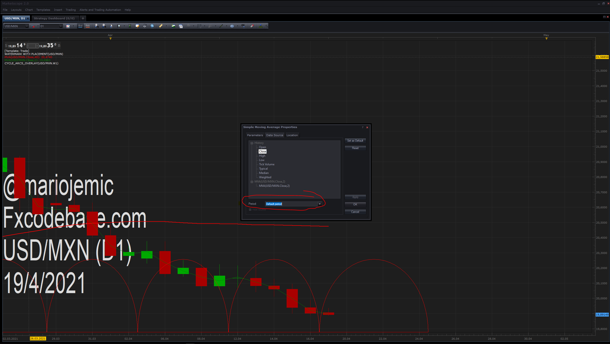

# Cycle_Arcs_Overlay

> Source: https://fxcodebase.com/code/viewtopic.php?f=17&t=71101  
> Forum: 17 · Topic 71101 · 4 post(s)

---

## Cycle_Arcs_Overlay

**Apprentice** · Sun Apr 18, 2021 2:39 am

Based on the request.
[https://fxcodebase.com/code/viewtopic.php?f=27&t=71077](https://fxcodebase.com/code/viewtopic.php?f=27&t=71077)
You can select the timeframe in the data source tab

 [Cycle_Arcs_Overlay.lua](files/141553/Cycle_Arcs_Overlay.lua)

---

## Re: Cycle_Arcs_Overlay

**fortesan9** · Sun Apr 18, 2021 12:19 pm

Only one arc is drawn from candle to candle,

---

## Re: Cycle_Arcs_Overlay

**Apprentice** · Mon Apr 19, 2021 2:04 am

---

## Re: Cycle_Arcs_Overlay

**fortesan9** · Mon Apr 19, 2021 9:54 am

Very nice indicator indeed Don Apprentice!

Muchas Gracias !
