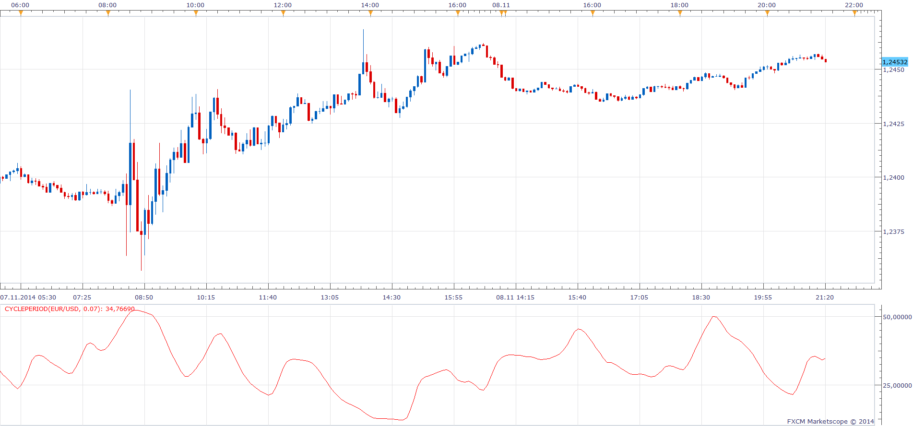
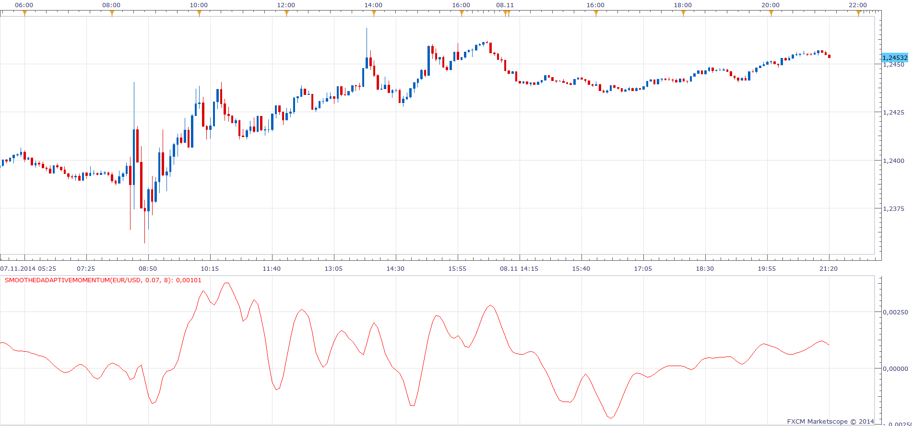
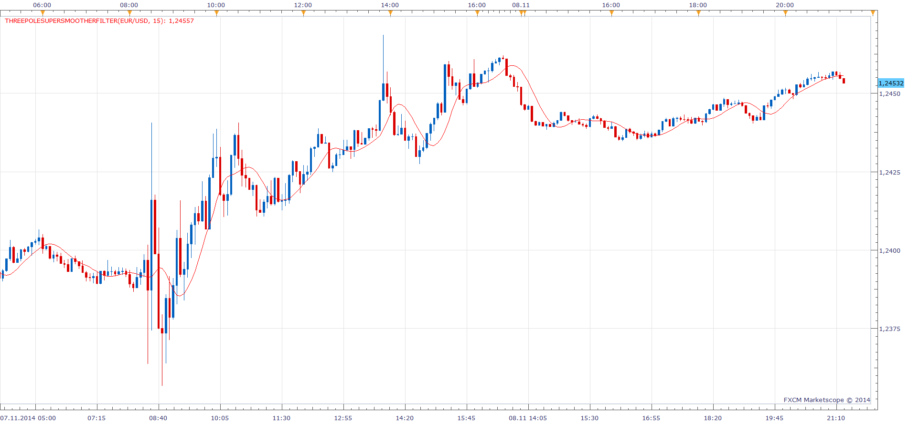

# Cycle Period

> Source: https://fxcodebase.com/code/viewtopic.php?f=17&t=61420  
> Forum: 17 · Topic 61420 · 5 post(s)

---

## Cycle Period

**Apprentice** · Sun Nov 09, 2014 9:54 am

Based on the request.
[viewtopic.php?f=27&t=61414&p=96942#p96942](https://fxcodebase.com/code/viewtopic.php?f=27&t=61414&p=96942#p96942)

Algorithm taken from book "Cybernetics Analysis for Stock and Futures" by John F. Ehlers

 [CyclePeriod.lua](files/96960/CyclePeriod.lua)

The indicator was revised and updated

---

## SmoothedAdaptiveMomentum

**Apprentice** · Sun Nov 09, 2014 9:55 am

Algorithm taken from book "Cybernetics Analysis for Stock and Futures" by John F. Ehlers

 [SmoothedAdaptiveMomentum.lua](files/96961/SmoothedAdaptiveMomentum.lua)

---

## Three Pole Super Smoother Filter

**Apprentice** · Sun Nov 09, 2014 11:24 am

 [ThreePoleSuperSmootherFilter.lua](files/96964/ThreePoleSuperSmootherFilter.lua)

---

## Re: Cycle Period

**red bull** · Sun Nov 09, 2014 2:43 pm

you've been very quick and kind, thank you very much!

---

## Re: Cycle Period

**Apprentice** · Tue Jun 27, 2017 3:55 am

The indicator was revised and updated.
