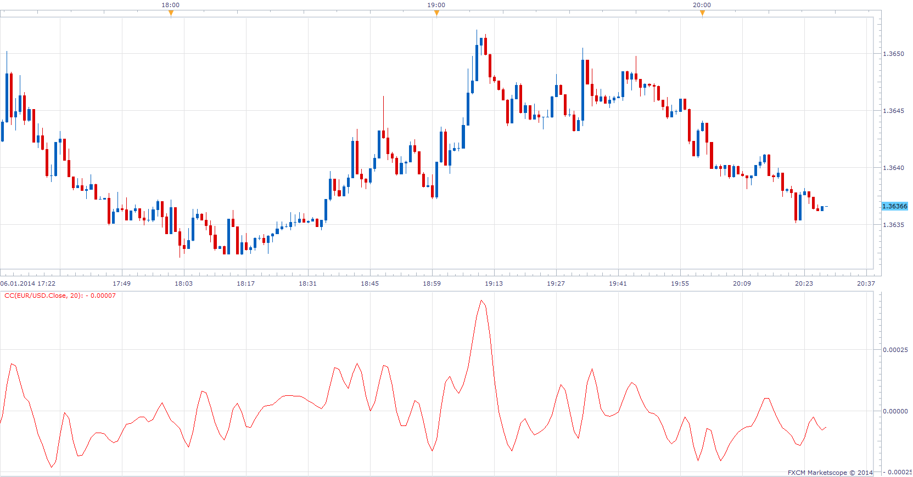
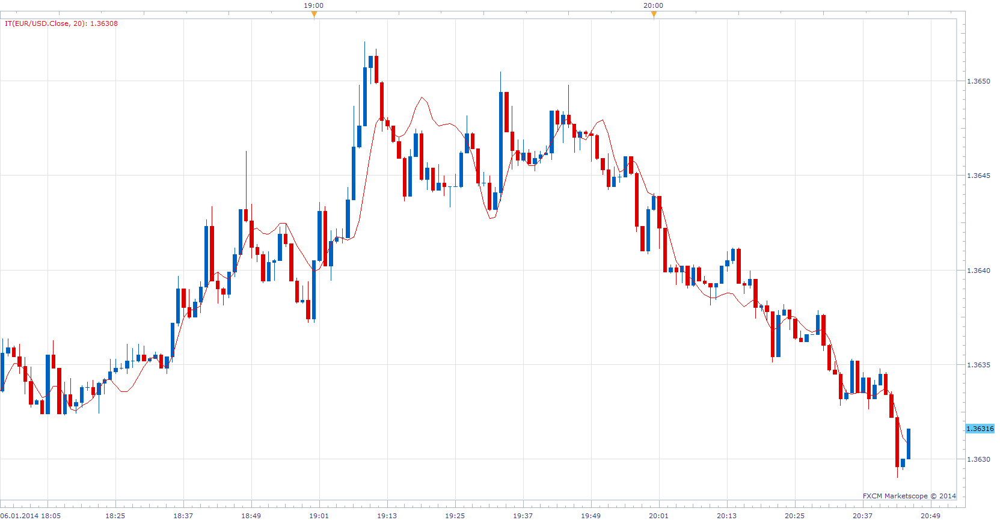
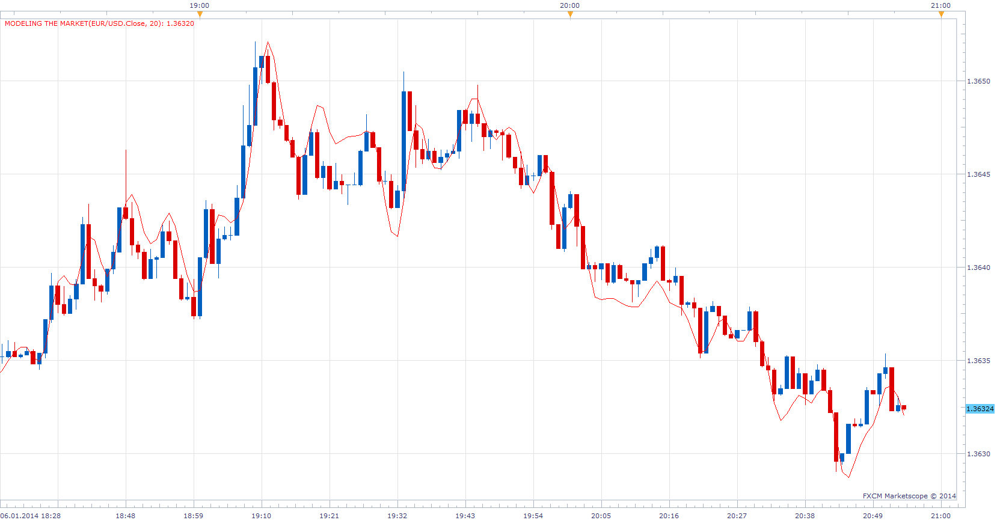

# Cyclic Component

> Source: https://fxcodebase.com/code/viewtopic.php?f=17&t=60180  
> Forum: 17 · Topic 60180 · 14 post(s)

---

## Cyclic Component

**Apprentice** · Mon Jan 06, 2014 2:29 pm

As described in an article by John Ehlers' article "Modeling
The Market = Building Trading Strategies "
August 2006 of S & C Magazine

 [CC.lua](files/91860/CC.lua)

The indicator was revised and updated

---

## INSTANTANEOUS TRENDLINE

**Apprentice** · Mon Jan 06, 2014 2:45 pm

As described in an article by John Ehlers' article "Modeling
The Market = Building Trading Strategies "
August 2006 of S & C Magazine

 [IT.lua](files/91861/IT.lua)

---

## MODELING THE MARKET

**Apprentice** · Mon Jan 06, 2014 2:54 pm

As described in an article by John Ehlers' article "Modeling
The Market = Building Trading Strategies "
August 2006 of S & C Magazine

For those who want to know more, De facto, Modeling
The Market is the sum of IT and CC.

 [MODELING THE MARKET.lua](files/91862/MODELING%20THE%20MARKET.lua)

---

## Re: Cyclic Component

**StefPasc** · Mon Jan 20, 2014 3:07 am

dear Apprentice,

I have installed the CC indicator, and I am facing a problem.
It causes the trading station platform to crush !
can u check it please ?
thank you in advance

---

## Re: Cyclic Component

**Apprentice** · Mon Jan 20, 2014 3:48 am

I failed to reproduce.

Can you share parameters used, the currency pair, time frame ...

If the problem persists, try to reinstall your TS.

---

## Re: Cyclic Component

**StefPasc** · Mon Jan 20, 2014 5:54 am

is it possible to send you (e-mail) a template that causes the problem ?

---

## Re: Cyclic Component

**Apprentice** · Mon Jan 20, 2014 7:13 am

u can send it to mario(.)jemic(@)gmail(.)com
Also Add any available screen shot or crash report.

---

## Re: Cyclic Component

**StefPasc** · Wed Jan 22, 2014 7:59 am

I re-installed everything and I am not having any problem now
Thank you very much Apprentice

---

## Re: Cyclic Component

**Alexander.Gettinger** · Wed Mar 05, 2014 5:01 pm

MQL4 version of indicators: [viewtopic.php?f=38&t=60403](https://fxcodebase.com/code/viewtopic.php?f=38&t=60403).

---

## Re: Cyclic Component

**Apprentice** · Fri Jun 16, 2017 6:37 am

The indicator was revised and updated.

---

## Re: Cyclic Component

**trdheat** · Wed Jan 10, 2018 1:25 pm

I have a question about CC. How many periods repaint for period=1 ?

---

## Re: Cyclic Component

**Apprentice** · Wed Jan 10, 2018 2:30 pm

Indicator will NOT repaint, only the current candle indicator value
will be re-calculated.

---

## Re: Cyclic Component

**trdheat** · Wed Jan 10, 2018 4:43 pm

Apprentice,

There is repaint for CC.lua, set length=1.

n=ongoing value

Check the n-1, after 1 min (you can try even for a tick as source) you observe other value than observed at first for n-1.

Is it clear what i mean? Try the experiment!

---

## Re: Cyclic Component

**trdheat** · Wed Jan 17, 2018 7:07 pm

Apprentice

Any news about my previous observation?

It is crucial for me if there is repaint...please check/test it
