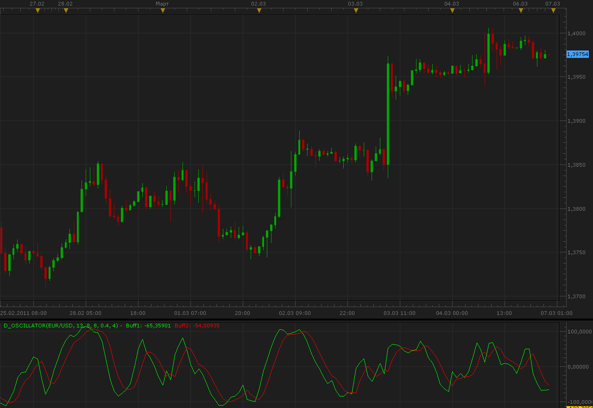
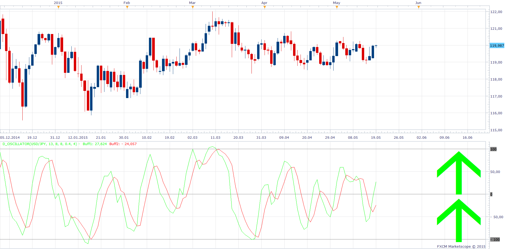
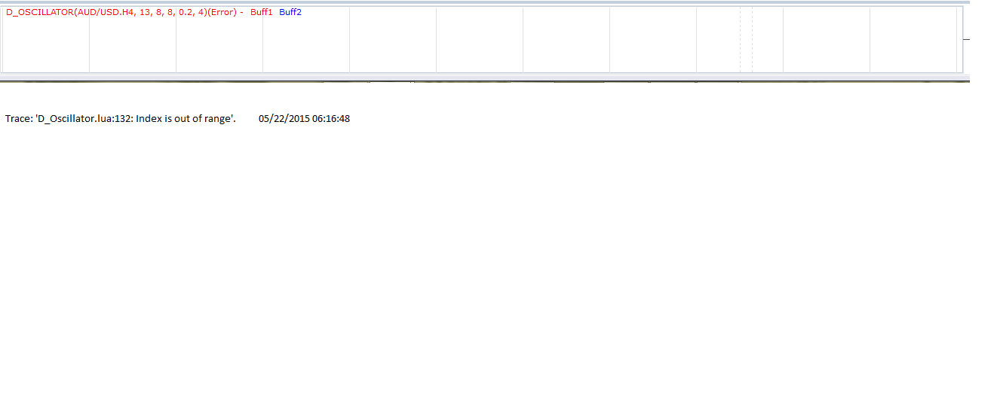

# D oscillator

> Source: https://fxcodebase.com/code/viewtopic.php?f=17&t=3608  
> Forum: 17 · Topic 3608 · 15 post(s)

---

## D oscillator

**Alexander.Gettinger** · Sun Mar 06, 2011 11:19 pm

Oscillator based on two indicators: RSI and CCI.

Formulas:
Line1[i]=2/(Smooth+1)*StCCI+(1-2/(Smooth+1))*Line1[i-1],
Line2[i]=2/(Smooth*0.8+1)*Line1[i-1]+(1-2/(Smooth*0.8+1))*Line2[i-1], where
StCCI=[CCI_Coeff]*CCI[i]+(1-[CCI_Coeff])*StRSI,
StRSI=(RSI[i]-MinRSI)*200/(MaxRSI-MinRSI)-100,
MaxRSI, MinRSI is a maximum and minimum of RSI from [i-D_Period] to [i].

 

Download:

 [D_Oscillator.lua](files/8673/D_Oscillator.lua)

Indicator based strategy
[viewtopic.php?f=31&t=68918](https://fxcodebase.com/code/viewtopic.php?f=31&t=68918)

---

## Re: D oscillator

**Alexander.Gettinger** · Sun Mar 06, 2011 11:23 pm

Strategy based on this oscillator: [viewtopic.php?f=31&t=3609](https://fxcodebase.com/code/viewtopic.php?f=31&t=3609)

---

## Re: D oscillator

**Hybrid** · Thu Jun 02, 2011 8:05 am

Hi,

Could you please make a bigger time frame version? It will be very useful.

Thank you.

---

## Re: D oscillator

**Apprentice** · Thu Jun 02, 2011 6:07 pm

Your request has been added to developmental cue.

---

## Re: D oscillator

**Apprentice** · Fri Jun 03, 2011 3:12 am

Biger Time Frame D Oscillator

 

 [BF_D oscillator.lua](files/11326/BF_D%20oscillator.lua)

You need to install D_Oscillator.lua from Top Most post.

---

## Re: D oscillator

**Hybrid** · Sat Jun 11, 2011 1:00 pm

Thank you very much, Apprentice!

---

## Re: D oscillator

**Alexander.Gettinger** · Fri Jun 29, 2012 1:28 pm

MQL4 version of this oscillator: [viewtopic.php?f=38&t=20672](https://fxcodebase.com/code/viewtopic.php?f=38&t=20672)

---

## Re: D oscillator

**sho-me-pips** · Mon May 18, 2015 4:40 pm

Could arrows be added for a visual of direction of lines.

---

## Re: D oscillator

**Apprentice** · Tue May 19, 2015 4:07 am

Show Arrows Option Added.

---

## Re: D oscillator

**sho-me-pips** · Tue May 19, 2015 8:11 am

Perfect, as always!!

---

## Re: D oscillator

**sho-me-pips** · Thu May 21, 2015 10:44 am

Hi Apprentice,

The Oscillator now creates an error when applying to bigger time frame. I can open oscillator again and click OK then it works. But when opening a template, it shows error and have to open and click OK.

---

## Re: D oscillator

**Apprentice** · Fri May 22, 2015 3:20 am

Can you specify the error message, provide a screenshot.

---

## Re: D oscillator

**sho-me-pips** · Fri May 22, 2015 7:20 am

Error message is in "Events"

---

## Re: D oscillator

**Apprentice** · Mon May 25, 2015 4:24 am

Try it now.
Additional checks added.

---

## Re: D oscillator

**Apprentice** · Mon Oct 29, 2018 7:32 am

The indicator was revised and updated.
