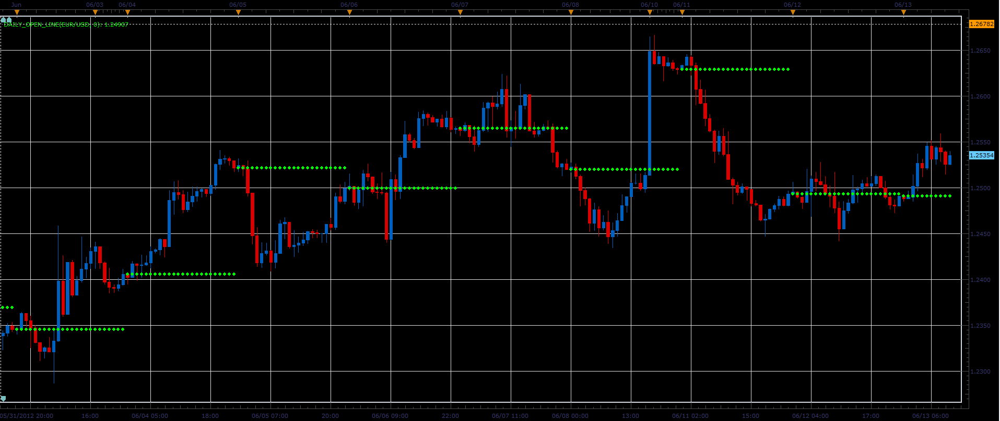
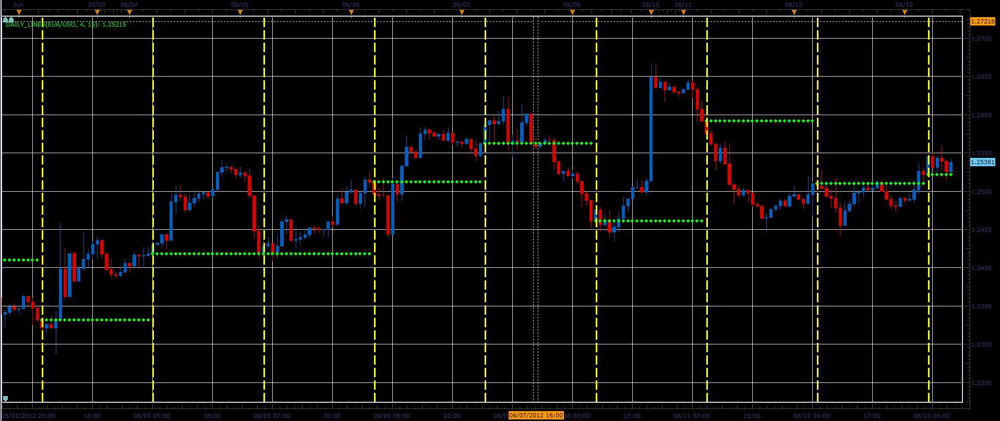
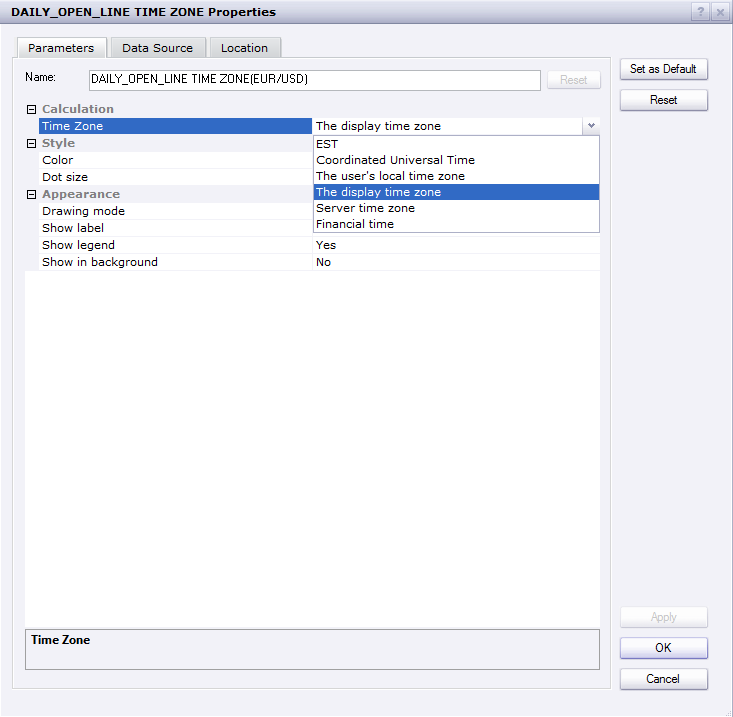

# Daily open lines

> Source: https://fxcodebase.com/code/viewtopic.php?f=17&t=20169  
> Forum: 17 · Topic 20169 · 30 post(s)

---

## Daily open lines

**Alexander.Gettinger** · Wed Jun 13, 2012 9:15 am

The indicator draws the daily open lines. Start time of the day specified.

 

Download:

 [Daily_Open_Line.lua](files/35459/Daily_Open_Line.lua)

 [Daily_Open_Line Time Zone.lua](files/35459/Daily_Open_Line%20Time%20Zone.lua)

---

## Re: Daily open lines

**Alexander.Gettinger** · Wed Jun 13, 2012 9:17 am

MQL4 version of this indicator: [viewtopic.php?f=38&t=20170](https://fxcodebase.com/code/viewtopic.php?f=38&t=20170)

---

## Re: Daily open lines

**Alexander.Gettinger** · Wed Jun 13, 2012 9:23 am

Version of indicator with vertical lines.

 

Download:

 [Daily_Lines.lua](files/35463/Daily_Lines.lua)

---

## Re: Daily open lines

**nazaar** · Wed Jun 13, 2012 9:22 pm

Hello,

I have tried both version and set it to start at 03:00 it does but also draws the dots from 23:15 hour as well on charts below 1-hour.
It works well on 1-hour charts and above.

Thanks.

---

## Re: Daily open lines

**daviej** · Sun Jun 17, 2012 2:15 am

Hi thanks for this indicator

I wonder if there is an option to make the lines solid?

Many many thanks

---

## Re: Daily open lines

**Apprentice** · Sun Jun 17, 2012 3:17 am

Your request is added to the development list.

---

## Re: Daily open lines

**Alexander.Gettinger** · Mon Jul 02, 2012 2:41 pm

> **daviej wrote:**
> Hi thanks for this indicator
>
> I wonder if there is an option to make the lines solid?
>
> Many many thanks

See this versions of indicators:

 [Daily_Open_Line2.lua](files/36403/Daily_Open_Line2.lua)

 [Daily_Lines2.lua](files/36403/Daily_Lines2.lua)

---

## Re: Daily open lines

**Hailkayy** · Mon Jul 02, 2012 8:56 pm

Hi,

i have an idea, can you let please user specify at which time he wants the line to be traced.
Ex if 8h30 specified. at close of the 8h30 candle. A line is drawn for entire day.

Thanks f possible. Great work.Peace.

---

## Re: Daily open lines

**Apprentice** · Tue Jul 03, 2012 2:02 am

Your request is added to the development list.

---

## Re: Daily open lines

**ascillia** · Tue Jul 03, 2012 11:41 am

Good Day to all !
Would be nice to have the same for weekly opens ...... if possible
Thanks

---

## Re: Daily open lines

**maweno** · Tue Aug 07, 2012 6:27 am

Hallo!

Is it possible the time to local time change, not EST (time input)?
And is it possible not to show the opening of the candle, but the first tick?

Best thanks!

---

## Re: Daily open lines

**toti1981** · Mon Jun 10, 2013 2:52 pm

Hello,

i tried "Daily_Open_Line2.lua" but i discovered that i need the line on the close price of the day not the open. Tried to modify it, but cannot figure out, because of Friday close is on different hour (1 hour earlier than the other days).
Could you please give me hints how to develope it?

Thanks

Toti

---

## Re: Daily open lines

**olasz11** · Sun Oct 20, 2013 3:27 pm

I have a problem with DAILY_LINES2.lua indicator. On lower timeframes (m1, m5, m15) it show two lines with other start time, but i want to see one line which has the start time what i set for. Are there any versions of this indicator which can show the current line on lower timeframes?

---

## Re: Daily open lines

**Apprentice** · Tue Oct 22, 2013 5:46 am

Try updated Version (Top most post).
Also i have add version with Time Zone Shift.

---

## Re: Daily open lines

**olasz11** · Thu Oct 24, 2013 11:20 am

It also does not work. On lower timeframes there is a time period shift so i can see two horizontal line in one day. I want to see only the current h line what i set.
Is is possible?

---

## Re: Daily open lines

**Apprentice** · Fri Oct 25, 2013 6:12 am

U have to select appropriate time zone.
Day start / end varies from time zone to time zone.

---

## Re: Daily open lines

**olasz11** · Sat Nov 02, 2013 8:15 am

Can you upload some screenshots about how i can set that?

---

## Re: Daily open lines

**Apprentice** · Sun Nov 03, 2013 4:55 am

---

## Re: Daily open lines

**stfx_81** · Tue Jun 10, 2014 3:58 am

Hi Apprentice,
I am new to this forum so not sure if i am posting in the right place.

I am trying to use daily lines.lua but for some reason it will only work properly on the H1 time frame.

I want to use it on the lower time frames, m15 m5 etc, but when i swap to those time frames it draws a vertical line every 5 mins from 4am to 5am? I have swapped changed etc every combination i can think of, but it still doesnt work? Any ideas?

Local time zone UK
Settings: Open H = 3, Open M = 0 Time F = H1 result = vertical line at 8am
When i then go down to m5 chart, from 4:05 am to 4:55am it draws a vertical line every 5 mins?

I have no idea what i am doing wrong,but all i want the indicator to do it draw a single vertical line at 8am every day and the opening candle price and draw dots as it does on the H1 Time F until 8am come round again...Please can someone help. Thanks

---

## Re: Daily open lines

**pakoromeu** · Tue Jun 10, 2014 7:14 pm

tries to combine these two indicators

[viewtopic.php?f=17&t=9511&p=21225&hilit=daystart#p21225](https://fxcodebase.com/code/viewtopic.php?f=17&t=9511&p=21225&hilit=daystart#p21225)

and Daily_Open_Line.lua on this post

cheers

---

## Re: Daily open lines

**stfx_81** · Thu Jun 19, 2014 6:01 am

Hi Pakoromeu,

Many thanks for the info. I already use daily lines open. But when i go to a lower time from the lines move from 08:00 to 08:15 for some weird reason.
The time of candle looks good, doesn't have the open price option.

Thanks

---

## Re: Daily open lines

**xpertizetrading** · Sun Sep 28, 2014 4:49 pm

Is it possible to code an indicator with 'N' hour open lines?
I am looking for 8 hours or 6 hours open lines or so.

Thanks and Regards,
Xpertizetrading

---

## Re: Daily open lines

**Kilgharrah** · Fri Feb 24, 2017 6:41 am

I would be extremely grateful if you would write me the appropriate programming to use the value of this indicator in a strategy.

---

## Re: Daily open lines

**Apprentice** · Fri Feb 24, 2017 8:16 am

Can you devise, a set of rules for such a strategy.

---

## Re: Daily open lines

**Kilgharrah** · Fri Feb 24, 2017 2:50 pm

For example in strategy [http://fxcodebase.com/code/viewtopic.php?f=17&t=59789&hilit=two+ma+cross](https://fxcodebase.com/code/viewtopic.php?f=17&t=59789&hilit=two+ma+cross), if the price is above the value **Daily open line** change the parameter ALLOWEDSIDE to only buy and if it is below to only sell. Which programming lines would have to add to the strategy. The indicator can have a different time frame of the strategy. Thank you so much

---

## Re: Daily open lines

**Apprentice** · Sat Feb 25, 2017 3:38 pm

Try this version.
[viewtopic.php?f=31&t=64481](https://fxcodebase.com/code/viewtopic.php?f=31&t=64481)

---

## Re: Daily open lines

**Kilgharrah** · Sun Feb 26, 2017 11:08 am

Thanks a lot, but I need the source period of the indicator to always be H1, in order to work with the strategy in others time frames (1min,,, 5min,, etc.)

---

## Re: Daily open lines

**chucklh3** · Mon Dec 11, 2017 10:29 pm

Could an option be added that would end the open line on a specific time? I only need it extend 19 hours, not the full 24.

---

## Re: Daily open lines

**Apprentice** · Fri Dec 15, 2017 7:01 am

Your request is added to the development list under Id Number 3976

---

## Re: Daily open lines

**Apprentice** · Tue Jul 03, 2018 7:00 am

The Indicator was revised and updated.
