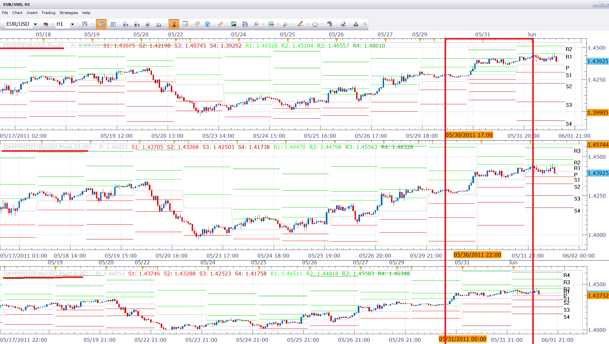

# Daily Pivot with Customization of Day Range

> Source: https://fxcodebase.com/code/viewtopic.php?f=17&t=4564  
> Forum: 17 · Topic 4564 · 16 post(s)

---

## Daily Pivot with Customization of Day Range

**Nikolay.Gekht** · Wed Jun 01, 2011 12:11 pm

FXCM's Trading Day lasts 17:00EST of yesterday to 17:00EST today, so the prices used to create a day candle is taken from that time range.

Sometimes pivots built on other day range (for example on the bar starting at London Midnight (22:00EST-22:00EST) may be more useful.

Here is the indicator which can be used to build **daily** pivots on hour or smaller time frame charts with the day range specified in the parameters. See the snapshot below to compare the default pivot, midnight-midnight NY pivot and midnight-midnight London pivot:

 

Notes:
1) this pivot is only 1-day pivot.
2) this pivot can**not** be applied on H2, H3, H4, H6, H8, Day, Week and Month charts.
3) the most probably it can give you weird result for:
- candles which appears inside the non-trading period (between 17:00EST of Friday and 17:00EST of Sunday)
- irregular nontrading days (such as first trading days after Christmas or New Year)

**Handling of the non-trading period logic:**

For 17:00-17:00 trading everything is simple. No non-trading period occurs inside the 1-day candle.
Day candles are: Sunday 17:00 (Monday candle), Monday 17:00 (Tuesday candle), Tue 17:00 (Wednesday candle) , Wed 17:00 (Thursday candle), Thu 17:00 (Friday candle). There is no Saturday and Sunday candles.

Shifting the trading day makes "pure" Friday candles too short and useless for pivots and brings a new Sunday candles which are also useless. For example if we choose 0:00 EST as the day start, the Friday candle will be just 16 hour candles long (Fri 0:00-Fri 17:00EST ), and a new Sunday candle 8 hours long (Sun 17:00EST-Mon 0:00) appears.

To avoid using such cut candles to pivot, we have to leave just 5 day candles per week, but we have "extend" the candles which start or end inside the nontrading period over this period.

So, For 0:00EST we will have the following candle: Monday 0:00-Tuesday 0:00, Tuesday 0:00-Wednesday 0:00, Wednesday 0:00 - Thursday 0:00, Thursday 0:00 - Monday 0:00 candle.
So, Friday actually contains 16 candles of Friday and 8 candles of Sunday.

Hint: To show yesterday high/low, choose:
 Pivot mode: Fibonacci Retracement
 Show mode: Historical
 Lines: R3 and S3 only

Download:

 [daypivot.lua](files/11252/daypivot.lua)

The indicator was revised and updated

---

## Re: Daily Pivot with Customization of Day Range

**patrick** · Thu Aug 04, 2011 2:26 am

Hi Nikolay,
Great work with the customised pivot calculator!
I use 15 minuite charts and would love to be able to set both the start hour and end hour times for the calculation of the Pivots. (Example - Start 2:00am EST European Open - End 12:00 noon EST London close ) is this possible?

Thanks in advance...
Cheers Patrick

---

## Re: Daily Pivot with Customization of Day Range

**fishmoyne1** · Wed Aug 10, 2011 6:58 am

Hello, could you show me how to download the daypivot.lua can't seem to be able or is it still available? Cheers.

---

## Re: Daily Pivot with Customization of Day Range

**miocker** · Wed Aug 10, 2011 12:50 pm

Hmm, you need just to click on the following link:
[download/file.php?id=4041](https://fxcodebase.com/code/download/file.php?id=4041)
I've just checked and the file downloaded correctly. Please let me know if you still cannot download the file.

---

## Re: Daily Pivot with Customization of Day Range

**fishmoyne1** · Thu Aug 11, 2011 4:19 am

Thanks for help Miocker.

---

## Re: Daily Pivot with Customization of Day Range

**dtdt1111** · Thu Aug 11, 2011 9:22 am

does it work?

it still show different pivots on 15 minute chart and 5 minute chart. If it's daily pivots, those two chart should have same pivots, right?

thanks

---

## Re: Daily Pivot with Customization of Day Range

**dtdt1111** · Thu Aug 11, 2011 11:10 am

i post a reply and don't see it. i see different pivots on different time-frame, such as 15minute chart or 5 minute chart, that's wrong, right?

---

## Re: Daily Pivot with Customization of Day Range

**miocker** · Thu Aug 11, 2011 4:16 pm

Your post was under approval, that is why it wasn't shown immediatelly.
Could you please provide currency pair and dates you're looking, because for example for USD/JPY 08/10 pivots on 15-min chart and on 5 min chart are completely the same (both pivots were applied with default parameters except Display mode changed to Historical).

---

## Re: Daily Pivot with Customization of Day Range

**sunshine** · Thu Aug 11, 2011 10:07 pm

> **dtdt1111 wrote:**
> does it work?
>
> it still show different pivots on 15 minute chart and 5 minute chart. If it's daily pivots, those two chart should have same pivots, right?
>
> thanks

Yes, the Pivots should have the same values. Please make sure that the same calculation mode is set in parameters of both indicators.

---

## Re: Daily Pivot with Customization of Day Range

**dtdt1111** · Fri Aug 12, 2011 6:18 am

i am looking at EURCHF right now. on 15minute chart(marketscope 2.0) pp 1.06707, r1 1.10889 r2 1.13357

on 5 minute chart pp 1.06797 r1 1.11007 r2 1.13454

---

## Re: Daily Pivot with Customization of Day Range

**patrick** · Fri Aug 12, 2011 6:24 pm

Hi,
Is it possible to have Session Pivots with customized session range for small time frames < 1hr.
ie.Would need to be able to select - Start session ( 0 - 23 hrs )
 End session ( 0 - 23 hrs )
and pivots would calculate for that session period.
Say 2:00 EST through to 12:00 EST.

Many Thanks

---

## Re: Daily Pivot with Customization of Day Range

**sunshine** · Sat Aug 13, 2011 1:56 am

> **dtdt1111 wrote:**
> i am looking at EURCHF right now. on 15minute chart(marketscope 2.0) pp 1.06707, r1 1.10889 r2 1.13357
>
> on 5 minute chart pp 1.06797 r1 1.11007 r2 1.13454

I'll check this pair once the market opens.

---

## Re: Daily Pivot with Customization of Day Range

**sunshine** · Tue Aug 16, 2011 3:48 am

> **dtdt1111 wrote:**
> i am looking at EURCHF right now. on 15minute chart(marketscope 2.0) pp 1.06707, r1 1.10889 r2 1.13357
>
> on 5 minute chart pp 1.06797 r1 1.11007 r2 1.13454

I'm afraid I cannot reproduce the issue. Please make sure that the same calculation method is used for both Pivots (you can check it in Indicator Properties).

Please also let me know which time frame do you use for Pivot. D1?

---

## Re: Daily Pivot with Customization of Day Range

**LordTwig** · Sat Aug 20, 2011 7:27 am

Hi,
Been trying to work out how to get the previous 'x' candles data (OHLC) as well as todays current OHLC. Thought I might have be able to use pivots indicator code but cannot understand where to start.

Is there some way to get this data easy to use in simple Indicator & strategy?

Like if todays Open is higher than previous candleOpen1 and
candleOpen1 is higher than candleOpen2 and
candleLow2 is higher than candleLow3 then Buy signal

Lordtwig

---

## Re: Daily Pivot with Customization of Day Range

**TMos1124** · Wed Jan 04, 2012 11:57 am

I wish to develop a strategy that will buy above or sell below the pivot from this indicator. Please add a pip distance (i wish to buy 10 pips above or sell 10 pips below) at close and for it to act once per day. Thank you for your time and effort.

---

## Re: Daily Pivot with Customization of Day Range

**Apprentice** · Mon Mar 20, 2017 8:06 am

Indicator was revised and updated.
