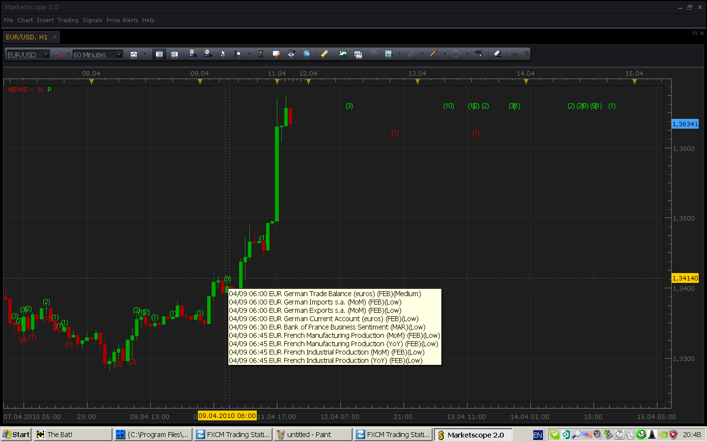

# dailyFX news indicator (closed)

> Source: https://fxcodebase.com/code/viewtopic.php?f=17&t=603  
> Forum: 17 · Topic 603 · 19 post(s)

---

## dailyFX news indicator (closed)

**Nikolay.Gekht** · Sun Apr 11, 2010 7:58 pm

**Note: The post is closed. Please read this topic [viewtopic.php?f=17&t=1972](https://fxcodebase.com/code/viewtopic.php?f=17&t=1972) about new version of the indicator**

The indicator shows dailyfx calendar ([http://www.dailyfx.com/calendar/](http://www.dailyfx.com/calendar/)) event headlines on the chart.

The indicator takes only those events which are related to the currencies of the currently selected instrument.

The indicator shows a number of news for the bar. The green number above the bar is a positive news, a red number below the bar is negative news. If you move a mouse cursor over the number, the toolip with headlines will be shown.

The indicator also loads and shows the news for 300 further bars.

Notes:
1) Only last 90 days events are loaded.
2) I do not recommend to use the indicator on 1-day and above chart. The news loading is synchronous and can "freeze" the marketscope for up to one minute, especially in case the internet connection is not pretty good.

**Update: Aug, 02 2010**. The new version of the dailyfx has been released.

a) you can choose whether you want to see all currencies or only currencies which the current currency pair consists of.
b) you can choose whether you want to see all importances, or Medium + High or High only news.
c) Actual and Forecast values are also shown in the tooltip.

 

Download the indicator:

 [news.lua](files/1071/news.lua)

Code: [Select all](https://fxcodebase.com/code/)
`function Init()
    indicator:name("DailyFX News");
    indicator:description("")
    indicator:requiredSource(core.Bar);
    indicator:type(core.Indicator);
    indicator.parameters:addBoolean("ALL", "All instruments", "Choose true to see all news and false to see the news which are related with the current currency pair only", false);
    indicator.parameters:addString("IMP", "Importance of the new to show", "", "ALL");
    indicator.parameters:addStringAlternative("IMP", "All news", "", "ALL");
    indicator.parameters:addStringAlternative("IMP", "Medium or above", "", "MED");
    indicator.parameters:addStringAlternative("IMP", "High only", "", "HIGH");
    indicator.parameters:addInteger("S", "Font size in points", "", 8, 6, 20);
    indicator.parameters:addColor("clrN", "Negative news color", "", core.rgb(255, 0, 0));
    indicator.parameters:addColor("clrP", "Positive/Neutral news color", "", core.rgb(0, 255, 0));
end

local source;
local newsN;
local newsP;
local http;
local barSize;
local offset;
local extent;
local instr;
local barSizeInDays;
local ALL;
local IMP;

function Prepare()
    source = instance.source;
    barSize = source:barSize();
    instr = source:instrument();
    offset = core.host:execute("getTradingDayOffset");
    ALL = instance.parameters.ALL;
    IMP = instance.parameters.IMP;

    -- calculate the size of the candle
    local s, e;
    s, e = core.getcandle(source:barSize(), core.now(), offset);
    s = e - s;  -- length of candle in days
    if s > 1 then
        assert(false, "1-day is the largest chart which can be used to get news");
    end
    barSizeInDays = s;
    -- number of candles to extent for 1 week.
    -- if source:isAlive() then
    if true then
        extent = math.floor(7 / s);
        if extent > 300 then
            extent = 300;
        end
    else
        extent = 0;
    end
    local name = profile:id();
    newsN = instance:createTextOutput("N", "N", "Arial", instance.parameters.S, core.H_Center, core.V_Bottom, instance.parameters.clrN, extent);
    newsP = instance:createTextOutput("P", "P", "Arial", instance.parameters.S, core.H_Center, core.V_Top, instance.parameters.clrP, extent);
    http = core.makeHttpLoader();
    instance:name(name);
end

local gWeekData = {};

function getweek(date)
    -- gets a week for the specified date
    local t = core.dateToTable(date);
    date = math.floor(date) - (t.wday - 1);
    t = core.dateToTable(date);
    return string.format("%02i-%02i-%04i", t.month, t.day, t.year), t.year;
end

--              date    time    TZ      curr    desc    imp     act     fore    prev
local pline = "([^,]*),([^,]*),([^,]*),([^,]*),([^,]*),([^,]*),([^,]*),([^,]*),([^,]*)%c()";
local pdate = "%a%a%a%s(%a%a%a)%s(%d%d?)";
local ptime = "(%d%d?):(%d%d)";

function parseCSV(response, year)
    local pos, date, time, tz, curr, desc, imp, act, fore, prev;
    local month, day, hour, minute, timemod
    local weekData = {};
    local idx = 1;
    pos = 1;
    while true do
        date, time, tz, curr, desc, imp, act, fore, prev, pos = string.match(response, pline, pos);
        if (date == nil) then
            break;
        end

        if IMP == "ALL" or
           (IMP == "MED" and imp == "Medium" or imp == "High") or
           (IMP == "HIGH" and imp == "High") then

            -- process only those news, which are related with the currencies of
            -- the current instrument
            if (string.find(instr, string.upper(curr), 1, true) ~= nil) or ALL then
                month, day = string.match(date, pdate);
                hour, minute = string.match(time, ptime);
                if month ~= nil and hour ~= nil then
                    local ttime = {};
                    local skip = false;
                    if month == "Jan" then
                        ttime.month = 1;
                    elseif month == "Feb" then
                        ttime.month = 2;
                    elseif month == "Feb" then
                        ttime.month = 2;
                    elseif month == "Mar" then
                        ttime.month = 3;
                    elseif month == "Apr" then
                        ttime.month = 4;
                    elseif month == "May" then
                        ttime.month = 5;
                    elseif month == "Jun" then
                        ttime.month = 6;
                    elseif month == "Jul" then
                        ttime.month = 7;
                    elseif month == "Aug" then
                        ttime.month = 8;
                    elseif month == "Sep" then
                        ttime.month = 9;
                    elseif month == "Oct" then
                        ttime.month = 10;
                    elseif month == "Nov" then
                        ttime.month = 11;
                    elseif month == "Dec" then
                        ttime.month = 12;
                    else
                        skip = true;
                    end

                    if not(skip) then
                        ttime.day = tonumber(day);
                        ttime.hour = tonumber(hour);
                        ttime.min = tonumber(minute);
                        ttime.sec = 0;
                    end
                    ttime.year = year;

                    local news = {};
                    news.instrument = curr;
                    news.orgtime = date .. " " .. time;
                    news.gmt_time = core.tableToDate(ttime);
                    news.est_time = core.host:execute("convertTime", 2, 1, news.gmt_time);
                    ttime = core.dateToTable(core.host:execute("convertTime", 2, 4, news.gmt_time));
                    news.sdate = string.format("%02i/%02i %02i:%02i", ttime.month, ttime.day, ttime.hour, ttime.min);
                    -- get new's candle
                    local s, e;
                    s, e = core.getcandle(barSize, news.est_time, offset);
                    local n, e1;
                    news.orgcandles = s;
                    news.orgcandlee = e;
                    -- check whether candle is a nontraing candle
                    n, e1 = core.isnontrading(s, offset);
                    if n then
                        -- put the news to the first after-nontrading candle (2 day after the begin of the
                        -- non-trading period)
                        s, e = core.getcandle(barSize, e1 + 2, offset);
                    end
                    news.candles = s;
                    news.candlee = e;
                    news.subject = desc;
                    local posneg = "";
                    if act ~= "" then
                        posneg = act;
                    elseif fore ~= "" then
                        posneg = fore;
                    end
                    news.neg = (string.find(posneg, "-", 1, true) ~= nil);
                    news.act = act;
                    news.fore = fore;
                    news.imp = imp;
                    weekData[idx] = news;
                    idx = idx + 1;
                end
            end
        end
    end
    weekData.last = idx - 1;
    return weekData;
end

function loadweek(week, year)
    local url;

    --url = "/calendar/cal.csv?week=" .. week .. "&sort=dateDesc&timezone=GMT&currency=|&importance=|";
    url = "/files/Calendar-" .. week .. ".csv";
    http:load("www.dailyfx.com", 80, url, false);
    if http:successful() then
        return parseCSV(http:response(), year);
    end
    return nil;
end

function ProcessCandle(period, date)
    local week, weekData, year;
    week, year = getweek(date);
    if gWeekData[week] == nil then
        weekData = loadweek(week, year);
        gWeekData[week] = weekData;
    else
        weekData = gWeekData[week];
    end

    if weekData ~= nil then
        local msgp = "";
        local cntp = 0;
        local msgn = "";
        local cntn = 0;
        for i = 1, weekData.last, 1 do
            local data = weekData[i];
            if (data.candles <= date and
                data.candlee > date) or
               (data.orgcandles <= date and
                data.orgcandlee > date)  then
                if data.neg then
                    if cntn > 0 then
                        msgn = msgn .. "\013\010";
                    end
                    msgn = msgn .. data.sdate .. " " .. data.subject .. "(" .. data.imp .. ")";
                    if data.act ~= "" then
                        msgn = msgn .. " Act=" .. data.act;
                    end
                    if data.fore ~= "" then
                        msgn = msgn .. " For=" .. data.fore;
                    end
                    cntn = cntn + 1;
                else
                    if cntp > 0 then
                        msgp = msgp .. "\013\010";
                    end
                    msgp = msgp .. data.sdate .. " " .. data.subject .. "(" .. data.imp .. ")";
                    if data.act ~= "" then
                        msgp = msgp .. " Act=" .. data.act;
                    end
                    if data.fore ~= "" then
                        msgp = msgp .. " For=" .. data.fore;
                    end
                    cntp = cntp + 1;
                end
            end
        end
        local pperiod;
        if period >= source:size() then
            pperiod = source:size() - 1;
        else
            pperiod = period;
        end
        if (cntn > 0) then
            newsN:set(period, source.low[pperiod], "(" .. cntn .. ")", msgn);
        end
        if (cntp > 0) then
            newsP:set(period, source.high[pperiod], "(" .. cntp .. ")", msgp);
        end
    end
end

function Update(period, mode)
    if source:hasData(period) then
        local date;
        date = source:date(period);
        -- the last 30
        if (core:now() - date) > 30 then
            return ;
        end
        ProcessCandle(period, date);
    end

    if extent > 0 and period == source:size() - 1 then
        local i, ccandle;

        ccandle = source:date(period);
        for i = 1, extent - 1, 1 do
            ccandle = ccandle + barSizeInDays;
            ProcessCandle(period + i, ccandle);
        end
    end
end`

---

## Re: dailyFX news indicator

**patick** · Tue Apr 13, 2010 8:52 pm

Excellent work... as usual. You have been busy lately with all these updates; just wanted to pop in and say, thank very-very much!

I wish there was tip/donate button on this website so we could actually get a little extra $ in your hands.

---

## Re: dailyFX news indicator

**Nikolay.Gekht** · Fri Apr 16, 2010 10:06 pm

> I wish there was tip/donate button on this website so we could actually get a little extra $ in your hands.

Thank you very much for your generous proposal. Our team is really happy to make trader's life easier. Hopefully, money earned on the development and support of the Trading Station, Marketscope applications, the reporting system and Order2Go API (yeah, we are those "bastards" who developed all these client-related things) is enough to support this site. The expression of your satisfaction with these products (and, probably, not only at this site) is the most valuable result of our work. So, if you like it - just do not hesitate to tell about it. It will be the best support of our work.

---

## Re: dailyFX news indicator

**Laurus12** · Mon Apr 19, 2010 6:05 pm

Fantastic! I just want to say that I totally agree with Patick Nikolay. You should know that we do not take this for granted. I now have indicators for Marketscope that I for not too long ago could only dream about. By the way, thank you for the Value Charts indicator. I did not know about it at all until you posted it. I have noticed that besides of the basics the Value Charts indicator has some not immediately obvious properties that is very interesting and worth looking into I think.

Thank you very much

---

## Re: dailyFX news indicator

**costock** · Wed Apr 21, 2010 1:39 pm

Hi Guys

I'm a relatively new trader and have only just found this board and custom indicator factility. I have installed the News Indicator, a simple but really useful tool. Install was simple but I notice that it local time does not seem to work or perhaps I'm missing something.

I'm in the UK on GMT +1. The news is not aligned to the correct candle and is 5 hours out e.g. 08:30 (GMT) news release aligns with the 13:30 candle.

Any ideas?

thanks

---

## Re: dailyFX news indicator

**Nikolay.Gekht** · Wed Apr 21, 2010 4:32 pm

Thank for the report. It looks like the timezone-based request on dailyFX site is broken. It returns the time in GMT even if the EST requested. I apologize for the inconvenience. Hopefully, now the Marketscope can convert data b/w timezone, so, I'll change the data requesting to GMT and will use the Marketscope's function to convert into EST (to find the proper candle) and to displayed data (to show the labels more convenient).

.... and already updated.

---

## Re: dailyFX news indicator [updated Apr, 21]

**faheem334** · Thu Apr 22, 2010 1:24 am

excellant work dear, i will also try this in order to earn money, please tell me that in how much time you reached this stage ?

---

## Re: dailyFX news indicator [updated Apr, 21]

**barbs666** · Thu Apr 29, 2010 12:32 am

Thanks very much for your work, look forward to testing!

---

## Re: dailyFX news indicator [updated Apr, 21]

**thetruth** · Wed Jun 30, 2010 1:58 pm

exelent work!!!
can you put some diferent color or something for low, medium and high importance,
thanks!!

---

## Re: dailyFX news indicator [updated Apr, 21]

**Nikolay.Gekht** · Wed Jun 30, 2010 3:52 pm

This in our plans...

I apologize that preparing the new release takes so much my time, so I'm just not able to care about fxcodebase as before. I hope that I'll finish and will be completely back in a couple of week.

---

## Re: dailyFX news indicator [updated Apr, 21]

**a135711** · Wed Jun 30, 2010 10:57 pm

is printing the actual numerical values of economic releases possible? i

---

## Re: dailyFX news indicator [updated Aug, 02]

**Nikolay.Gekht** · Mon Aug 02, 2010 12:45 pm

**Update: Aug, 02 2010**. The new version of the dailyfx has been released. Unfortunately, the URL format for getting calendar data has been changed, so you need to update the indicator in order to get it working again. Also,
a) you can choose whether you want to see all currencies or only currencies which the current currency pair consists of.
b) you can choose whether you want to see all importances, or Medium + High or High only news.
c) Actual and Forecast values are also shown in the tooltip.

Please download the updated indicator from the top post of this topic ([viewtopic.php?f=17&t=603](https://fxcodebase.com/code/viewtopic.php?f=17&t=603))

---

## Re: dailyFX news indicator [updated Aug, 02]

**thetruth** · Tue Aug 10, 2010 9:55 am

Exelent work, but the indicator do not display the news in correct time,
the USD Federal Open Market Committee Rate Decision (AUG 10) is displayed in
other time.
if i can fix it, tell me how.

---

## Re: dailyFX news indicator [updated Aug, 02]

**Nikolay.Gekht** · Tue Aug 10, 2010 11:15 am

Hm... dailyfx displays it at 18:15UTC on the site, but, when csv calendar is requested, it sends it at 14:15. I'll ask dailyfx team why. There is no problem in indicator, rather the problem in the data sent by dailyfx. Anyway, thank for the reporting. This will help dailyfx team to improve their new version of the site.

---

## Re: dailyFX news indicator [updated Aug, 02]

**berliner-panda** · Tue Aug 17, 2010 12:14 pm

...there are no news in the indicator since a couple of days. Is the link to dailyFX again updated? Could anybody help, please!

---

## Re: dailyFX news indicator [updated Aug, 02]

**Nikolay.Gekht** · Tue Aug 17, 2010 2:38 pm

And now they have changed format of the file. They gotta make us all crazy. I'm handling this, give me a couple of hours, please.

upd: It looked much easier than I expected. They just changed the time format. Fixed. Please reinstall the indicator.

---

## Re: dailyFX news indicator [updated Aug, 17] (closed)

**Apprentice** · Mon Jan 23, 2017 6:12 am

Indicator was revised and updated.

---

## Re: dailyFX news indicator (closed)

**LordTwig** · Tue Jul 11, 2017 12:41 am

This is probably one of the best and most important indicators here...Thanks for keeping it alive and updated @ all the team here doing a fabulous job

---

## Re: dailyFX news indicator (closed)

**Apprentice** · Mon Feb 05, 2018 8:46 am

The Indicator was revised and updated.
