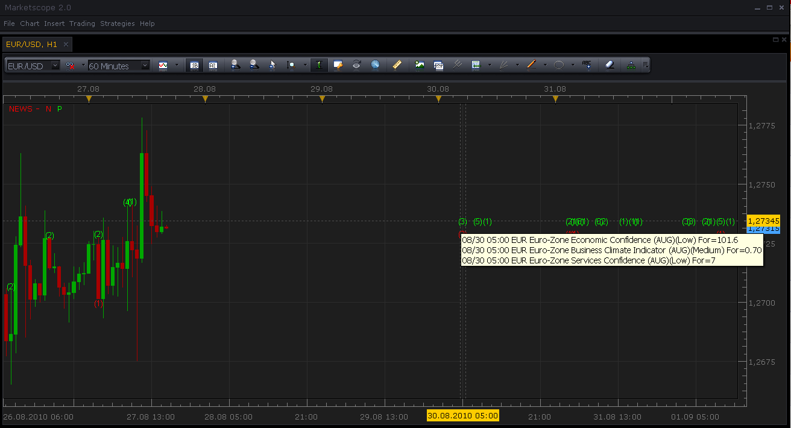
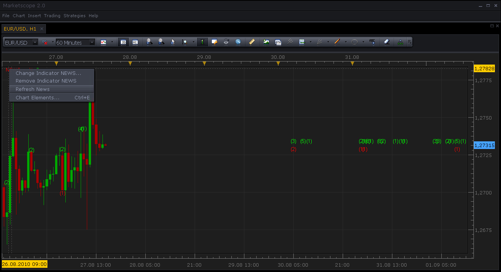
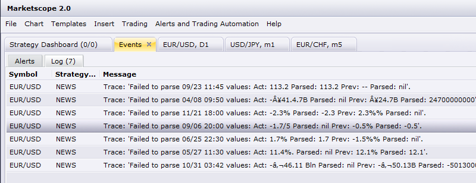
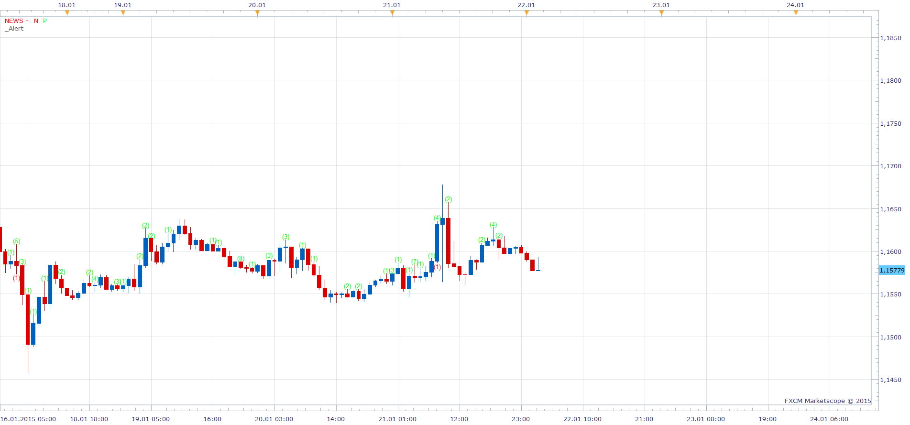
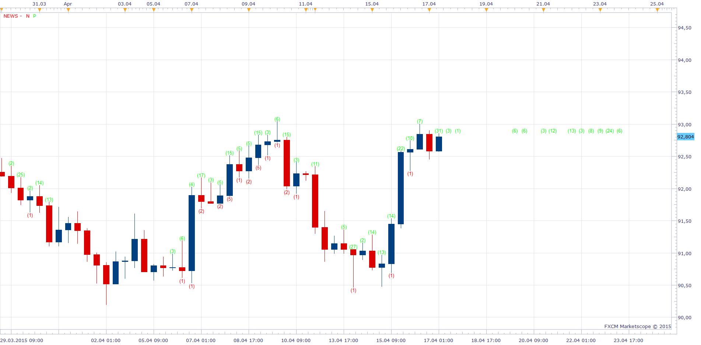

# Dailyfx news indicator for Aug 27,10 Trading Station release

> Source: https://fxcodebase.com/code/viewtopic.php?f=17&t=1972  
> Forum: 17 · Topic 1972 · 52 post(s)

---

## Dailyfx news indicator for Aug 27,10 Trading Station release

**Nikolay.Gekht** · Sat Aug 28, 2010 9:40 pm

This is an update for the existing dailyfx news indicator (see [viewtopic.php?f=17&t=603](https://fxcodebase.com/code/viewtopic.php?f=17&t=603)).

New features:
1) The indicator does not block Marketscope anymore while the news are being loaded.
2) You can specify "refresh" period (in minutes). In that case the calendar events will be reloaded every N minutes.
3) You can also refresh the news anytime. Just right-click anywhere on the chart at which the indicator is applied, and then choose "Refresh news" in the context menu.

The indicator features:
1) The indicator shows either those events which are related to the currencies of the currently selected instrument or all the events in the calendar, depending on the user choice.

2) The indicator shows news of all all, medium + high or high-only importance, depending on the user choice.

3) The indicator shows a number of news for the bar. The green number above the bar is a positive news, a red number below the bar is negative news. If you move a mouse cursor over the number, the toolip with headlines will be shown.

4) The indicator also loads and shows the news for 300 further bars.

 

 

Download:

 [news.lua](files/3996/news.lua)

---

## Re: Dailyfx news indicator for Aug 27,10 Trading Station release

**notex0000** · Mon Sep 27, 2010 5:03 am

Hi! ICan I set this indcator to see the old news? In the last year? This is very usefull inducator but i want make statistic in the past -> price action and "difference of the forecast and real data" (sorry about my bad english)

---

## Re: Dailyfx news indicator for Aug 27,10 Trading Station release

**Nikolay.Gekht** · Mon Sep 27, 2010 9:09 am

This indicator shows all the news FXCM provides at dailyfx. At the moment, the oldest data they provide is May 2010. So, the indicator can, but there is no source where take the data.

---

## Re: Dailyfx news indicator for Aug 27,10 Trading Station release

**OilyFish** · Tue Sep 28, 2010 2:49 pm

Are there any news indicators/strategy's where you can set parameters to automatically enter a trade immediately the news is issued?

---

## Re: Dailyfx news indicator for Aug 27,10 Trading Station release

**Nikolay.Gekht** · Tue Sep 28, 2010 3:39 pm

Not yet, but I see no problem to develop such strategy. However, there should be more strict rule on how to detect a news, and when to enter and so on. If you are interested let's discuss it in the request forum.

---

## Re: Dailyfx news indicator for Aug 27,10 Trading Station release

**forexler** · Thu Jun 09, 2011 2:42 am

very helpy tool ,
sometimes it didn't show news of high importance (BOE decision etc) due to the fact that format strings in the CSV file (calendar file dailyfx) are handled differently.
Text in the "imp-field" is sometimes written as HIGH or High , MEDIUM or Medium etc.
The original News.lua handles string.upper only ( HIGH,LOW,MEDIUM)

I changed the code to handle this in

function parseCSV(response, year)
.....

if IMP == "ALL" or
 (IMP == "MED" and imp == "MEDIUM")
 or (IMP == "MED" and imp == "Medium")
 or ( IMP == "MED" and imp =="HIGH")
 or (IMP == "MED" and imp == "High")

 or (IMP == "HIGH" and imp == "HIGH")

 or (IMP == "HIGH" and imp == "High") then

regards
Fritz

---

## Re: Dailyfx news indicator for Aug 27,10 Trading Station release

**t1982t** · Mon Jul 18, 2011 11:16 am

Hello
I have found very useful this indicator. I wondering if it is possible a strategy with it.
Thank you
Kind regards

---

## Re: Dailyfx news indicator for Aug 27,10 Trading Station release

**Apprentice** · Tue Jul 19, 2011 4:34 am

Such a strategy should contain.
Option to define a trading direction for each news announcement.
For example.
If the news release is better than expected.
Direction of Trade in this case.
If the news release is worse than expected.
Direction of Trade in this case.
If the news release is as expected.
Direction of Trade in this case.

Also the same should be possible,
based on comparisons to previous results.

True?

---

## Re: Dailyfx news indicator for Aug 27,10 Trading Station release

**t1982t** · Tue Jul 19, 2011 9:22 am

Yep, it should contain that, it would be great.
and if it is the way to utilize all the direction of the trade (minimun 50 pips in the mayority of cases), it would be so great . I have not found a strategy in this respect.
The strategy that I am using consist on two entries : one order buy, and one order sell, at the minute of the news (using only highly relevants on EUR/USD) by a distant of ten pips to each other, with a limit of 10 and stop of 100. It is very risky, however so strange to fail.
Actually I just thought: if news positive, buy, if news negative sell, but I am afraid to obtain benefit of news it is not so simple.
I have noticed that the mayority of news have a kind of retracement (some times to 60 pips in average of 4 hours), what I like to call tail of the news, if there a way to entry at the buttom of the tail, there is a way to get minimun 50 pips. Perhaps with some kind of slippage or wait after news or entry at level less n pips after news.

Maybe anybody out there has a good strategy to share. Some one! Any idea?
But anyway sounds good that way.
and is it possible?

---

## Re: Dailyfx news indicator for Aug 27,10 Trading Station release

**emjay-short** · Thu Jul 21, 2011 11:49 am

I've opened a FX Trading Station Feedback ticket via ([http://support.fxcm.com/fxts/feedback/](http://support.fxcm.com/fxts/feedback/)) and requested to implement it (news.lua functionality) into MarketScope. Not needing the News.lua. As a Widget which works more seamlessly.

When I use the indicator, my MarketScope stops responding for several seconds when opening a new chart. A bit annoying when switching charts several times a day.

Fingers crossed that they will put this feature in an improved version into Marketscope.

---

## Re: Dailyfx news indicator for Aug 27,10 Trading Station release

**bomberone3** · Fri Nov 04, 2011 5:09 pm

Is it possible add also on the candle a line that shows exctly when the news is released?

---

## Re: Dailyfx news indicator for Aug 27,10 Trading Station release

**LuckyPanda** · Tue Nov 08, 2011 6:31 pm

Very useful indicator but like the previous post said, it has very long lag when changing time frames. Could it be fixed? Thanks.

---

## Re: Dailyfx news indicator for Aug 27,10 Trading Station release

**Nikolay.Gekht** · Wed Nov 09, 2011 8:45 am

I see the problem. I happens when the indicator is not loaded completely and waits for dailyfx response for older periods. I can be changed in upcoming version of TS2 (currently beta) and using an alternative http module. I'll prepare the update and the instruction for beta today.

---

## Re: Dailyfx news indicator for Aug 27,10 Trading Station release

**t1982t** · Sun Apr 29, 2012 10:35 pm

Hello. I wondering if It´s possible a strategy with this indicator.
The conditions could be:
Long: positive news
Short: negative news
Best regards and always thank you for your efforts and time

---

## Re: Dailyfx news indicator for Aug 27,10 Trading Station release

**Apprentice** · Mon Apr 30, 2012 3:26 am

In theory, yes.

---

## Re: Dailyfx news indicator for Aug 27,10 Trading Station release

**t1982t** · Mon Apr 30, 2012 12:46 pm

---

## Re: Dailyfx news indicator for Aug 27,10 Trading Station release

**Alexander.Gettinger** · Fri Jan 04, 2013 11:32 am

In the indicator fixed bug of first week of the year.

---

## Re: Dailyfx news indicator for Aug 27,10 Trading Station rel

**Steven Smith** · Fri Jan 18, 2013 2:03 am

I think this indicator shows all the news FXCM provides at dailyfx.
At the moment, the oldest data they provide is May 2010. So, the indicator can,
but there is no source where take the data.

---

## Re: Dailyfx news indicator for Aug 27,10 Trading Station rel

**Jacques** · Thu Feb 06, 2014 5:30 am

Hi, devs.

Thanks for this useful indicator. I'd like to request an option to see only the news from the affected currencies from currency pairs, i.e. GBP and AUD news for GBP/AUD currency pair or GBP and JPY news for GBP/JPY currency pair.

Thanks for your help.

Best regards,
Jacques

---

## Re: Dailyfx news indicator for Aug 27,10 Trading Station rel

**mjf1288** · Thu Feb 06, 2014 2:32 pm

Could someone please implement this with the current algorithm:

if the news comes out better than expected, then red
if the news comes out worse than expected, then green

There are fundamental flaws with the current implementation. The smart money does not buy on good news, they buy on bad news and vice versa.

---

## Re: Dailyfx news indicator for Aug 27,10 Trading Station rel

**Apprentice** · Fri Feb 07, 2014 3:10 am

Your request is added to the development list.

---

## Re: Dailyfx news indicator for Aug 27,10 Trading Station rel

**all_in** · Fri Jul 04, 2014 9:10 am

> **mjf1288 wrote:**
> Could someone please implement this with the current algorithm:
>
> if the news comes out better than expected, then red
> if the news comes out worse than expected, then green
>
> There are fundamental flaws with the current implementation. The smart money does not buy on good news, they buy on bad news and vice versa.

Not necessarily, this news related price action was on bad news, which was an excuse to mark the price up, to gather the stops/short positions, who will need to buy in order to cover and the SM will gladly sell, increasing supply to the downside.

---

## Re: Dailyfx news indicator for Aug 27,10 Trading Station rel

**moomoofx** · Wed Nov 26, 2014 9:12 pm

Hi everyone,

I have updated the indicator to meet some requested functionality on this current thread and another thread ([viewtopic.php?f=27&t=36197](https://fxcodebase.com/code/viewtopic.php?f=27&t=36197)).

Specifically, a bunch of you requested that if the number is less than the forecast, it should be negative. Amusingly, some of you even requested the exact opposite, i.e. if the actual number is greater than the forecast, it is negative. Even though I disagree with all of you, there is now a new parameter called **Meaning of Negative** where you can toggle if the previous behavior applies or the new behavior.

I have also changed the text for each news event to show the previous value in the event of the forecast value not being available.

Additionally, someone requested that you be able to choose which currency news are shown. This is now implemented via the **Instruments** and**Instruments List**parameters. Instruments is a selection box which allows you to choose to show news related to All Instruments, the Current Instrument, or the instruments specified in the List. Set Instruments to List and fill in the Instruments List parameter with a comma separated list of currencies, for example, EUR,USD,JPY and you should be fine.

Please download the updated version from the first post in this thread.

**Update**
Apologies I updated the code again about 90 minutes later as it had several bugs due to the data format constantly changing so please redownload if you did.

Sometimes units were provided, sometimes currency pair symbols were provided. It is pretty robust now but even still there are times where the values cannot be parsed elegantly because they have been entered wrong. Sorry, not my fault, blame DailyFX. However, if that does happen you'll see them appear in the Event Log window like in the attached screenshot.

 

Cheers,
MooMooForex

---

## Re: Dailyfx news indicator for Aug 27,10 Trading Station rel

**moomoofx** · Tue Dec 09, 2014 3:49 am

As requested, I have created a strategy that trades the news. This indicator is not required for the strategy to work.

[viewtopic.php?f=31&t=61584](https://fxcodebase.com/code/viewtopic.php?f=31&t=61584)

Cheers,
MooMooForex

---

## Re: Dailyfx news indicator for Aug 27,10 Trading Station rel

**Paul W** · Wed Jan 21, 2015 3:55 pm

Is anyone having trouble with the Dailyfxnews indicator not posting calendar events on the charts ? Mine was working fine last week, not now. thanks

---

## Re: Dailyfx news indicator for Aug 27,10 Trading Station rel

**Apprentice** · Thu Jan 22, 2015 2:30 am

As u can see. My test did not detect any problems.
Can you provide parameter section screenshot.

---

## Re: Dailyfx news indicator for Aug 27,10 Trading Station rel

**Paul W** · Thu Jan 22, 2015 5:40 am

this is puzzling.

If you are able to get results, then clearly it is local to my machine - one would think.

The indicator was working fine last week, and I haven't changed any settings - of consequence.

I will have to investigate further. thx

I assume the indicator is polling data from .dailyfx.com/calendar ?

---

## Re: Dailyfx news indicator for Aug 27,10 Trading Station rel

**sthue100** · Thu Jan 22, 2015 10:54 am

Mine quit on the 18th. Shows all news up until that date.

---

## Re: Dailyfx news indicator for Aug 27,10 Trading Station rel

**Paul W** · Thu Jan 22, 2015 2:28 pm

Jan 18th looks like the last posted Calender event date

Could the problem be with the data source ?

---

## Re: Dailyfx news indicator for Aug 27,10 Trading Station rel

**sthue100** · Thu Jan 22, 2015 2:43 pm

Figuring this out. I guess this comes out weekly. If you look at [http://www.dailyfx.com/files/Calendar-01-11-2015.csv](http://www.dailyfx.com/files/Calendar-01-11-2015.csv) it has 149 news events for the week.
Looking at [http://www.dailyfx.com/files/Calendar-01-18-2015.csv](http://www.dailyfx.com/files/Calendar-01-18-2015.csv) the file only shows 3 news events all on the 18th. So it was only filled out for Sunday. Oversight by FXCM?

---

## Re: Dailyfx news indicator for Aug 27,10 Trading Station rel

**Paul W** · Thu Jan 22, 2015 8:13 pm

I believe I found the answer. It appears data for the week of Jan 18 is incomplete.

If you download the week of Jan 25 - complete data resumes

Jan 12 - 15: [http://www.dailyfx.com/files/Calendar-01-11-2015.csv](http://www.dailyfx.com/files/Calendar-01-11-2015.csv) complete

Jan 18 - 23: [http://www.dailyfx.com/files/Calendar-01-18-2015.csv](http://www.dailyfx.com/files/Calendar-01-18-2015.csv) incomplete, only Jan 18

Jan 25 - 30: [http://www.dailyfx.com/files/Calendar-01-25-2015.csv](http://www.dailyfx.com/files/Calendar-01-25-2015.csv) complete

Note to self for the future.

Thanks

---

## Re: Dailyfx news indicator for Aug 27,10 Trading Station rel

**Spidey** · Mon Mar 16, 2015 12:40 am

The csv data files on DailyFx have been missing/incomplete for the last 2 weeks. The xls files appear to be correct. Maybe they've forgotten how to export a csv file. I have emailed every contact email on the DailyFX site as well as sent a support request to FXCM last Monday but so far no reply.

Any chance an admin or moderator could look into this?

Thanx

---

## Re: Dailyfx news indicator for Aug 27,10 Trading Station rel

**Paul W** · Mon Mar 16, 2015 6:55 am

Am experiencing similar problems with incomplete CSV data – database call issues ?

Suggest trying the ForexFactory Calendar as a backup
[viewtopic.php?f=17&t=61485&p=97199&hilit=FFCALENDAR#p97199](https://fxcodebase.com/code/viewtopic.php?f=17&t=61485&p=97199&hilit=FFCALENDAR#p97199)

For those who want to test the weekly data, change link address to the appropriate month/week/year - [http://www.dailyfx.com/files/Calendar-03-15-2015.csv](http://www.dailyfx.com/files/Calendar-03-15-2015.csv)

---

## Re: Dailyfx news indicator for Aug 27,10 Trading Station rel

**rtsayers** · Wed Apr 15, 2015 1:24 pm

I am also having problems with this indicator not working? Very frustrating!

---

## Re: Dailyfx news indicator for Aug 27,10 Trading Station rel

**Apprentice** · Fri Apr 17, 2015 4:02 am

I just tested News indicator.
Did not encountered any problems.

---

## Re: Dailyfx news indicator for Aug 27,10 Trading Station rel

**Paul W** · Fri Apr 17, 2015 7:41 am

Database issue – sporadic, will be Ok for weeks at a time

Have tested and found complete, then incomplete data, within minutes of download times ?

An individual server (one of many) within the network - may also depend on whether you are logging onto a live or demo server ?

CSV download link - [http://www.dailyfx.com/files/Calendar-04-19-2015.csv](http://www.dailyfx.com/files/Calendar-04-19-2015.csv)

Note: MM/WW/YY where WW = Sunday of the desired week

Contacting FXCM – so they will log and track could help

---

## Re: Dailyfx news indicator for Aug 27,10 Trading Station rel

**rtsayers** · Fri Apr 17, 2015 8:48 pm

Weird because it doesn't work on both of my computers with marketscope and I have removed and installed it a bunch of times and I missing 4 days of data.

---

## Re: Dailyfx news indicator for Aug 27,10 Trading Station rel

**fatbeetrader** · Wed May 06, 2015 8:00 am

still not working!!

---

## Re: Dailyfx news indicator for Aug 27,10 Trading Station rel

**rtsayers** · Mon Jun 01, 2015 4:04 pm

Hi Its still not working!

---

## Re: Dailyfx news indicator for Aug 27,10 Trading Station rel

**Spidey** · Mon Sep 07, 2015 2:51 am

still not working.

Quite shocking that FXCM allows this to continue on their DailyFx site. Either support the service or cancel it altogether. I'm trading live and (used to) rely on this for a heads up when news is due.

I have emailed every email address I can find for FXCM and haven't received a single reply.

---

## Re: Dailyfx news indicator for Aug 27,10 Trading Station rel

**Spidey** · Tue Sep 08, 2015 8:42 am

Seems DailyFx no longer provides a csv file, only pdf and xls. So unless someone or the author is willing and able to modify the code, that's it for this indicator.

---

## Re: Dailyfx news indicator for Aug 27,10 Trading Station rel

**Apprentice** · Thu Sep 10, 2015 3:02 am

Thank you for your report.
We will investigate.

---

## Re: Dailyfx news indicator for Aug 27,10 Trading Station rel

**LordTwig** · Mon Sep 14, 2015 9:15 am

Hi News indicator has stopped working in trading station. Hasn't worked since 29th August 2015.. does not work even if uninstall and install. Is this an issue for all or only my issue. Can someone look into what could be wrong?? Cheers

---

## Re: Dailyfx news indicator for Aug 27,10 Trading Station rel

**Apprentice** · Tue Sep 15, 2015 4:09 am

We are aware of that.
Looks like FXCM do not provide data anymore.
It will take a while until this will be fixed.

---

## Re: Dailyfx news indicator for Aug 27,10 Trading Station rel

**Konstantin.Toporov** · Tue Sep 15, 2015 10:37 pm

FXCM recommends to use their indicator [https://www.fxcmapps.com/apps/dailyfx-news/](https://www.fxcmapps.com/apps/dailyfx-news/).
It is free but FXCM account required.

---

## Re: Dailyfx news indicator for Aug 27,10 Trading Station rel

**Spidey** · Thu Sep 24, 2015 3:07 am

FXCM still provides data but in xls (excel) format. Two options are :
1) modify indicator to parse xls files (probably difficult)
2) modify indicator to have option to import csv file directly from disk. users can download xls file from DailyFx and save as csv.

Currently trying to download FXCM news indicator but the account login appears not to be working. From the screenshot it appears more intrusive than Nikolay/Apprentice's version

---

## Re: Dailyfx news indicator for Aug 27,10 Trading Station rel

**Spidey** · Thu Sep 24, 2015 5:31 am

FXCM indicator causes my cpu usage to jump 10%, my fan goes crazy and cursor lags and jumps on the charts. Otherwise, its OK.

---

## Re: Dailyfx news indicator for Aug 27,10 Trading Station rel

**Paul W** · Thu Sep 24, 2015 1:59 pm

am experiencing a similar problem - hang time opening entry and market order windows

not good,

not quite as good, but have gone to ForexFactory Calendar - [viewtopic.php?f=17&t=61485&p=97199&hilit=FFCALENDAR#p97199](https://fxcodebase.com/code/viewtopic.php?f=17&t=61485&p=97199&hilit=FFCALENDAR#p97199)

unfortunate

---

## Re: Dailyfx news indicator for Aug 27,10 Trading Station rel

**Spidey** · Fri Oct 16, 2015 7:05 am

Sent a support request on the DailyFx app shop support page two weeks ago. So far, no reply, no acknowledgement. Really great. Just as well its not a paid app.

---

## Re: Dailyfx news indicator for Aug 27,10 Trading Station rel

**Spidey** · Mon Dec 21, 2015 4:39 am

Working again with the beta site.

Change the following line:
http:load("www.dailyfx.com", 80, url, true);

to:
http:load("beta.dailyfx.com", 80, url, true);

May change again in the future if they rename the site.

---

## Re: Dailyfx news indicator for Aug 27,10 Trading Station rel

**Apprentice** · Mon Dec 21, 2015 5:05 am

news for dailyfx beta.lua added.

---

## Re: Dailyfx news indicator for Aug 27,10 Trading Station rel

**Apprentice** · Wed Oct 03, 2018 5:37 am

The indicator was revised and updated.
