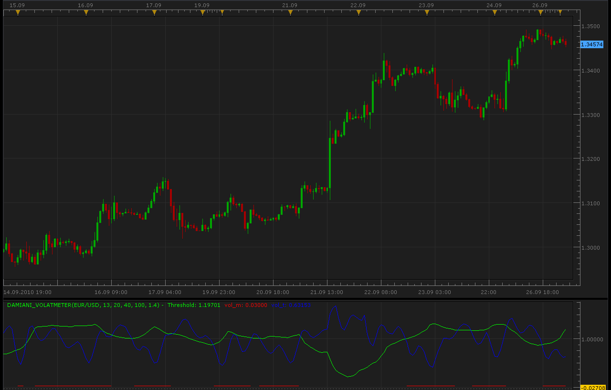

# Damiani volameter

> Source: https://fxcodebase.com/code/viewtopic.php?f=17&t=2274  
> Forum: 17 · Topic 2274 · 3 post(s)

---

## Damiani volameter

**Alexander.Gettinger** · Mon Sep 27, 2010 2:06 am

[viewtopic.php?f=27&t=2225](https://fxcodebase.com/code/viewtopic.php?f=27&t=2225)

 

The indicator was revised and updated

---

## Re: Damiani volameter

**Alexander.Gettinger** · Mon Sep 27, 2010 2:48 am

For work this indicator must be installed indicator StdDev ([viewtopic.php?f=17&t=870&start=0](https://fxcodebase.com/code/viewtopic.php?f=17&t=870&start=0)).

---

## Re: Damiani volameter

**Apprentice** · Mon Jan 23, 2017 6:02 am

Indicator was revised and updated.
