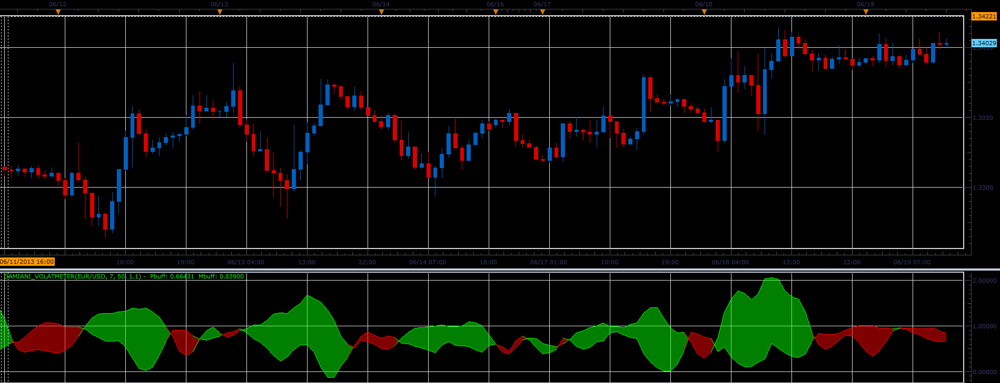

# Damiani volatmeter oscillator

> Source: https://fxcodebase.com/code/viewtopic.php?f=17&t=41459  
> Forum: 17 · Topic 41459 · 2 post(s)

---

## Damiani volatmeter oscillator

**Alexander.Gettinger** · Wed Jun 19, 2013 3:07 pm

This indicators is a ported MQL5 indicators from [http://www.mql5.com/ru/code/1749](http://www.mql5.com/ru/code/1749) (in Russian).

The indicator measures the volatility and shows it in as colored stripes.

 

Download:

 [Damiani_Volatmeter.lua](files/67710/Damiani_Volatmeter.lua)

For this indicator must be installed StdDev indicator ([viewtopic.php?f=17&t=870](https://fxcodebase.com/code/viewtopic.php?f=17&t=870)).

The indicator was revised and updated

---

## Re: Damiani volatmeter oscillator

**Apprentice** · Tue May 23, 2017 6:32 am

Indicator was revised and updated.
