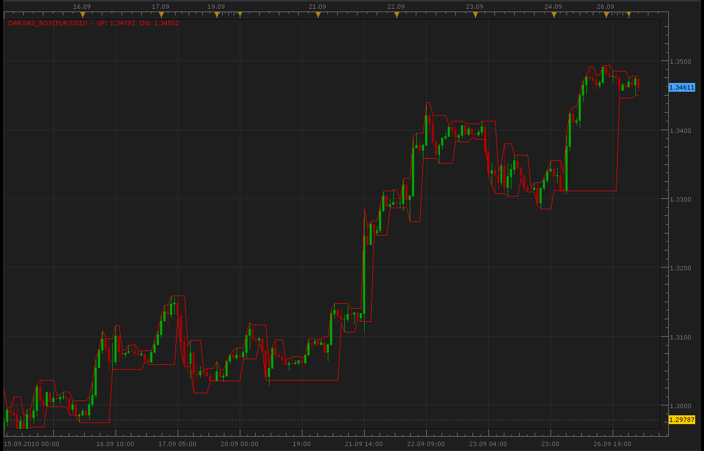
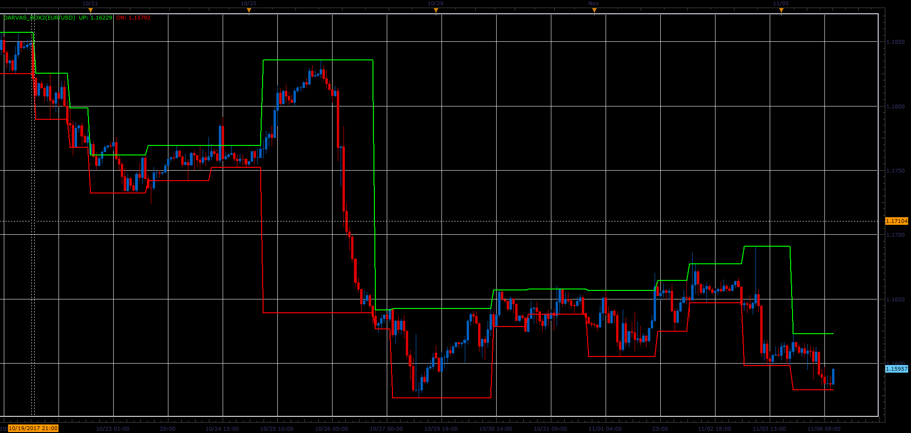

# Darvas Box

> Source: https://fxcodebase.com/code/viewtopic.php?f=17&t=2275  
> Forum: 17 · Topic 2275 · 10 post(s)

---

## Darvas Box

**Alexander.Gettinger** · Mon Sep 27, 2010 2:43 am

For what is Darvas Box please see:
[http://www.investopedia.com/terms/d/darvasboxtheory.asp](http://www.investopedia.com/terms/d/darvasboxtheory.asp)

 



```lua
function Init()
    indicator:name("Darvas Box");
    indicator:description("Darvas Box");
    indicator:requiredSource(core.Bar);
    indicator:type(core.Indicator);

    indicator.parameters:addGroup("Style");
    indicator.parameters:addColor("clrUP", "UP Color", "UP Color", core.rgb(0, 255, 0));
    indicator.parameters:addColor("clrDN", "DN Color", "DN Color", core.rgb(255, 0, 0));
end

local first;
local source = nil;
local BuffUP=nil;
local BuffDN=nil;
local box_top=0.;
local box_bottom=0.;
local state=1;
local i;

function Prepare()
    source = instance.source;
    first = source:first()+2;
    local name = profile:id() .. "(" .. source:name() .. ")";
    instance:name(name);
    BuffUP = instance:addStream("BuffUP", core.Line, name .. ".UP", "UP", instance.parameters.clrUP, first);
    BuffDN = instance:addStream("BuffDN", core.Line, name .. ".DN", "DN", instance.parameters.clrDN, first);
end

function Update(period, mode)
  if (period>first) then
   box_top=0.;
   box_bottom=0.;
   state=1;
   for i=first,period,1 do
    if state==1 then
     box_top=source.high[i];
    elseif state==2 then
     if box_top<=source.high[i] then
      box_top=source.high[i];
     end
    elseif state==3 then
     if box_top>source.high[i] then
      box_bottom=source.low[i];
     else
      box_top=source.high[i];
     end
    elseif state==4 then
     if box_top>source.high[i] then
      if box_bottom>=source.low[i] then
       box_bottom=source.low[i];
      end
     else
      box_top=source.high[i];
     end
    elseif state==5 then
     if box_top>source.high[i] then
      if box_bottom>=source.low[i] then
       box_bottom=source.low[i];
      end
     else
      box_top=source.high[i];
     end
     state=0;
    end
    BuffUP[i]=box_top;
    BuffDN[i]=box_bottom;
    state=state+1;
   end
  end
end
```

---

## Re: Darvas Box

**armandvon** · Mon Sep 27, 2010 4:02 am

Thank you!

---

## Re: Darvas Box

**Robwin** · Mon Dec 12, 2016 5:44 pm

Hello,
Please possible modify for have the true darvas indicator (3 bars) as this ? :

---

## Re: Darvas Box

**Apprentice** · Fri Dec 16, 2016 5:02 am

Your request is added to the development list, Under Id Number 3696
 If someone is interested to do this task, please contact me.

---

## Re: Darvas Box

**Alexander.Gettinger** · Mon Nov 06, 2017 1:28 pm

> **Robwin wrote:**
> Hello,
> Please possible modify for have the true darvas indicator (3 bars) as this ? :

Please, try this version of the indicator.

 



Download:

 [Darvas_Box2.lua](files/115898/Darvas_Box2.lua)

---

## Re: Darvas Box

**fizzmen74** · Thu Mar 22, 2018 10:15 pm

Hello,

Please possible modify for have " different line width" and "different line style" ?

I want to apply the indicator several times (different styles and colors) with different timeframes.

Thank you.

---

## Re: Darvas Box

**Apprentice** · Fri Mar 23, 2018 5:56 am

Try it now.

---

## Re: Darvas Box

**fizzmen74** · Tue Mar 27, 2018 12:45 pm

thank you, I'm sorry but I can not express myself.
I was talking about the DARVAS_box2.lua for modifications.

thank you for everything.

---

## Re: Darvas Box

**Apprentice** · Tue Mar 27, 2018 3:56 pm

Style option was added to both.
Please refresh and re-download.

---

## Re: Darvas Box

**fizzmen74** · Tue Mar 27, 2018 5:52 pm

Thank you so much!!!
