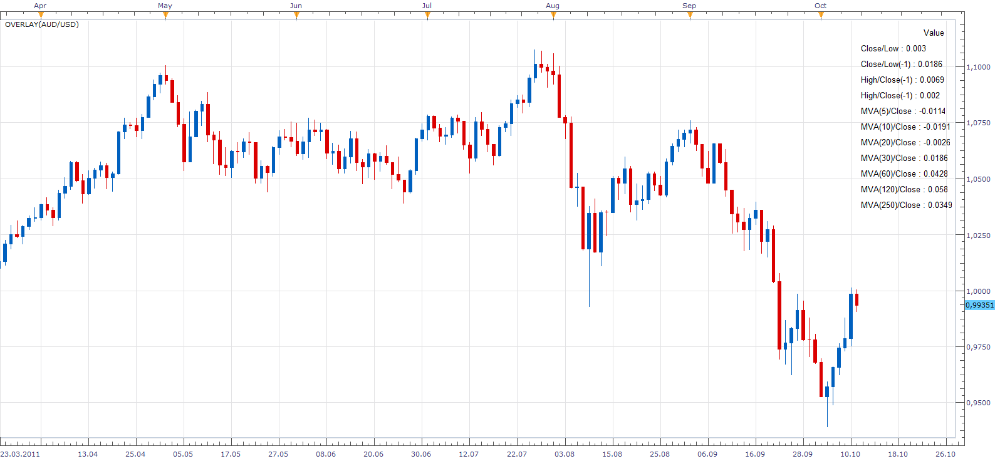

# Data Overlay

> Source: https://fxcodebase.com/code/viewtopic.php?f=17&t=7183  
> Forum: 17 · Topic 7183 · 8 post(s)

---

## Data Overlay

**Apprentice** · Tue Oct 11, 2011 8:39 am

This simple indicator displays the following information.
 "Close/Low", "Close/Low(-1)", "High/Close(-1), "High/Close(-1)" and "MVA( PERIOD")/Close
For this Periods 5,10, 20, 30, 60, 120, 250

The data can be displayed in Pips.

 [Overlay.lua](files/16069/Overlay.lua)

The indicator was revised and updated

MT4/MQ4 version.
[viewtopic.php?f=38&t=65975](https://fxcodebase.com/code/viewtopic.php?f=38&t=65975)

---

## Re: Data Overlay

**kingsee** · Tue Oct 11, 2011 12:30 pm

Thank you very much!!!

but how can i display the information on the top/left of screen?so ,i can study the chart clearly.

---

## Re: Data Overlay

**Apprentice** · Tue Oct 11, 2011 4:28 pm

This is the version that presents data in two lines at the top of the chart.

 [Overlay.lua](files/16084/Overlay.lua)

---

## Re: Data Overlay

**kingsee** · Wed Oct 12, 2011 1:02 am

Thank you very much.The data at the top of the chart is great！！！
 But i think presenting data in one lines at the top of the chart is a better way.we can using vlaues with different colors insteading different indicators' name. for example ,from left to right,the first red value means mva(250)/close; the second blue value means mva(120)/close.....according to the color,i can find out what i want quickly.
 I like the following setting :

colors of values means indicator
red mva(250)/close
blue mva(120)/close
aqua mva(60)/close
silver mva(30)/close
magenta mva(20)/close
green mva(10)/close
yellow mva(5)/close
green h(-1)/c
(The h(-1)/c posted may be wrong .it ought to be:yesterday's high-todays's close)
green h/c
red c/l(-1)
red c/l

do me a favor ,please .thanks a lot!

---

## Re: Data Overlay

**jsi@jp** · Wed Oct 12, 2011 6:18 am

Thank you very much for this indicator.
This indicator seems to be useful for risk management.
Can you add **Amount**.

-------------------------------------------------------------------------------------------------------------------
**<>Example<>**
-------------------------------------------------------------------------------------------------------------------
Amount = The usable margin * 0.02 / ((source.close[period] - source.high[period-1]) + Spread) * (1 / Pip Cost)

Amount = The usable margin * 0.02 / ((source.close[period] - source.low[period-1]) + Spread) * (1 / Pip Cost)

0.02 = Risk management %　(It can input arbitrarily.)
-------------------------------------------------------------------------------------------------------------------

Thank you for your time and consideration.

jsi@jp

---

## Re: Data Overlay

**Apprentice** · Wed Oct 12, 2011 5:08 pm

Your request is added to the developmental cue.

---

## Re: Data Overlay

**kingsee** · Wed Oct 12, 2011 8:25 pm

thank you

---

## Re: Data Overlay

**Apprentice** · Fri Mar 17, 2017 6:53 am

Indicator was revised and updated.
