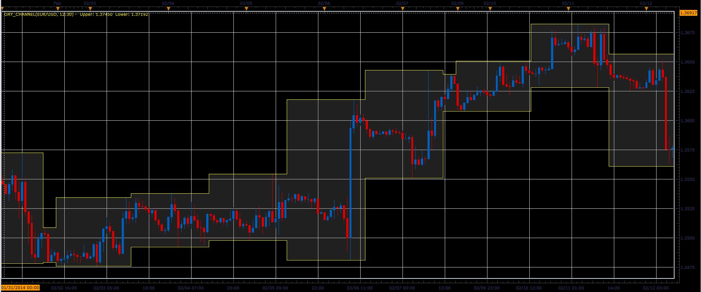

# Day channel

> Source: https://fxcodebase.com/code/viewtopic.php?f=17&t=60334  
> Forum: 17 · Topic 60334 · 4 post(s)

---

## Day channel

**Alexander.Gettinger** · Fri Feb 21, 2014 1:49 pm

The indicator draws High/Low channel begins and ends at a specified time.

 

Download:

 [Day_Channel.lua](files/92803/Day_Channel.lua)

The indicator was revised and updated

---

## Re: Day channel

**Jaywalker** · Sun Jun 08, 2014 4:37 am

Hi

Please, if possible, can some extra features please be added to this indicator:

- end time ( so that it can create a channel between the high and low of a specific period intraday, for example between 18h00 and 24h00 )
- 3 equidistant lines above the channel and below the channel (effectively creating 3 channels above and below ), which will only show in the following days trading hours ( so for example, if the difference between high and low between 18h00 and 24h00 on Monday is 40 pips, then indicator will produce lines 40 pips, 80 pips and 120 pips above high line, and 40 pips, 80 pips and 120 pips below the low line, showing only during Tuesdays trading hours (and ending before the "start time" of the indicator, so in this example 18h00 on Tuesday)

Please see attached photo for illustration

Many thanks
Mike

---

## Re: Day channel

**Apprentice** · Sun Jun 08, 2014 5:31 am

Your request is added to the developmental list.

---

## Re: Day channel

**Apprentice** · Sat Jul 01, 2017 4:42 am

The indicator was revised and updated.
