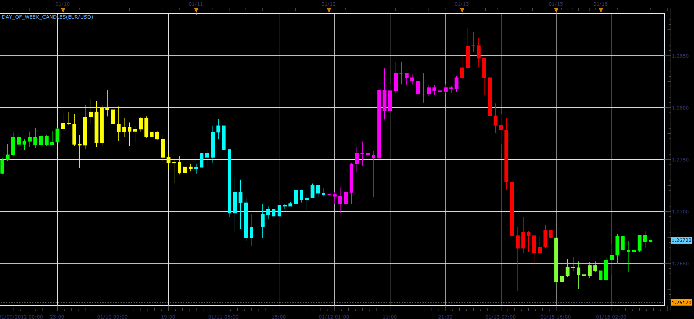

# Day of week candles

> Source: https://fxcodebase.com/code/viewtopic.php?f=17&t=11787  
> Forum: 17 · Topic 11787 · 5 post(s)

---

## Day of week candles

**Alexander.Gettinger** · Mon Jan 16, 2012 9:22 am

This indicator is a ported MQL5 indicator from [http://www.mql5.com/en/market/product/39](http://www.mql5.com/en/market/product/39)

Candles are the same color depending on the day of the week.

 

Download:

 [Day_Of_Week_Candles.lua](files/23590/Day_Of_Week_Candles.lua)

The indicator was revised and updated

---

## Re: Day of week candles

**market junky** · Tue Jan 31, 2012 7:29 pm

Would be perfect if user could customize the time settings himself instead of default 00:00 to 00:00.

---

## Re: Day of week candles

**Apprentice** · Wed Feb 01, 2012 2:55 am

I understand your request.
But I have to consider how to implement it.

---

## Re: Day of week candles

**Alexander.Gettinger** · Sat Feb 04, 2012 8:52 pm

Day of week candles with begin time of trading day.

Download:

 [Day_Of_Week_Candles2.lua](files/25180/Day_Of_Week_Candles2.lua)

---

## Re: Day of week candles

**Apprentice** · Mon Mar 27, 2017 3:18 pm

Indicator was revised and updated.
