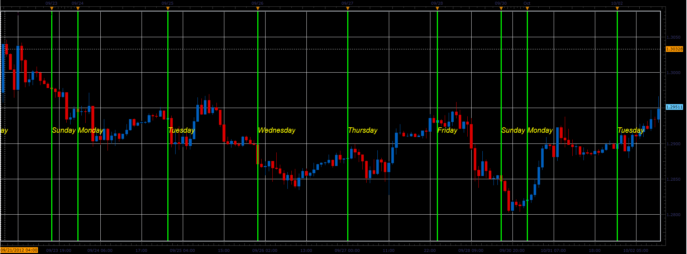

# Day of week lables indicator

> Source: https://fxcodebase.com/code/viewtopic.php?f=17&t=24023  
> Forum: 17 · Topic 24023 · 39 post(s)

---

## Day of week lables indicator

**Alexander.Gettinger** · Tue Oct 02, 2012 2:38 pm

The indicator shows the beginning of the day and sign its name.

 

Download:

 [Day_Of_Week_Lables.lua](files/41320/Day_Of_Week_Lables.lua)

MT4/Mq4 version.
[viewtopic.php?f=38&t=64044&p=108867#p108867](https://fxcodebase.com/code/viewtopic.php?f=38&t=64044&p=108867#p108867)

The indicator was revised and updated

---

## Re: Day of week lables indicator

**nazaar** · Wed Dec 19, 2012 9:28 pm

Hello, I do a lot of manual back testing and name of day label tool is excellent.

Could you also do one for months of the year?

Thanks in advance.

---

## Re: Day of week lables indicator

**Apprentice** · Thu Dec 20, 2012 3:07 am

Your request is added to the development list.

---

## Re: Day of week lables indicator

**Alexander.Gettinger** · Fri Jan 18, 2013 5:43 pm

Indicator is updated. In indicator added month separators.

---

## Re: Day of week lables indicator

**nazaar** · Sat Jan 19, 2013 11:20 am

> **Alexander.Gettinger wrote:**
> Indicator is updated. In indicator added month separators.

**Excellent, thank you very much! Much appreciated.**

What makes this tool excellent is not only what it displays but the many options which the user can set to their preferred liking.

I am glad you placed the label at the top of the screen. Could you add an option for user to choose to display at top or bottom of screen?

thanks.
Timing is everything.

---

## Re: Day of week lables indicator

**speakinmymind** · Fri Jun 07, 2013 5:54 am

Could you please add the ability to remove days? This would give the ability to see weeks at a glance

Also (or as an alternative) the ability to change the color of the line for each day would be useful.

Thanks

---

## Re: Day of week lables indicator

**Apprentice** · Fri Jun 07, 2013 6:30 am

Day On / Off already exists.
Style Option Added.

---

## Re: Day of week lables indicator

**speakinmymind** · Fri Jun 07, 2013 7:08 am

I meant the ability to turn individual days on and off, for example, I only want to see the Monday line and label. This will give you the Weekly vertical lines.

I can turn the lines off for the other days, but I cannot turn off the labels.

Also, I second the request to allow the labels to be aligned to the top or bottom.

Thanks

---

## Re: Day of week lables indicator

**fxcyberman** · Tue Jun 11, 2013 7:07 am

can add the time zone option ? or choose local time, etc.

---

## Re: Day of week lables indicator

**Apprentice** · Wed Jun 12, 2013 5:37 am

Your request is added to the development list.

---

## Re: Day of week lables indicator

**speakinmymind** · Sun Aug 04, 2013 1:55 pm

Any update on getting the labels moved to top or bottom of screen? Or being able to remove the labels (words) without removing the lines?

---

## Re: Day of week lables indicator

**MarkMcCoskey** · Mon Nov 25, 2013 6:28 pm

> **fxcyberman wrote:**
> can add the time zone option ? or choose local time, etc.

I second the Time Zone and/or Local Time options. I don't seem to be able to get the line on the right candle (I'm looking at 1 HR charts and am in the Pacific Time Zone - currently -8).

> **speakinmymind wrote:**
> Any update on getting the labels moved to top or bottom of screen? Or being able to remove the labels (words) without removing the lines?

I'd love to see Labels along the Bottom, if at all possible.

Thanks!!!

---

## Re: Day of week lables indicator

**dfboy503** · Tue Dec 24, 2013 3:32 am

TKS! The indicator is very useful.
But,when I added the indicator ,the shape of the candlesticks were shortened.I wish the shape of chart will not change while the indicator is added.Could u help me to figure it out?
TKS in advance.

---

## Re: Day of week lables indicator

**Apprentice** · Wed Dec 25, 2013 2:51 pm

This is the result of auto scaling.
Mirror presentation issue.
This indicator is using some out dated functionality.

---

## Re: Day of week lables indicator

**dfboy503** · Wed Dec 25, 2013 9:40 pm

> **Apprentice wrote:**
> This is the result of auto scaling.
> Mirror presentation issue.
> This indicator is using some out dated functionality.

TKS.I know nothing about LUA programming,so it means that can not be changed,right?

---

## Re: Day of week lables indicator

**Apprentice** · Fri Dec 27, 2013 3:57 am

Right. It this implementation this is not possible.
We need to rewrite it completely, if you think that's a big problem.

---

## Re: Day of week lables indicator

**dfboy503** · Fri Dec 27, 2013 4:31 am

> **Apprentice wrote:**
> Right. It this implementation this is not possible.
> We need to rewrite it completely, if you think that's a big problem.

TKS a million.I have to remind u that the button 'aotoscale chart vertically ' had been slected both in the condition of indicator ON and OFF.
And I got anther problem which I guess it's about the Execution efficiency of Program structure.shall i describe it here as a rewriting request? Much appreciate if rewriting is possible.

---

## Re: Day of week lables indicator

**Apprentice** · Sat Dec 28, 2013 4:14 am

If the topic is not related to Day of week indicator lables,
I would prefer that you, open a new topic.
Use Indicator and Signal Requests
 [viewforum.php?f=27](https://fxcodebase.com/code/viewforum.php?f=27)

General Discussions, Discussions or Indicator Development.

---

## Re: Day of week lables indicator

**dfboy503** · Sat Dec 28, 2013 9:27 am

OK.Here I go with EUR/USD-H1 as an example:
1.create a new chart and add the indicator as the figure 1 posted below.
2.Scroll the mouse on the chart to zoom out to the minimum,then select a part of historical data.Figure 2 posted.
3.As figure 3 showed,try to Drag the chart left and right with mouse, u can feel the feeling of lag.Now click the indicator and delete it.Drag the chart again,the feeling of lag disappear.
Many Built-in indicators in TS2 I have tried don't have the problem of lag when u viewing the historical data.So I'm wondering is that some program stucture problem?And that can be modified?
TKS!

---

## Re: Day of week lables indicator

**Apprentice** · Mon Dec 30, 2013 3:36 am

As you can see by the date, this is pretty old indicator.

At that time, it was the best and the only possible solution.

In the meantime, we've got some new features to our disposal.
Which enabled better performance.
Therefore, a complete rewrite is needed.

Try my quick fix.

Also if you know of other indicators that need a facelift,
warn us about them.

---

## Re: Day of week lables indicator

**dfboy503** · Mon Dec 30, 2013 7:53 am

I'm looking forward to your new disposal and hope u can consider the tips all I mentioned above.
By the way ,giving me a reply when u refreshing the update will be great !
TKS & wish u a happy new year!

---

## Re: Day of week lables indicator

**Apprentice** · Mon Dec 30, 2013 9:45 am

I have made ​​a minor update already.
You should test it.

---

## Re: Day of week lables indicator

**dfboy503** · Mon Dec 30, 2013 10:45 am

Thank u for the quick reply.I had tested the update.But it seemed like it has nothing change compared to the last version.The problems I mentioned in the reply above(Shape change & Lag of drag operation) still exist.Could u pls check it again?

---

## Re: Day of week lables indicator

**dfboy503** · Sun Jan 12, 2014 10:19 pm

May I ask is there any change these days?

---

## Re: Day of week lables indicator

**Coondawg71** · Sat Feb 01, 2014 6:22 am

Is is possible to scale this indicator so it may be placed in the Inferior panel. As of now, when placed below price chart it is unreadable.

Thanks,

sjc

---

## Re: Day of week lables indicator

**Apprentice** · Sat Feb 01, 2014 2:54 pm

Until major overhaul is performed, try this version.

 [Day_Of_Week_Lables.lua](files/92405/Day_Of_Week_Lables.lua)

---

## Re: Day of week lables indicator

**PaulEamonn** · Sun May 18, 2014 8:11 am

Hi Apprentice

I'm aware that this indicator is in line for an update and so I was wondering if I could add a request to the list of improvements the other guys have requested.

I'm really only interested in seeing the beginning and end of each trading day on the hourly and smaller time frames. So Is it possible to add the facility to specify which time frames the dividing lines can be seen on? In the same way as the objects in MT4.

The reason I ask is that, with the current version, if you have the day lines visible and change the chart to the daily time frame, all you can see is the day separators and it's very distracting.

Thanks in advance.

---

## Re: Day of week lables indicator

**Apprentice** · Tue May 27, 2014 7:28 am

Please Re-Download.
I have to declutter the chart a bit.

---

## Re: Day of week lables indicator

**jonuss** · Fri Feb 27, 2015 11:21 am

Thank you for all the indicators. I greatly appreciate it.

Can you please add an option to this indicator to put the label(Day, Month, etc) on the top, bottom, or middle?

Thank you again

---

## Re: Day of week lables indicator

**Apprentice** · Mon Mar 02, 2015 6:10 pm

Something similar to Watermark?
[viewtopic.php?f=17&t=27637&hilit=watermark](https://fxcodebase.com/code/viewtopic.php?f=17&t=27637&hilit=watermark)

---

## Re: Day of week lables indicator

**4x4partners** · Wed May 06, 2015 3:11 am

Hi,

I get an error when placing the Day of Week Label indy on my chart? Is there an updated version somewhere?

Thanks!

---

## Re: Day of week lables indicator

**Apprentice** · Wed May 06, 2015 6:48 am

Try it now.

---

## Re: Day of week lables indicator

**4x4partners** · Wed May 06, 2015 9:05 am

Thanks Apprentice! Works now.

---

## Re: Day of week lables indicator

**PaulEamonn** · Mon May 11, 2015 11:05 am

Hi Apprentice

I think this indicator is good, but I think it would be better if there was the option to define the maximum time frame that it can be seen on.

For example, I'm only interested in highlighting the start of the London session and the start of the New York session Sunday to Friday. As the indicator only shows one line per day, I load two copies of the indicator and set the 'Begin Time of Day' time to suit on each copy. Although, the option to show two lines with one copy of the indicator would be great, it can be got over as I say.

However, once I've set up two lines like this, if I switch to any time frame above H2 the chart looks very crowded. So the ability to stop showing daily lines above a specified time frame would be great.

Thanks in advance.

---

## Re: Day of week lables indicator

**PaulEamonn** · Thu May 21, 2015 4:27 am

Hi Apprentice

Ok, I've solved the problem of 'over crowding' by setting the default period in the Data Source tab to H1. Pretty obvious really - Doh!

However, when I switch down to the lower time frames the line is no longer shown on the hour. The m30 is fine, but the m15 jumps forward 15 minutes, the m5 by 25 minutes and the m1 by 29 minutes.

It's not the biggest problem in the world, but if something can be done about it, it would save my overloaded brain having to think about another thing.

Another interesting anomaly I have spotted is that the lines don't show on the 1st of every month. A bit of a pain, but again, not the end of the world. I just thought you might be interested.

Many thanks

---

## Re: Day of week lables indicator

**Apprentice** · Tue Jul 04, 2017 9:32 am

The indicator was revised and updated.

---

## Re: Day of week lables indicator

**Serge Levesque** · Tue Sep 28, 2021 3:50 pm

Hi, the indicator stops printing the information (vertial line) at 10,000. Can you fix this. Thank you.

---

## Re: Day of week lables indicator

**Apprentice** · Thu Sep 30, 2021 6:12 am

Try it now.

---

## Re: Day of week lables indicator

**Serge Levesque** · Tue Oct 26, 2021 9:06 pm

Works well, thank you Apprentice.
