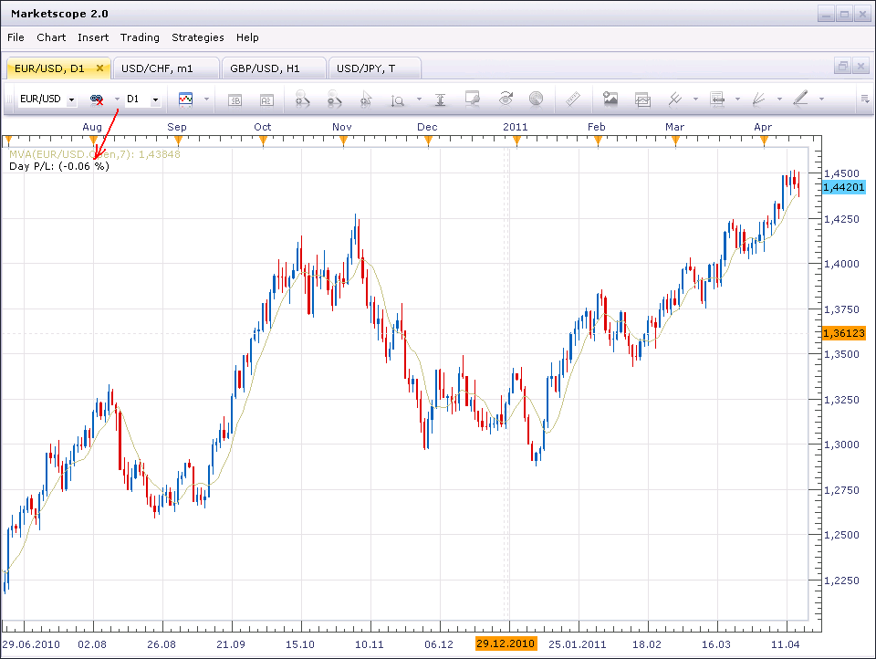

# Day P/L Percentage

> Source: https://fxcodebase.com/code/viewtopic.php?f=17&t=3911  
> Forum: 17 · Topic 3911 · 23 post(s)

---

## Day P/L Percentage

**sunshine** · Thu Apr 14, 2011 6:07 am

In response to requests from the users (TygerKrane, dailyfx forum), I've implemented the "Day P/L Percentage" indicator.
The indicator shows the Day P/L as percentage from the account equity balance at the beginning of the trading day (17:00 EST).

 

Download the indicator:

 [Day_PL_Percentage.lua](files/9659/Day_PL_Percentage.lua)

The indicator was revised and updated

---

## Re: Day P/L Percentage

**uglock** · Thu Apr 14, 2011 7:59 am

Thank you Sunshine for this indicator! Could you please also add the label at the top-right corner of the chart. The indicator legend contains too much details and the P/L value is hardly seen there. It will be awesome if the font and placement could be configured.

---

## Re: Day P/L Percentage

**sunshine** · Thu Apr 14, 2011 8:25 am

I've removed the unnecessary info from the label. The top post is updated.
Thanks for the feedback, uglock!

---

## Re: Day P/L Percentage

**cyanidez** · Wed Apr 20, 2011 5:45 am

Thank you sunshine, this is a very handy one!

Cheerz
cyanidez

---

## Re: Day P/L Percentage

**mfoste1** · Sun Jun 19, 2011 4:59 pm

Im getting this error in the day pl on the chart it looks like this **Day P/L: (-1,#IND%)**

why is it doing this?

thanks in advance,

Mfoste1

---

## Re: Day P/L Percentage

**sunshine** · Mon Jun 20, 2011 6:21 am

> **mfoste1 wrote:**
> Im getting this error in the day pl on the chart it looks like this **Day P/L: (-1,#IND%)**
>
> why is it doing this?

Thanks for the report.
It looks like the issue appears when the "floating" balance of the account at the beginning of the trading day (M2MEquilty) is equaled to zero. I've added check for zero, so now in this case you will see "N/A".
The top post has been updated. Please reinstall the indicator.

---

## Re: Day P/L Percentage

**mfoste1** · Tue Apr 10, 2012 10:13 pm

Would someone be able to get this indicator to display weekly and monthly P/L as well? I find it would be extremely helpful and easy in fostering good risk management techniques. Thank you

---

## Re: Day P/L Percentage

**Hailkayy** · Wed Apr 11, 2012 8:30 am

Agreed about Weekly and monthly, good idea

---

## Re: Day P/L Percentage

**ingmar** · Tue Apr 17, 2012 6:45 pm

Bumping for weekly and monthly.

---

## Re: Day P/L Percentage

**mjf1288** · Sun Sep 30, 2012 10:31 am

I see a lot of people requesting weekly and monthly P/L, I will also agree this is a simple must have indicator.

---

## Re: Day P/L Percentage

**Apprentice** · Mon Oct 01, 2012 1:41 am

Your request is added to the development list.

---

## Re: Day P/L Percentage

**mjf1288** · Thu Dec 06, 2012 5:58 am

any word on this update to show weekly/monthly P/L as well?

---

## Re: Day P/L Percentage

**mjf1288** · Sun Feb 03, 2013 5:17 pm

Any progress on this?

---

## Re: Day P/L Percentage

**mjf1288** · Sat Mar 16, 2013 2:03 pm

Hello,

just checking to see if anyone has checked this out yet. It has been in request for quite some time now. I really don't think it should take much modifications to create the ability to display weekly and monthly p/L. It would be very helpful to traders who like to monitor their gains other than on an intraday basis. Please help with this . Thanks

---

## Re: Day P/L Percentage

**Hailkayy** · Mon Mar 18, 2013 5:23 pm

Weekly and Monthly Profit and Loss from one trader's account.

---

## Re: Day P/L Percentage

**speakinmymind** · Wed Mar 27, 2013 2:13 am

I believe this indicator uses the "Day P/L" and equity to do a simple percentage formula. There is not a running status of your "monthly P/L". If there were you could point the code to use that, but until there is a monthly p/l provided in TS, there is no monthly information to program an indicator to use.

I'm just picking up on programming so I may be wrong, and there may be another solution out there somewhere.

---

## Re: Day P/L Percentage

**speakinmymind** · Thu Mar 28, 2013 8:20 pm

Can you add a way to adjust the time? for example every 30 min? i think this would require storing the day p/l every say 30 min and comparing that with the current day p/l with the percentage formula for that in real time, furthermore this makes me wonder if your balance or equity converted to p/l could be stored on a longer timeframe to create the heavily requested weekly / monthly p/l percentage?

Regards

---

## Re: Day P/L Percentage

**Apprentice** · Fri Mar 29, 2013 1:14 pm

Your request is added to the development list.

---

## Re: Day P/L Percentage

**TygerKrane** · Sun Sep 21, 2014 11:43 am

Hey guys,
I am TygerKrane, who made the original request for this indicator, and I have a VERY, VERY, VERY, Simple idea to make a weekly or monthly percentage indicator a reality!!!

How about you just make a simple input indicator for the User.
1.The user inputs a [Dollar Amount], and [Date];
2.The indicator calculates the percentage change for their input [Dollar Amount] and the current 'Equity' value for their account;
3.The indicator displays on the chart: **MM/DD/YY; P/L: (x%)**

Sound good?

-maybe you want to give the user the option to choose for the charts' Date Display:
~~MM/DD/YY
~~DD/MM/YY
~~MM/DD
~~DD/MM

The reason you show the date, is so that user always knows the time reference; so they will remember to change it (for example at the start of a new week, or the start of a new month).

The user can always get their balance for a particular day in the past from the 'Account Report History'.

=+=+=+=+=+=+=+=+=+=+=+=+=+=+=+=+=+=

OR IF IT IS POSSIBLE, (slightly more complex option, if it is possible)
The user inputs the date, and the indicator can access the Account Report History and retrieve the End of Day Balance, and do the calculations from that.

In this case, the indicator, (within the 'Properties' dialog box, AND NOT ON THE CHART) should fill in the End of Day Balance that it retrieved, so that the user has a confirmation for the date they chose.
I request not to put the confirmation Balance "on the chart", because the whole purpose of the indicator is to trade without focusing on Dollar Amounts.

As far as having the indicator access the Account Report History, there is an indicator developed here at fxcodebase that might help:

**Trading History**
[viewtopic.php?f=17&t=9754](https://fxcodebase.com/code/viewtopic.php?f=17&t=9754)

> "TRADING_HISTORY indicator retrieves information with help of report api library.
> Using of report api library allows to retrive information about any amount of closed positions (up to account creation time)."

=+=+=+=+=+=+=+=+=+=+=+=+=+=+=+=+

IN CONCLUSION, since many people have requested this indicator for a very long time,
I would ask that you create the SIMPLE, SIMPLE version first, because it gets the job and can be programmed quickly.

Afterwards, if you desire, you can go back and design the more complex version with the automatic Account History Lookup.

Thank You Very Much,

TygerKrane

---

## Re: Day P/L Percentage

**Apprentice** · Tue Sep 23, 2014 3:26 am

Something like Account indicator?
[viewtopic.php?f=17&t=2851&p=6510&hilit=Equity#p6510](https://fxcodebase.com/code/viewtopic.php?f=17&t=2851&p=6510&hilit=Equity#p6510)

---

## Re: Day P/L Percentage

**TygerKrane** · Wed Sep 24, 2014 5:03 pm

This is my dream for the "Complex Version".

---

## Re: Day P/L Percentage

**TygerKrane** · Thu Sep 25, 2014 3:18 am

And, this is my dream for the Simple Version.

---

## Re: Day P/L Percentage

**Apprentice** · Thu Jun 29, 2017 6:23 am

The indicator was revised and updated.
